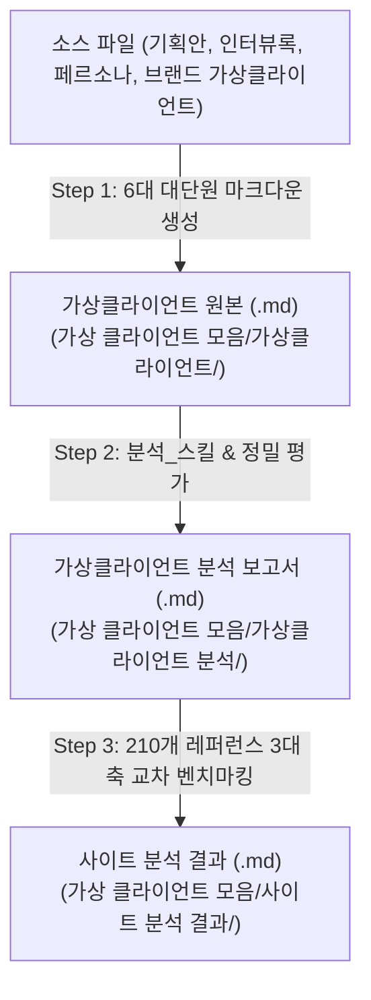

# 🚀 가상클라이언트 생성 & 레퍼런스 분석 자동화 스킬 (Virtual Client Automation Skill)

본 스킬은 **가상클라이언트 1~4번 원본과 100% 동일한 정규 6대 대단원 마크다운(`.md`) 생성**부터 분석 스킬 발동(양식 정밀 변환), 210개 글로벌 레퍼런스 사이트 심층 분석(메뉴, 콘텐츠, 기능)까지의 3단계 프로세스를 완벽하게 자동화합니다.

---

## 🗺️ 1. 전제 조건 및 폴더 구조 검증

작업을 시작하기 전 다음 디렉터리 구조가 존재하는지 확인하고, 없으면 자동으로 생성한다.

- **소스 입력 디렉터리**:
  - `C:\yyw\가상클라이언트 생성\` (`브랜드 기획안.txt`, `인터뷰_대화록_및_주제별정리.md`, `페르소나_.txt` 등)
  - `C:\yyw\가상클라이언트 생성\브랜드 가상클라이언트\` (기존 브랜드 가상클라이언트 원본 소스)
  - `C:\yyw\가상클라이언트 생성\가상 클라이언트 기반 분석 결과 작성 양식.md`
  - `C:\yyw\md_skill\분석_스킬\SKILL.md`
  - `C:\yyw\브랜드 관련 레퍼런스\` (`01_선별_수집결과_데이터.txt`, `02_선별_분류결과_데이터.md`, `03_선별_심층분석_보고서.md`)
- **결과 저장 디렉터리**:
  - `C:\yyw\가상 클라이언트 모음\가상클라이언트\` (가상클라이언트_{N}_{타깃명}.md)
  - `C:\yyw\가상 클라이언트 모음\가상클라이언트 분석\` (가상클라이언트_{N}_{타깃명}_분석결과.md)
  - `C:\yyw\가상 클라이언트 모음\사이트 분석 결과\` (사이트분석결과_가상클라이언트_{N}_{타깃명}.md)

---

## 🔄 2. 3단계 자동 실행 프로세스 규칙 (1~4번 완전체 규격 적용)

### 📍 [Step 1] 가상클라이언트 완전체 마크다운(.md) 자동 생성
1. **소스 데이터 통합 분석**: `C:\yyw\가상클라이언트 생성\` 폴더 내 기획 문서들과 `브랜드 가상클라이언트\` 폴더 내 파일들을 전량 수집·분석한다.
2. **중복 방지 게이트**: `C:\yyw\가상 클라이언트 모음\가상클라이언트\` 내 기존 클라이언트(1~6번 및 기존 타깃)와 직업군, Pain Point, 라이프스타일 중복을 엄격히 차단한다.
3. **순차 번호 부여**: 신규 생성 시 `가상클라이언트_7` (7번)부터 순차 부여한다.
4. **★ 1~4번 정식 6대 대단원 마크다운 구조 필수 작성 (용량 최소 5KB 이상)**:
   - `## 1. 가상 클라이언트`: 프로젝트 주제, 제작 목적, 제공 자료, 적용 매체(데스크톱/모바일 톤앤매너)
   - `## 2. 클라이언트 요구사항`: **최소 5개 이상의 상세 표** (번호, 클라이언트 요청 내용, 관련 자료, 중요도: 높음/보통)
   - `## 3. 정보 구조 (IA & 5대 영역 분석)`:
     - 주제, 부주제, 5개 핵심 메뉴
     - **5대 영역 상세**: 디자인 스타일(컬러 팔레트/무드), 화면 구성 & 레이아웃, 메뉴 & 사용자 흐름, 문구 & 콘텐츠(직업별 통계/카피), 주요 기능 & 인터랙션
     - **정보 유형**: 사실, 개념, 절차
   - `## 4. 내비게이션 & 사용자 흐름 (User Flow)`: 시작 화면, 5단계 이동 경로, 모달/팝업 연결 페이지, 검색 및 위치 안내 UI
   - `## 5. 화면 구성 (레이아웃 & 와이어프레임)`:
     - 헤더, 내비게이션(GNB)
     - **핵심 콘텐츠 (1번부터 8번까지 번호 매김 상세 명세)**
     - 보조 콘텐츠, 푸터
   - `## 6. 검토 결과 (분석 스킬 기반 종합 평가)`: 누락 항목 0건 검증, 중복 항목 정리, 사용자 관점의 개선점, 브랜드 차별화 전략
5. **저장 경로**: `C:\yyw\가상 클라이언트 모음\가상클라이언트\가상클라이언트_{N}_{타깃명}.md` (단순 .txt 요약본 생성 금지)

---

### 📍 [Step 2] 분석 스킬 발동 & 작성 양식 맞춤 변환
1. Step 1에서 생성된 완전체 `.md` 파일과 `C:\yyw\md_skill\분석_스킬\SKILL.md` 및 `가상 클라이언트 기반 분석 결과 작성 양식.md`을 결합한다.
2. Step 1의 6대 규격을 바탕으로 수치화된 데이터와 정성 분석을 보강한 심층 분석 보고서를 작성한다.
3. **저장 경로**: `C:\yyw\가상 클라이언트 모음\가상클라이언트 분석\가상클라이언트_{N}_{타깃명}_분석결과.md`

---

### 📍 [Step 3] 가상클라이언트 기준 브랜드 관련 레퍼런스 사이트 분석
1. Step 2 분석 보고서와 `브랜드 관련 레퍼런스` 폴더(`01_선별_수집결과_데이터.txt`, `02_선별_분류결과_데이터.md`, `03_선별_심층분석_보고서.md` 등 엄선된 정예 브랜드 DB)를 기반으로 교차 벤치마킹한다.
2. 가상클라이언트별 관점에서 다음 **3대 핵심축**으로 결과를 도출하여 독립 파일로 작성한다:
   - **[메뉴 (Menu & Navigation)]**: GNB 5대 계층 구조, 뎁스(Depth 3이내), 타깃별 이동 동선
   - **[콘텐츠 (Content & Copywriting)]**: 메인 카피라이팅, 에디토리얼 룩북/매크로 뷰, 3D/알고리즘 스펙, 찐후기 & 신뢰 배지
   - **[기능 (Function & Interaction UI)]**: 바이오피드백 데이터 UI, 타깃 액션 UI(카톡 1-Click 공유, O2O 지도 검색, 네이버페이 1-Click 등), Floating Sticky CTA Bar
3. **저장 경로**: `C:\yyw\가상 클라이언트 모음\사이트 분석 결과\사이트분석결과_가상클라이언트_{N}_{타깃명}.md`

---

## ⚖️ 3. 엄격 품질 게이트 및 명명 규칙

1. **포맷 완전성**: Step 1 산출물은 반드시 `.md` 확장자로 저장하며, 1~4번 문서와 동일한 **6대 대단원(요구사항 표 5행, IA 5대 영역, 핵심 콘텐츠 8대 항목 등)**을 100% 충족해야 한다.
2. **최소 분량 기준**: 가상클라이언트 원본 `.md` 문서는 최소 5KB 이상의 풍부한 기획 데이터로 작성되어야 한다.
3. **출력 링크**: 작업 완료 시 생성된 모든 산출물의 로컬 경로를 `file:///` 형식의 Clickable Markdown Link로 제공한다.
