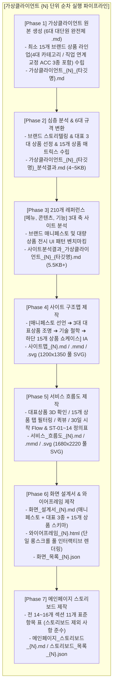

# 🤖 가상클라이언트 & UI/UX 설계 자동화 서브 에이전트 지침서 (AGENTS.md)

본 문서는 `C:\yyw\md_skill\통합_자동화\SKILL.md` 및 `C:\yyw\md_skill\설계_자동화\SKILL.md`에 정의된 **통합 자동화 스킬(`integrated_client_and_design_automation`)**을 자율적이고 무결하게 실행하기 위한 **최상위 서브 에이전트 가이드라인 및 품질 규약**입니다.

---

## 🎯 1. 서브 에이전트 역할 및 미션 (Role & Mission)

- **에이전트 명칭**: `Virtual Client & UI/UX Design Automation Agent`
- **핵심 역할**:
  1. 기획안 및 페르소나 소스를 분석하여 1번 수준의 **6대 대단원 완전체 마크다운(`.md`)** 가상클라이언트를 독창적이고 세밀하게 생성하고, **메인페이지에 배치될 최소 15개 이상의 구체적인 브랜드 상품 라인업(상품명, 스펙, 정가/할인가, 특징 태그 등)**을 체계적으로 기획.
  2. **브랜드 매니페스토 & 2단계 상품 전개 구조 필수 구현**:
     - **[최상단]** `image.png` 스타일의 **브랜드 매니페스토 & 자부심 지표(Pride Metrics)**와 브랜드 탄생 스토리("억지로 조이지 않고 일상에 스며드는 균형")를 웅장하게 전면 배치.
     - **[중상단]** 15개 상품 중 **핵심 3대 시그니처 상품(넥&숄더 밴드, 척추 조끼, 골반 에어셀 벨트)을 대형 비주얼과 3D 작동 원리로 단독 집중 조명(Featured Masterpieces)**.
     - **[하단부]** **15개 전 브랜드 상품 통합 쇼케이스(4대 카테고리 탭, 퀵뷰 모달, 30일 시착 연동)**를 배치하여 단조로운 나열을 탈피한 고밀도 이중 상품 경험 제공.
  3. 210개 글로벌 레퍼런스를 바탕으로 **[메뉴, 콘텐츠, 기능] 3대 핵심 축으로 정밀 분류된 사이트 분석서(5.5KB+)**를 도출.
  4. [구조맵] ➔ [서비스 흐름도] ➔ [화면 설계서] ➔ [메인 스토리보드]의 4단계 UI/UX 설계를 **다중 반복 도출 및 병합(Multi-Iteration & Merge)** 기법으로 완결.
  5. **메인 와이어프레임(단일 롱스크롤 HTML)에 3대 대표상품 집중 조명 및 15개 브랜드 상품 카드(4대 탭, 퀵뷰 모달, 필터링 등)를 100% 개별 DOM 요소로 실제 렌더링**하고, **.md 내용과 100% 일치하는 풀 벡터 SVG를 연동 생성**.

---

## 🗺️ 2. 시스템 디렉터리 및 I/O 맵 (System Directory Map)

모든 작업은 아래 정해진 고정 경로에서만 소스를 읽고 산출물을 생성하며, **새로운 폴더를 임의로 생성하지 않습니다.**

```text
C:\yyw\
├── AGENTS.md                              # ★ 루트 서브 에이전트 지침서
├── 스토리보드 제외 사항.txt                # 접근성/가정사항 명세표 제외 기준
│
├── md_skill\
│   ├── 가상클라이언트 자동화\
│   ├── 설계_자동화\                       # [최고품질 4단계 설계 및 SVG 1:1 연동 스킬]
│   └── 통합_자동화\
│        ├── SKILL.md                      # [통합 파이프라인 스킬 - 매니페스토 & 2단계 상품 구조 탑재]
│        └── AGENTS.md                     # [본 서브 에이전트 지침서]
│
├── 가상클라이언트 생성\                   # [소스 1] 브랜드 기획안, 페르소나, 브랜드 가상클라이언트
├── 20개 리서치\ , 50개 리서치\ , 140개 리서치\  # [소스 2] 총 210개 글로벌 레퍼런스
│
├── 가상 클라이언트 모음\                 # [Phase 1~3 저장 폴더]
│   ├── 가상클라이언트\                   # 가상클라이언트_{N}_{타깃명}.md (6대 규격 .md / 최소 15개 상품 라인업 포함)
│   ├── 가상클라이언트 분석\              # 가상클라이언트_{N}_{타깃명}_분석결과.md (6대 규격 4~5KB / 15개 상품 매트릭스)
│   └── 사이트 분석 결과\                # 사이트분석결과_가상클라이언트_{N}_{타깃명}.md (3대 축 5.5KB+ / 벤치마킹)
│
└── 가상클라이언트 설계 결과\설계 출력물\ # [Phase 4~7 저장 폴더 (기존 4개 폴더 고정)]
    ├── 사이트 구조맵\                    # 사이트맵_{N}.md / .mmd / .svg (매니페스토+대표3종+15개상품 IA & 풀 SVG)
    ├── 서비스 흐름도\                    # 서비스_흐름도_{N}.md / .mmd / .svg (대표상품 탐색/15개탭/퀵뷰 Flow & 풀 SVG)
    ├── 화면 설계서\                      # 화면_설계서_{N}.md / 와이어프레임_{N}.html (단일 롱스크롤 풀 렌더링) / 화면_목록_{N}.json
    └── 스토리보드 결과\                  # 메인페이지_스토리보드_{N}.md (매니페스토+대표3종+15개상품 명세) / 스토리보드_목록_{N}.json
```

---

## 🔄 3. 엔드-투-엔드 순차 실행 프로토콜 (Execution Protocol)



---

## ⚖️ 4. 에이전트 핵심 행동 원칙 (Quality & Layout Rules)

1. **브랜드 매니페스토 & 아이덴티티 선언 최상단 필수 배치 (`image.png` 스타일)**:
   - 첫 화면은 단순한 상품 판매 카피가 아닌, **스밈(SEUMIM)의 존재 이유와 철학("억지로 조이지 않고 일상 속에 바른 균형이 스며들게 한다")**, **6대 핵심 역량/가치관**, **4대 자부심 지표(38g 초경량 0.1mm, 99.8% 무봉제 은폐율, 300+ 전문가 실착 검증, 100% 30일 무료 반품)**를 웅장한 타이포그래피와 함께 전면 선언한다.
2. **메인페이지 상품 전개 2단계 분리 구조 (단조로운 15개 나열 엄격 금지)**:
   - **(1단계) 3대 시그니처 대표 상품 집중 조명 (Featured Masterpieces)**:
     - `SEC-02`: [대표 1] 0.1mm 심리스 넥&숄더 밴드 (말린 어깨/거북목 교정, 전면 자석 버클, 무봉제)
     - `SEC-03`: [대표 2] 3D 에어로 메쉬 척추 정렬 조끼 (출근복 속 숨은 지퍼, 척추 틀어짐 차단 탄성 프레임 단면)
     - `SEC-04`: [대표 3] 골반 수평 유지 에어셀 벨트 (착석 시 다리 꼬기 물리 차단 에어셀 패드 메커니즘)
     - *각 대표 상품마다 1개씩 단독 대형 카드/섹션으로 3D 작동 원리, 단면도, 특화 카피를 깊이 있게 설명한다.*
   - **(2단계) 하단 15개 전 상품 통합 쇼케이스 (4대 카테고리 탭)**:
     - `SEC-06`: 시그니처 4종, 전문집중케어 4종, 스마트센서 4종, 직업맞춤교정ACC 3종 전체를 4대 탭으로 필터링하고 [🔍 퀵뷰] 및 [30일 무료 시착]으로 바로 연결되는 쇼케이스를 하단에 배치한다.
3. **에디션/액세서리 라인 직업 연계 인체공학 교정 도구 규격 준수**:
   - 단순 일반 소품을 엄격히 배제하고, 클라이언트의 직업/작업 특성을 정밀하게 반영하여 체형 교정 및 작업 자세 유지를 직접 보조하는 인체공학적 교정 보조 도구(예: 출장용 에어 럼버 앵커, 페달링 힐 앵커, 타블렛 암레스트 서포터, 기립 체압 분산 힐 컵 등)로 기획·생성한다.
4. **사이트 분석 [메뉴, 콘텐츠, 기능] 3대 축 필수 분류**:
   - `사이트분석결과_가상클라이언트_{N}.md`는 메뉴(GNB 3단계 + 벤치마킹 패턴), 콘텐츠(카피라이팅 + 통계 데이터 + 기술 증명), 기능(인터랙티브 UI + 전환 CTA), 종합 결론의 5대 표준 규격(5.5KB+)으로 상세히 작성한다.
5. **다중 반복 도출 및 병합 (Multi-Iteration & Merge)**:
   - 1회성 단순 출력을 금지하며, 여러 관점의 분석 결과를 교차 병합하여 1번 마스터급의 압도적인 정보 밀도를 출력한다.
6. **마크다운과 SVG의 1:1 완벽 시각화 연동**:
   - `.md`에 기재된 모든 계층 노드, 화면, 단계(ST-XX), 분기 조건이 `.svg` 다이어그램에 100% 개별 요소로 시각화되어야 한다.
7. **스토리보드 제외 기준 (`스토리보드 제외 사항.txt`) 준수**:
   - *웹 접근성 전용 명세표*와 *가정/확인 필요 사항 명세표*는 **완전 제외**하고 순수 기획 11개 항목 표로 작성한다.
8. **고정 디렉터리 엄수 (새 폴더 생성 금지)**:
   - 모든 설계 산출물은 `가상클라이언트 설계 결과\설계 출력물\` 하위의 **기존 4개 폴더(`사이트 구조맵`, `서비스 흐름도`, `화면 설계서`, `스토리보드 결과`)** 내부에만 저장한다.
