# 🚀 통합 자동화 마스터 파이프라인 스킬 (Integrated Master Automation Pipeline)

본 스킬은 `C:\yyw\` 워크스페이스의 모든 소스 데이터를 기반으로, **[가상클라이언트 완전체 생성] ➔ [분석 스킬 발동] ➔ [210개 레퍼런스 3대 축 정밀 사이트 분석] ➔ [1. 사이트 구조맵] ➔ [2. 서비스 흐름도] ➔ [3. 화면 설계서] ➔ [4. 메인페이지 스토리보드]**의 총 7단계 엔드-투-엔드(End-to-End) 프로세스를 최고 품질로 완결하는 통합 자동화 스킬입니다.

특히 **`image.png` 레퍼런스 스타일의 브랜드 매니페스토 전면 선언**과 함께, **핵심 3대 대표상품 단독 집중 조명(Featured Masterpieces)** 및 **하단 클라이언트별 맞춤 20~35개(평균 28개) 전 상품 통합 쇼케이스(4대 카테고리 탭 & 퀵뷰 & 30일 무료 시착)**의 **2단계 이중 상품 전개 구조**를 표준으로 탑재합니다.

클라이언트의 직업군, 작업 환경, 신체적 Pain Point에 따라 상품 수량(20~35개, 평균 28개 내외)과 카테고리별 비중을 유연하고 다채롭게 기획·생성합니다.

---

## 🗺️ 1. 시스템 디렉터리 및 I/O 맵 (Fixed Directory Architecture)

모든 작업은 아래 정해진 고정 경로에서만 소스를 읽고 산출물을 생성하며, **임의의 새 폴더 생성을 엄격히 금지합니다.**

```text
C:\yyw\
├── AGENTS.md                                 # ★ 루트 에이전트 지침서
├── 스토리보드 제외 사항.txt                   # [스토리보드 접근성/가정사항 명세표 완전 제외 기준]
├── 프롬프트\
│   ├── Antigravity 프롬프트.txt             # [Phase 4, 5, 6 기준 프롬프트]
│   └── 스토리보드 프롬프트.txt               # [Phase 7 메인 스토리보드 전용 프롬프트]
│
├── md_skill\
│   ├── 가상클라이언트 자동화\SKILL.md          # [Phase 1~3 전용 스킬]
│   ├── 설계_자동화\SKILL.md                  # [Phase 4~7 UI/UX 4단계 설계 전용 스킬]
│   └── 통합_자동화\
│        ├── SKILL.md                         # ★ [본 통합 마스터 스킬 - 평균 28개 가변 상품 라인업 탑재]
│        └── AGENTS.md                        # [서브 에이전트 행동 지침서]
│
├── 가상클라이언트 생성\                      # [소스 1] 브랜드 기획안, 페르소나, 브랜드 가상클라이언트
├── 210개 리서치\                             # [소스 2] 총 210개 글로벌 레퍼런스 마스터 DB
│
├── 가상 클라이언트 모음\                    # [Phase 1~3 산출물 저장 디렉터리]
│   ├── 가상클라이언트\                      # 가상클라이언트_{N}_{타깃명}.md (6대 규격 완전체 .md / 20~35개 [평균 28개] 상품 라인업 포함)
│   ├── 가상클라이언트 분석\                 # 가상클라이언트_{N}_{타깃명}_분석결과.md (6대 규격 5~6KB / 평균 28개 상품 카테고리 매트릭스)
│   └── 사이트 분석 결과\                   # 사이트분석결과_가상클라이언트_{N}_{타깃명}.md (3대 축 6.0KB+ / 210개 벤치마킹)
│
└── 가상클라이언트 설계 결과\설계 출력물\    # [Phase 4~7 4대 설계 산출물 저장 디렉터리 (기존 4개 폴더 고정)]
    ├── 사이트 구조맵\                       # 사이트맵_{N}.md / .mmd / .svg (매니페스토+3대대표상품+평균28개상품 IA & 풀 SVG)
    ├── 서비스 흐름도\                       # 서비스_흐름도_{N}.md / .mmd / .svg (대표상품 확인/평균28개 탭/퀵뷰 Flow & 풀 SVG)
    ├── 화면 설계서\                         # 화면_설계서_{N}.md / 와이어프레임_{N}.html (평균 28개 전 상품 인터랙티브 뷰어 60~90KB) / 화면_목록_{N}.json
    └── 스토리보드 결과\                     # 메인페이지_스토리보드_{N}.md (매니페스토+대표3종+평균28개상품 쇼케이스 명세) / 스토리보드_목록_{N}.json
```

---

## 🔄 2. 7대 Phase 엔드-투-엔드 순차 실행 프로토콜

```mermaid
flowchart TD
    subgraph Pipeline["[가상클라이언트 {N} 단위 7대 Phase 실행 파이프라인]"]
        direction TB
        P1["[Phase 1] 가상클라이언트 원본 생성 (6대 대단원 완전체 .md)\n- 클라이언트 맞춤 20~35개 (평균 28개) 다채로운 브랜드 상품 라인업 기획\n- 4대 카테고리별 유연 배분 (직업 연계 교정 ACC 포함)\n- 저장: 가상 클라이언트 모음/가상클라이언트/가상클라이언트_{N}_{타깃명}.md"]
        P2["[Phase 2] 가상클라이언트 심층 분석 (6대 규격 변환)\n- 브랜드 스토리텔링 & 대표 3대 상품 선정 & 평균 28개 상품 매트릭스 수립 (5~6KB)\n- 저장: 가상 클라이언트 모음/가상클라이언트 분석/가상클라이언트_{N}_{타깃명}_분석결과.md"]
        P3["[Phase 3] 210개 레퍼런스 3대 축 정밀 사이트 분석\n- 브랜드 매니페스토 및 대량 상품(평균 28개) 전시 UI 패턴 벤치마킹 매핑 (6.0KB+)\n- 저장: 가상 클라이언트 모음/사이트 분석 결과/사이트분석결과_가상클라이언트_{N}_{타깃명}.md"]
        P4["[Phase 4] 사이트 구조맵 설계\n- [매니페스토 선언 ➔ 3대 대표상품 조명 ➔ 기술 철학 ➔ 하단 평균 28개 상품 쇼케이스] IA + 3대 전환 여정\n- 1200x1350 풀 벡터 SVG (트리 + 전환 여정 서브그래프 통합)\n- 저장: 가상클라이언트 설계 결과/설계 출력물/사이트 구조맵/"]
        P5["[Phase 5] 서비스 흐름도 설계\n- 대표상품 3D 확인 / 평균 28개 상품 탭 필터링 / 퀵뷰 / 30일 무료 시착 Flow + ST-01~14 정의표\n- 1680x2220 초대형 고밀도 풀 플로우 SVG\n- 저장: 가상클라이언트 설계 결과/설계 출력물/서비스 흐름도/"]
        P6["[Phase 6] 화면 설계서 & 인터랙티브 와이어프레임\n- SCR-01~14 전 14개 화면 풀 명세 (매니페스토 + 대표 3종 + 평균 28개 상품 스키마 포함)\n- 단일 롱스크롤 웹페이지 와이어프레임 HTML (평균 28개 전 상품 렌더링, 60~90KB)\n- 14개 전 화면 컴포넌트/인터랙션 스키마 JSON\n- 저장: 가상클라이언트 설계 결과/설계 출력물/화면 설계서/"]
        P7["[Phase 7] 메인페이지 스토리보드 설계\n- 매니페스토(SEC-01) + 대표 3종(SEC-02~04) + 평균 28개 상품 쇼케이스(SEC-06) 명세\n- 스토리보드 제외 사항.txt(접근성/가정사항 명세표 제외) 100% 준수\n- 14~16개 섹션 풀 스키마 JSON\n- 저장: 가상클라이언트 설계 결과/설계 출력물/스토리보드 결과/"]

        P1 --> P2 --> P3 --> P4 --> P5 --> P6 --> P7
    end
```



---

## ⚖️ 3. 최고 품질을 보장하는 7대 핵심 원칙 (Quality Gates)

### 원칙 1: 브랜드 매니페스토 & 아이덴티티 선언 최상단 필수 배치 (`image.png` 스타일)
- 첫 화면은 단순한 상품 판매 카피가 아닌, **스밈(SEUMIM)의 존재 이유와 철학("억지로 조이지 않고 일상 속에 바른 균형이 스며들게 한다")**, **6대 핵심 역량/가치관**, **4대 자부심 지표(38g 초경량 0.1mm, 99.8% 무봉제 은폐율, 300+ 전문가 실착 검증, 100% 30일 무료 반품)**를 웅장한 타이포그래피와 함께 전면 선언해야 합니다.

### 원칙 2: 메인페이지 상품 전개 2단계 분리 구조 (클라이언트별 평균 28개 다채로운 쇼케이스)
- **(1단계) 3대 시그니처 대표 상품 집중 조명 (Featured Masterpieces)**:
  - `SEC-02`: [대표 1] 0.1mm 심리스 넥&숄더 밴드 (말린 어깨/거북목 교정, 전면 자석 버클, 무봉제)
  - `SEC-03`: [대표 2] 3D 에어로 메쉬 척추 정렬 조끼 (출근복 속 숨은 지퍼, 척추 틀어짐 차단 탄성 프레임 단면)
  - `SEC-04`: [대표 3] 골반 수평 유지 에어셀 벨트 (착석 시 다리 꼬기 물리 차단 에어셀 패드 메커니즘)
  - *각 대표 상품마다 1개씩 단독 대형 카드/섹션으로 3D 작동 원리, 단면도, 특화 카피를 깊이 있게 설명합니다.*
- **(2단계) 하단 클라이언트 맞춤 20~35개 (평균 28개) 전 상품 통합 쇼케이스 (4대 카테고리 탭)**:
  - `SEC-06`: 클라이언트의 직업/작업 특성에 맞추어 **총 20~35개(평균 28개 내외: 예: 24, 26, 28, 30, 32개 등 다양하게 생성)**의 상품을 기획하고, 4대 카테고리(시그니처 라인, 전문 집중 케어, 스마트 센서 테크, 직업 맞춤 교정 ACC) 탭으로 필터링하며 [🔍 퀵뷰] 및 [30일 무료 시착]으로 바로 연결되는 쇼케이스를 하단에 배치합니다.
  - **카테고리별 유연 배분 예시 (평균 28개 기준)**:
    * 시그니처 라인: 6~8종 (핵심 부위별 심리스 코어웨어)
    * 전문 집중 케어: 6~9종 (관절, 요추, 하지, 경추 부위별 집중 보조 도구)
    * 스마트 센서 테크: 6~8종 (각도 트래커, 무소음 햅틱, HUD, 체압 패드 등 바이오 디바이스)
    * 직업 맞춤 교정 ACC: 6~10종 (직무별 특화 에르고 앵커, 스트랩, 힐 컵, 암레스트 등)

### 원칙 3: 직업 연계 인체공학 교정 ACC 다채로운 맞춤 기획
- 단순 일반 소품(일반 가방, 단순 파우치 등) 생성을 엄격히 금지합니다.
- **반드시 클라이언트의 직업/작업 환경을 정밀하게 반영하여, 실질적인 체형 교정 및 작업 자세 유지를 직접 보조하는 인체공학적 교정 보조 도구(예: 출장용 에어 럼버 앵커, 관절 중립 락 스트랩, 체압 분산 힐 컵, 타블렛 암레스트 서포터, 장시간 운전 페달 앵커, 현장 기립 무릎 완충 패드 등)를 클라이언트별로 6~10종 다양하게 기획·생성**해야 합니다.

### 원칙 4: 사이트 분석의 3대 핵심 축 (Menu, Content, Function) 필수 분류
- 모든 `사이트분석결과_가상클라이언트_{N}.md`는 **[1. 메뉴 (GNB 계층 구조 + 벤치마킹 패턴), 2. 콘텐츠 (카피라이팅 + 통계 데이터 + 기술 증명), 3. 기능 (인터랙티브 UI + 전환 CTA), 4. 종합 검토 결론]**의 5대 표준 규격(5.5KB+)으로 상세히 작성해야 합니다.

### 원칙 5: 다중 반복 도출 및 교차 병합 (Multi-Iteration & Merge)
- 결과물 작성 시 1회성 단순 출력을 엄격히 금지하며, 다중 관점 교차 병합을 통해 1번 마스터급의 압도적인 정보 밀도를 보장합니다.

### 원칙 6: 마크다운과 SVG의 1:1 완벽 시각화 연동
- `.md`에 기재된 모든 계층 노드, 화면, 단계(ST-XX), 분기 조건이 `.svg` 다이어그램에 100% 개별 요소로 시각화되어야 합니다.

### 원칙 7: 스토리보드 제외 기준 (`스토리보드 제외 사항.txt`) 준수
- *웹 접근성 전용 명세표*와 *가정/확인 필요 사항 명세표*는 **완전 제외**하고 순수 기획 11개 항목 표로 작성합니다.
