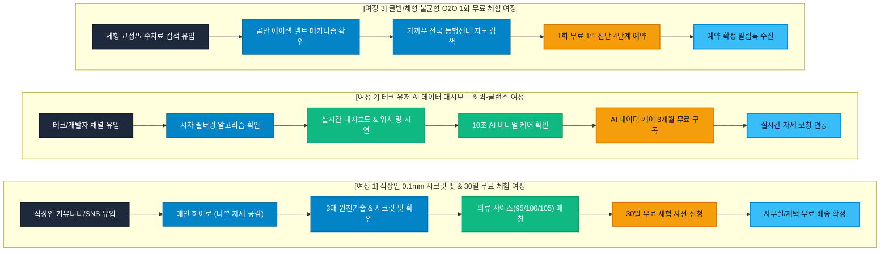

# SEUMIM(스밈) 통합 웹사이트 사이트맵 명세서 (가상클라이언트 1: 스밈 박서준 총괄)

## 1. 프로젝트 개요

- **프로젝트명**: 스밈(SEUMIM) 통합형 스마트 홈케어 체형 교정 플랫폼 데스크톱 웹사이트
- **브랜드명 / 총괄**: 스밈 (SEUMIM) / 박서준 기획총괄
- **비즈니스 모델**: HW 판매(3대 시그니처) + SW 구독(AI 미니멀 케어) + O2O 오프라인 센터 3중 선순환 모델
- **핵심 목표**: 하드웨어 사전 예약 유도, AI 미니멀 케어 앱 3개월 무료 구독 모집, 오프라인 제휴 교정 센터 1회 무료 체험권 예약 접수
- **적용 매체**: 데스크톱 웹사이트 메인페이지 및 연동 웹 서비스 (모바일 반응형 연동 원칙 포함)

---

## 2. 설계 근거 및 핵심 사용자 목표

### (1) 설계 근거 (가상클라이언트 1 분석 반영)
1. **자세 인지 불능 극복**: 직장인 82.3%가 업무 몰입 시 나쁜 자세를 인지하지 못하므로, 메인페이지 최상단에 척추 질환 현실 통계 및 바른 자세 밸런스 점수를 직관적으로 배치함.
2. **오알림 스트레스 차단**: 시중 센서의 진동 오작동 불만을 해소하기 위해 '시차 필터링 알고리즘' 및 '유연 전도성 센서 섬유' 스펙을 독립 기술 섹션으로 노출.
3. **구매 실패 방지**: 모호한 S/M/L 표기 대신 상의 95/100 등 의류 연계 정밀 사이즈 매칭 UI/팝업 제공.
4. **O2O 융합 케어 동선**: 온라인 HW/SW 소개에 그치지 않고, 1회 무료 1:1 체형 진단 오프라인 센터 예약 폼을 4단계 이내로 전면 배치하여 전환율 극대화.

### (2) 핵심 사용자 목표 (User Goals)
- **Goal 1 (비회원/신규 직장인)**: 0.1mm 초슬림 시크릿 핏과 통계 데이터를 확인하고 30일 무료 체험 및 사전 예약을 완료한다.
- **Goal 2 (테크/데이터 유저)**: 실시간 다크모드 대시보드 및 스마트워치 퀵-글랜스(Quick-Glance) UI를 확인하고 AI 데이터 케어를 구독한다.
- **Goal 3 (체형 불균형 사용자)**: 위치 기반 가까운 오프라인 제휴 센터를 검색하고 1:1 체형 진단 1회 무료 체험을 접수한다.

---

## 3. 전역 내비게이션 구조 (Navigation Systems)

### (1) GNB (Global Navigation Bar - 상단 고정 헤더)
- 브랜드 로고 | 1.0 브랜드 | 2.0 시그니처 HW | 3.0 AI 데이터 케어 | 4.0 오프라인 동행센터 | 5.0 혜택 & 체험 | [CTA: 30일 무료 체험] | [로그인/마이페이지 `[가정]`]

### (2) Utility Bar (상단 우측 영역)
- [비회원 상태]: 로그인 `[가정]`, 회원가입 `[가정]`, 고객센터
- [회원 상태]: 마이페이지 `[가정]`, 1:1 예약 내역 `[가정]`, 로그아웃 `[가정]`

### (3) FNB (Footer Navigation Bar - 하단 푸터)
- 기업 기본 정보 (상호, 대표자, 사업자등록번호, 주소, CS 센터)
- 약관 링크 (이용약관, 개인정보처리방침, 환불/반품 정책)
- SNS 링크 (인스타그램, 블라인드, 와디즈, 카카오톡 채널)

---

## 4. 계층형 사이트맵 (Hierarchical Sitemap)

```text
스밈(SEUMIM) 웹사이트
├─ 0.0 메인페이지 (Main Landing Page)
│  ├─ 0.1 히어로 섹션 (브랜드 슬로건 & 메인 CTA)
│  ├─ 0.2 직장인 척추 질환 통계 & 자세 인지 불능 현실
│  ├─ 0.3 스밈 3대 원천 기술 (전도성 센서 / 시차 필터링 / 탄성 복원)
│  ├─ 0.4 3대 시그니처 HW 라인업 (어깨 밴드 / 척추 조끼 / 골반 벨트)
│  ├─ 0.5 0.1mm 초슬림 시크릿 착용 핏 & 비주얼
│  ├─ 0.6 AI 데이터 대시보드 & 스마트워치 퀵-글랜스 UI
│  ├─ 0.7 앉은 자리 10초 AI 미니멀 케어 루틴
│  ├─ 0.8 오프라인 동행센터 1회 무료 체험권 & 지점 검색
│  └─ 0.9 직장인 찐후기 & 사전 신청 하단 CTA
│
├─ 1.0 브랜드 (Brand Story)
│  ├─ 1.1 브랜드 철학 (Effort-Free 웰니스)
│  ├─ 1.2 2030 척추 질환 통계 리포트
│  └─ 1.3 3대 원천 기술 명세 (센서 섬유 / 알고리즘 / 구조공학)
│
├─ 2.0 시그니처 HW (Products)
│  ├─ 2.1 어깨 & 거북목 프리미엄 밴드 (0.1mm 시크릿 핏)
│  ├─ 2.2 스마트 척추 정렬 가디건 조끼 (탄성 프레임)
│  ├─ 2.3 골반 수평 유지 에어셀 벨트 (물리 넛지)
│  └─ 2.4 의류 연계 정밀 사이즈 가이드 (95/100/105) [모달/팝업]
│
├─ 3.0 AI 데이터 케어 (AI & App Care)
│  ├─ 3.1 다크모드 실시간 자세 대시보드 (웹/모바일 연동)
│  ├─ 3.2 스마트워치 퀵-글랜스 링 UI
│  └─ 3.3 앉은 자리 10초 AI 미니멀 릴렉스 루틴 안내
│
├─ 4.0 오프라인 동행센터 (O2O Center)
│  ├─ 4.1 위치 기반 전국 제휴 지점 지도 검색
│  ├─ 4.2 1회 무료 체형 진단 4단계 예약 신청 [모달/팝업]
│  └─ 4.3 예약 완료 및 SMS 안내 [가정]
│
├─ 5.0 혜택 & 체험 (Offer & Review)
│  ├─ 5.1 직장인 & 테크 유저 찐후기 갤러리
│  ├─ 5.2 30일 무료 체험 및 사전 신청 폼 [모달/팝업]
│  └─ 5.3 자주 묻는 질문 (FAQ 아코디언)
│
├─ 6.0 회원 서비스 [가정]
│  ├─ 6.1 로그인 / 회원가입 [가정]
│  └─ 6.2 마이페이지 (체험 신청 내역 / 구독 관리) [가정]
│
└─ 9.0 예외 및 시스템 페이지 [가정]
   ├─ 9.1 404 Not Found (페이지를 찾을 수 없음) [가정]
   ├─ 9.2 접근 권한 제한 페이지 [가정]
   └─ 9.3 시스템 정기 점검 안내 페이지 [가정]
```

---

## 5. 페이지별 목적, 핵심 콘텐츠, 주요 기능, 연결 페이지 표

| 페이지 ID | 뎁스 | 페이지명 | 주요 목적 | 핵심 콘텐츠 | 주요 기능 | 연결 페이지 |
|:---:|:---:|:---|:---|:---|:---|:---|
| **P-0.0** | 1차 | 메인 랜딩페이지 | 핵심 브랜드 가치 전달 및 30일 체험/예약 전환 | 슬로건, 척추 통계, 3대 원천기술, HW 라인업, AI 대시보드, O2O 검색 | Floating Sticky CTA, 비포/애프터 슬라이더, 퀵-글랜스 UI | P-1.0 ~ P-5.0 |
| **P-1.0** | 2차 | 브랜드 스토리 | 브랜드 철학 및 원천 기술 신뢰 형성 | Effort-Free 슬로건, 40.4% 병원 시간 부족 통계, 3대 원천기술 | 기술 3D 매크로 뷰 호버, 3중 선순환 모델 인포그래픽 | P-0.0, P-2.0 |
| **P-2.0** | 2차 | 시그니처 HW | 3대 교정 하드웨어 라인업 상세 안내 | 어깨 밴드, 척추 조끼, 골반 벨트 상세 룩북 & 스펙 | 제품 탭 전환, 0.1mm 시크릿 핏 투명도 조절 UI | P-2.4, P-5.2 |
| **P-2.4** | 3차 | 의류 연계 사이즈 가이드 | 구매 실패 방지를 위한 사이즈 맞춤 가이드 | 상의 95/100/105 등 의류 기준 정밀 규격표 | 사이즈 자동 추천 팝업/UI, 신체 측정 가이드 | P-2.0, P-5.2 |
| **P-3.0** | 2차 | AI 데이터 케어 | SW 구독 서비스 소개 및 기술 신뢰 확보 | 다크모드 대시보드 시연, 10초 AI 미니멀 릴렉스 루틴 | 실시간 자세 점수 원형 게이지 UI, 워치 링 UI 시연 | P-0.0, P-5.2 |
| **P-4.0** | 2차 | 오프라인 동행센터 | O2O 오프라인 지점 검색 및 1회 무료 체험 유도 | 전국 제휴 교정 센터 위치, 1:1 진단 절차, 매니저 프로필 | 위치 기반 지도 API 검색 UI, 4단계 예약 신청 팝업 | P-4.2, P-0.0 |
| **P-4.2** | 3차 | 1회 무료 체험 4단계 예약 | 1회 무료 오프라인 체형 진단 접수 | 지점 선택, 날짜/시간, 사용자 기본 정보, 접수 확인 | 4단계 Wizard 예약 폼 UI, SMS 자동 발송 `[가정]` | P-4.0, P-4.3 |
| **P-4.3** | 3차 | 예약 완료 및 안내 `[가정]` | 예약 확정 안내 및 방문 주의사항 전달 | 예약 일시, 지점 위치 지도, 준비사항 안내 | 카카오톡/SMS 알림톡 전송 `[가정]`, 예약 변경 | P-0.0, P-6.2 |
| **P-5.0** | 2차 | 혜택 & 체험 | 찐후기 검증 및 30일 무료 체험 최종 신청 | 실사용자 찐후기, FAQ 아코디언, 30일 시착 보장 배지 | FAQ 아코디언 토글, 30일 무료 체험 신청 | P-5.2, P-0.0 |
| **P-5.2** | 3차 | 30일 무료 체험 사전 신청 | 사전 예약 접수 및 30일 시착 체험 신청 | 신청자 정보 입력, 제품 선택, 주소 입력 | 1-Click 사전 신청 폼, 의류 사이즈 매칭 UI | P-5.0, P-0.0 |
| **P-6.1** | 2차 | 로그인 / 회원가입 `[가정]` | 회원 인증 및 개인화 서비스 제공 | 간편 로그인 (카카오/네이버/구글), 회원가입 | 1-Click SNS 간편 인증 `[가정]` | P-0.0, P-6.2 |
| **P-6.2** | 2차 | 마이페이지 `[가정]` | 개인 데이터 및 예약/구독 현황 관리 | 실시간 자세 데이터 리포트, 체험 신청 및 예약 내역 | 데이터 다운로드 `[가정]`, 예약 변경/취소 `[가정]` | P-4.2, P-5.2 |
| **P-9.1** | 2차 | 404 Not Found `[가정]` | 잘못된 URL 접근 시 안내 | 에러 안내 메시지, 메인 바로가기 버튼 | 메인 이동 버튼, 고객센터 바로가기 `[가정]` | P-0.0 |

---

## 6. Mermaid Flowchart 사이트맵

```mermaid
flowchart TD
    %% 노드 스타일 정의
    classDef main fill:#1E293B,stroke:#0F172A,stroke-width:2px,color:#FFFFFF,font-weight:bold;
    classDef depth1 fill:#0284C7,stroke:#0369A1,stroke-width:2px,color:#FFFFFF;
    classDef depth2 fill:#38BDF8,stroke:#0284C7,stroke-width:1px,color:#0F172A;
    classDef modal fill:#F59E0B,stroke:#D97706,stroke-width:1px,color:#0F172A;
    classDef assumed fill:#64748B,stroke:#475569,stroke-width:1px,color:#FFFFFF,stroke-dasharray: 5 5;

    %% 메인페이지
    MAIN["0.0 메인 랜딩페이지 (P-0.0)"]:::main

    %% 1차 메뉴 (GNB)
    BRAND["1.0 브랜드 스토리 (P-1.0)"]:::depth1
    PRODUCT["2.0 시그니처 HW (P-2.0)"]:::depth1
    AIDATA["3.0 AI 데이터 케어 (P-3.0)"]:::depth1
    O2O["4.0 오프라인 동행센터 (P-4.0)"]:::depth1
    OFFER["5.0 혜택 & 체험 (P-5.0)"]:::depth1
    MYPAGE["6.0 회원 서비스 [가정] (P-6.0)"]:::assumed
    EXCEPT["9.0 예외 페이지 [가정] (P-9.0)"]:::assumed

    MAIN --> BRAND
    MAIN --> PRODUCT
    MAIN --> AIDATA
    MAIN --> O2O
    MAIN --> OFFER
    MAIN -.-> MYPAGE
    MAIN -.-> EXCEPT

    %% 브랜드 하위
    BRAND --> B1["1.1 브랜드 철학"]:::depth2
    BRAND --> B2["1.2 척추 질환 통계"]:::depth2
    BRAND --> B3["1.3 3대 원천 기술"]:::depth2

    %% 하드웨어 하위
    PRODUCT --> P1["2.1 어깨 & 거북목 밴드"]:::depth2
    PRODUCT --> P2["2.2 스마트 척추 조끼"]:::depth2
    PRODUCT --> P3["2.3 골반 에어셀 벨트"]:::depth2
    PRODUCT --> P4["2.4 정밀 사이즈 가이드 [모달]"]:::modal

    %% AI 데이터 하위
    AIDATA --> A1["3.1 다크모드 대시보드"]:::depth2
    AIDATA --> A2["3.2 스마트워치 퀵-글랜스 UI"]:::depth2
    AIDATA --> A3["3.3 10초 AI 미니멀 케어"]:::depth2

    %% O2O 동행센터 하위
    O2O --> O1["4.1 위치 기반 지도 검색"]:::depth2
    O2O --> O2["4.2 1회 무료 체험 4단계 예약 [모달]"]:::modal
    O2 --> O3["4.3 예약 완료 안내 [가정]"]:::assumed

    %% 혜택 및 체험 하위
    OFFER --> F1["5.1 직장인/테크 찐후기"]:::depth2
    OFFER --> F2["5.2 30일 무료 체험 신청 [모달]"]:::modal
    OFFER --> F3["5.3 FAQ 아코디언"]:::depth2

    %% 회원 서비스 하위 [가정]
    MYPAGE -.-> M1["6.1 로그인/회원가입 [가정]"]:::assumed
    MYPAGE -.-> M2["6.2 마이페이지 [가정]"]:::assumed

    %% 예외 페이지 [가정]
    EXCEPT -.-> E1["9.1 404 Not Found [가정]"]:::assumed
    EXCEPT -.-> E2["9.2 시스템 점검 안내 [가정]"]:::assumed

    %% 주요 사용자 여정 (User Journey Links)
    P4 --> F2
    O2 --> O3
    F2 --> MAIN
```



---

## 7. 핵심 사용자 전환 여정 (Key User Conversion Journeys)



### 📌 여정별 상세 시나리오

1. **여정 1 (직장인 0.1mm 시크릿 핏 & 30일 무료 체험 여정 - 메인 전환)**:
   - 블라인드 또는 인스타그램 유입 ➔ 메인페이지에서 직장인 82.3% 자세 인지 불능 통계 공감 ➔ 셔츠 안 0.1mm 시크릿 핏 확인 ➔ 상의 사이즈 매칭 ➔ 30일 무료 체험 사전 신청 완료.
2. **여정 2 (테크 유저 AI 데이터 대시보드 & 퀵-글랜스 여정 - SW 구독)**:
   - 깃허브 또는 테크 블로그 유입 ➔ 진동 오알림 없는 시차 필터링 알고리즘 확인 ➔ 다크모드 대시보드 및 스마트워치 퀵-글랜스 링 조작 ➔ 3개월 AI 무료 구독 신청 ➔ 마이페이지 연동.
3. **여정 3 (골반/체형 불균형 O2O 1회 무료 체험 여정 - 오프라인 연계)**:
   - 체형 교정 검색 유입 ➔ 골반 수평 에어셀 벨트 원리 확인 ➔ 위치 기반 가까운 오프라인 동행센터 검색 ➔ 4단계 Wizard로 1회 무료 진단 예약 ➔ 카카오 알림톡 수신 및 지점 방문.

