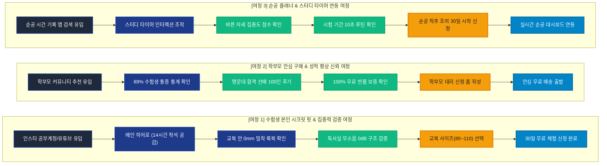

# SEUMIM(스밈) 고3 수험생 웹사이트 사이트맵 명세서 (가상클라이언트 2: 김도윤)

## 1. 프로젝트 개요

- **프로젝트명**: 스밈(SEUMIM) 고3 수험생 집중력 강화 척추 조끼 & 스터디 플래너 연동 웹 플랫폼
- **브랜드명 / 타깃**: 스밈 (SEUMIM) / 김도윤 (19세, 고3 자연계열 수험생)
- **비즈니스 모델**: 수험생 전용 0.1mm 시크릿 척추 조끼 판매 + 순공 플래너 AI 연동 + 학부모 안심 30일 무료 체험 프로모션
- **핵심 목표**: 하루 14시간 착석 공부 중 목/어깨 결림 해결, 교복 안 0mm 밀착 착용감 제공, 학부모 30일 무료 체험 신청 1만 건 달성
- **핵심 사용자층**: 수능/내신 대비 고등학생, 재수생, 공시생 및 자녀의 바른 자세와 집중력을 지원하려는 학부모
- **적용 매체**: 반응형 데스크톱 웹 플랫폼 (스터디 타이머 인터랙션 및 일간 집중도 대시보드 포함)

---

## 2. 설계 근거 및 핵심 사용자 목표

### (1) 설계 근거 (가상클라이언트 2 분석 반영)
1. **교복/체육복 안 0.1mm 초슬림 시크릿 핏**: 또래 시선을 극도로 신경 쓰는 청소년을 위해 교복 셔츠나 후드티 안에 입어도 봉제선과 핏이 전혀 드러나지 않는 초극세사 스킨 메쉬 룩북을 전면 배치.
2. **독서실/스터디카페 소음 0dB 무소음 탄성 메커니즘**: 진동이나 알람 소리가 금지된 조용한 스터디 환경에 맞추어, 소음 없이 물리적으로 척추를 지지하는 바이오 힌지 탄성 프레임 스펙 강조.
3. **순공 시간 & 바른 자세 집중력 점수 시각화**: 착석 시간 대비 척추 각도 유지율을 수험생 친화적인 '순공 집중력 스코어'로 전환하여 학업 동기 부여.
4. **학부모 안심 구매를 위한 30일 무상 시착 및 100% 무료 반품 보증**: 자녀 체형에 맞지 않거나 효과가 없을 경우 전액 환불/무료 반품 가능한 골드 배지 노출로 결제 전환율 극대화.

### (2) 핵심 사용자 목표 (User Goals)
- **Goal 1 (수험생 본인)**: 교복 셔츠 착용 시 0mm 밀착 비침 0% 룩북과 무소음 탄성 지지 원리를 확인한다.
- **Goal 2 (학부모/보호자)**: 89% 수험생 목/어깨 통증 통계와 100인 의대/명문대 합격생 선배 후기를 검증한다.
- **Goal 3 (구매/체험 신청자)**: 교복 상의 사이즈(85~110)를 매칭하고 30일 무료 체험 사전 신청을 완료한다.

---

## 3. 전역 내비게이션 구조 (Navigation Systems)

### (1) GNB (Global Navigation Bar - 상단 고정 헤더)
- 브랜드 로고 | 1.0 수험생 조끼 | 2.0 무소음 테크 | 3.0 순공 대시보드 | 4.0 30일 무료 체험 | 5.0 학부모 후기 | [CTA: 30일 무료 체험] | [로그인/조회 `[가정]`]

### (2) Utility & Floating Study Bar
- [상단 우측]: ⏰ 오늘 순공 타이머 퀵뷰 | 교복 사이즈 상담 톡 | 고객센터
- [하단 플로팅 바]: "🎒 수능 D-Day 대비! 30일간 집/독서실에서 무료로 입어보세요 [100% 무료 반품]" 1-Click 바로 신청

### (3) FNB (Footer Navigation Bar - 하단 푸터)
- 기업 기본 정보 (상호, 대표자, 사업자등록번호, 주소, CS 센터 080 무료)
- 30일 안심 무료 반품/교환 규정, 청소년 안전 인증서, 개인정보처리방침
- SNS 링크 (유튜브 입시 채널, 인스타그램 공부계정, 카카오톡 채널)

---

## 4. 계층형 사이트맵 (Hierarchical Sitemap)

```text
스밈(SEUMIM) 수험생 척추 조끼 웹사이트
├─ 0.0 메인 랜딩페이지 (Main Landing Page)
│  ├─ 0.1 수험생 집중력 히어로 ("순공 14시간, 무너지지 않는 수험생의 척추 파트너")
│  ├─ 0.2 고3 수험생 89% 목/어깨 결림 및 집중력 저하 현실 통계
│  ├─ 0.3 교복/체육복 안 0.1mm 초슬림 시크릿 착용 핏 룩북 갤러리
│  ├─ 0.4 독서실 무소음 0dB 바이오 힌지 탄성 지지 메커니즘 3D 모식도
│  ├─ 0.5 교복 상의 기준(85~110) 수험생 정밀 사이즈 가이드 [모달/팝업]
│  ├─ 0.6 순공 시간 연동 바른 자세 집중력 대시보드 시연
│  ├─ 0.7 서울대/의대 합격생 100인 및 학부모 찐 실착 포토 후기
│  ├─ 0.8 30일 무료 시착 체험 & 100% 무료 반품 보장 안심 배지
│  └─ 0.9 30일 무료 체험 사전 신청 폼 & 하단 CTA [모달/팝업]
│
├─ 1.0 수험생 조끼 (Student Vest)
│  ├─ 1.1 0.1mm 초극세사 스킨 메쉬 사양 및 사계절 통기성
│  ├─ 1.2 교복 셔츠 / 후드티 / 체육복 착용 핏 비교 화보
│  └─ 1.3 교복 상의 기준 정밀 사이즈(85~110) 가이드 [모달/팝업]
│
├─ 2.0 무소음 테크 (Silent Tech)
│  ├─ 2.1 독서실 소음 0dB 물리적 탄성 복원 구조공학
│  ├─ 2.2 장시간 숙임 시 목/어깨 근전도 38% 이완 시험 성적서
│  └─ 2.3 무진동 / 무배터리 친환경 반영구 프레임 명세
│
├─ 3.0 순공 대시보드 (Study Dashboard)
│  ├─ 3.1 스터디 타이머 연동 실시간 자세 유지율 시연
│  ├─ 3.2 일간/주간 순공 집중력 점수 리포트
│  └─ 3.3 시험 기간 10초 목/어깨 스트레칭 루틴
│
├─ 4.0 30일 무료 체험 (Free Trial)
│  ├─ 4.1 30일간 독서실/집에서 실착해보는 무료 체험 혜택 안내
│  ├─ 4.2 100% 무료 반품 및 왕복 배송비 0원 안심 보증
│  ├─ 4.3 30일 무료 체험 사전 신청 폼 [모달/팝업]
│  └─ 4.4 신청 완료 및 배송 일정 SMS 안내 [가정]
│
├─ 5.0 학부모 후기 (Parent Reviews)
│  ├─ 5.1 명문대 합격 선배 100인의 공부 집중력 찐후기
│  ├─ 5.2 강남/대치동 학부모 커뮤니티 추천 인터뷰
│  └─ 5.3 자주 묻는 질문 (FAQ 아코디언)
│
├─ 6.0 회원 서비스 [가정]
│  ├─ 6.1 카카오/네이버 간편 로그인 [가정]
│  └─ 6.2 마이페이지 (체험 신청 내역 및 순공 리포트 연동) [가정]
│
└─ 9.0 예외 및 시스템 페이지 [가정]
   ├─ 9.1 404 Not Found (페이지를 찾을 수 없음) [가정]
   └─ 9.2 시스템 정기 점검 안내 페이지 [가정]
```

---

## 5. 페이지별 목적, 핵심 콘텐츠, 주요 기능, 연결 페이지 표

| 페이지 ID | 뎁스 | 페이지명 | 주요 목적 | 핵심 콘텐츠 | 주요 기능 | 연결 페이지 |
|:---:|:---:|:---|:---|:---|:---|:---|
| **P-0.0** | 1차 | 메인 랜딩페이지 | 수험생/학부모 공감 형성 및 30일 무료 체험 전환 | 집중력 히어로, 착석 통계, 시크릿 핏, 무소음 힌지, 순공 대시보드, 100인 후기 | Floating Sticky Bar, 비침 비교 슬라이더, 타이머 시연, 신청 폼 | P-1.0 ~ P-5.0 |
| **P-1.0** | 2차 | 수험생 조끼 | 교복 안 0mm 밀착 및 사계절 쾌적성 검증 | 0.1mm 스킨 메쉬 룩북, 교복 착용 비포애프터 | 360도 룩북 뷰어, 비침 비교 인터랙션 | P-0.0, P-1.3 |
| **P-1.3** | 3차 | 교복 정밀 사이즈 가이드 | 구매 실패 방지를 위한 사이즈 맞춤 가이드 | 교복 상의(85~110) 기준 정밀 규격표 | 사이즈 자동 추천 팝업 UI | P-1.0, P-4.3 |
| **P-2.0** | 2차 | 무소음 테크 | 독서실 무소음 및 의학적 피로 완화 입증 | 0dB 탄성 복원 구조, 근전도 38% 이완 성적서 | 3D 탄성 프레임 작동 시뮬레이터 | P-0.0, P-4.3 |
| **P-3.0** | 2차 | 순공 대시보드 | 학습 시간과 자세 결합을 통한 가치 증명 | 스터디 타이머, 순공 집중력 스코어, 10초 루틴 | 실시간 순공 타이머 UI, 집중도 게이지 | P-0.0, P-4.3 |
| **P-4.0** | 2차 | 30일 무료 체험 | 학부모 안심 구매 심리 형성 및 예약 유도 | 30일 무료 시착 안내, 100% 무료 반품 정책 | 30일 무료 체험 신청 모달 호출 | P-4.3, P-0.0 |
| **P-4.3** | 3차 | 30일 무료 체험 신청 폼 | 30일 무상 시착 사전 접수 완료 | 학생 정보, 교복 사이즈, 배송지 주소 입력 | 1-Click 간편 신청 폼 | P-4.4, P-0.0 |
| **P-4.4** | 3차 | 신청 완료 안내 `[가정]` | 접수 확정 안내 및 안심 반품 일정 전달 | 주문 번호, 배송 예정일, 무료 반품 안내 | 카카오 알림톡 발송 `[가정]` | P-0.0, P-6.2 |
| **P-5.0** | 2차 | 학부모 후기 | 합격 선배 및 학부모 찐 경험 검증 | 100인 명문대생 후기, 대치동 맘 인터뷰, FAQ | 후기 필터링 뷰어, FAQ 아코디언 토글 | P-0.0, P-4.3 |
| **P-6.1** | 2차 | 로그인/회원가입 `[가정]` | 회원 인증 및 학습 데이터 연동 | 간편 SNS 로그인 (카카오/네이버) | 1-Click 간편 인증 `[가정]` | P-0.0, P-6.2 |
| **P-6.2** | 2차 | 마이페이지 `[가정]` | 무료 체험 배송 조회 및 순공 리포트 관리 | 체험 진행 현황, 일간 순공 집중력 리포트 | 1-Click 반품 신청 `[가정]` | P-4.3, P-4.4 |
| **P-9.1** | 2차 | 404 Not Found `[가정]` | 에러 대응 | 에러 안내 메시지, 메인 이동 | 메인 바로가기 버튼 | P-0.0 |

---

## 6. Mermaid Flowchart 사이트맵

```mermaid
flowchart TD
    %% 노드 스타일 정의
    classDef main fill:#1E293B,stroke:#1E3A8A,stroke-width:2px,color:#FFFFFF,font-weight:bold;
    classDef depth1 fill:#1E3A8A,stroke:#1E40AF,stroke-width:2px,color:#FFFFFF;
    classDef depth2 fill:#DBEAFE,stroke:#93C5FD,stroke-width:1px,color:#1E293B;
    classDef modal fill:#F59E0B,stroke:#D97706,stroke-width:1px,color:#0F172A;
    classDef study fill:#10B981,stroke:#059669,stroke-width:1.5px,color:#FFFFFF;
    classDef assumed fill:#64748B,stroke:#475569,stroke-width:1px,color:#FFFFFF,stroke-dasharray: 5 5;

    %% 메인페이지
    MAIN["0.0 수험생 메인 랜딩 (P-0.0)"]:::main

    %% 1차 메뉴 (GNB)
    VEST["1.0 수험생 조끼 (P-1.0)"]:::depth1
    TECH["2.0 무소음 테크 (P-2.0)"]:::depth1
    STUDY["3.0 순공 대시보드 (P-3.0)"]:::study
    TRIAL["4.0 30일 무료 체험 (P-4.0)"]:::depth1
    REVIEW["5.0 학부모 후기 (P-5.0)"]:::depth1
    MYPAGE["6.0 회원 서비스 [가정] (P-6.0)"]:::assumed
    EXCEPT["9.0 예외 페이지 [가정] (P-9.0)"]:::assumed

    MAIN --> VEST
    MAIN --> TECH
    MAIN --> STUDY
    MAIN --> TRIAL
    MAIN --> REVIEW
    MAIN -.-> MYPAGE
    MAIN -.-> EXCEPT

    %% 수험생 조끼 하위
    VEST --> V1["1.1 0.1mm 스킨 메쉬 사양"]:::depth2
    VEST --> V2["1.2 교복/체육복 착용 핏"]:::depth2
    VEST --> V3["1.3 교복 정밀 사이즈 [모달]"]:::modal

    %% 무소음 테크 하위
    TECH --> T1["2.1 독서실 소음 0dB 구조"]:::depth2
    TECH --> T2["2.2 근전도 38% 이완 성적서"]:::depth2
    TECH --> T3["2.3 무진동/반영구 프레임"]:::depth2

    %% 순공 대시보드 하위
    STUDY --> S1["3.1 스터디 타이머 연동"]:::depth2
    STUDY --> S2["3.2 순공 집중력 점수 리포트"]:::depth2
    STUDY --> S3["3.3 10초 릴렉스 루틴"]:::depth2

    %% 30일 무료 체험 하위
    TRIAL --> F1["4.1 무료 시착 혜택 안내"]:::depth2
    TRIAL --> F2["4.2 100% 무료 반품 약관"]:::depth2
    TRIAL --> F3["4.3 30일 무료 체험 신청 [모달]"]:::modal
    F3 --> F4["4.4 신청 완료 안내 [가정]"]:::assumed

    %% 학부모 후기 하위
    REVIEW --> R1["5.1 100인 합격생 후기"]:::depth2
    REVIEW --> R2["5.2 대치동 학부모 인터뷰"]:::depth2
    REVIEW --> R3["5.3 FAQ 아코디언"]:::depth2

    %% 회원 서비스 및 예외 [가정]
    MYPAGE -.-> M1["6.1 간편 로그인 [가정]"]:::assumed
    MYPAGE -.-> M2["6.2 마이페이지 [가정]"]:::assumed
    EXCEPT -.-> E1["9.1 404 Not Found [가정]"]:::assumed
    EXCEPT -.-> E2["9.2 시스템 점검 안내 [가정]"]:::assumed

    %% 주요 구매 동선
    V3 --> F3
    T1 --> F3
    S1 --> F3
    F3 --> F4
```



---

## 7. 핵심 사용자 전환 여정 (Key User Conversion Journeys)



### 📌 여정별 상세 시나리오

1. **여정 1 (수험생 본인 시크릿 핏 & 집중력 검증 여정 - 메인 전환)**:
   - 인스타그램 공스타 또는 유튜브 수험생 브이로그 접점 ➔ 메인페이지에서 하루 14시간 착석 목/어깨 뻐근함 공감 ➔ 교복 셔츠/후드티 안 0.1mm 티 안 나는 룩북 확인 ➔ 독서실에서 눈치 안 보이는 0dB 무소음 탄성 힌지 확인 ➔ 교복 상의 사이즈 선택 ➔ 30일 무료 체험 신청 완료.
2. **여정 2 (학부모 안심 구매 & 성적 향상 신뢰 여정 - 구매력 전환)**:
   - 강남/대치동 맘카페 및 입시 커뮤니티 유입 ➔ 청소년 척추 질환 통계 및 시험 성적서 확인 ➔ 서울대/의대 합격생 100인의 실착 후기 검증 ➔ 30일간 입어보고 불만족 시 왕복 배송비 0원 100% 무료 반품 보장 확인 ➔ 학부모가 안심하고 자녀 대신 사전 체험 신청.
3. **여정 3 (순공 플래너 & 스터디 타이머 연동 여정 - 학습 동기부여)**:
   - 열품타 등 스터디 타이머 앱 사용자 유입 ➔ 메인 스터디 타이머 UI 시연 조작 ➔ 자세 점수와 집중력 상관관계 리포트 확인 ➔ 10초 스트레칭 루틴 확인 ➔ 수험생 조끼 30일 시착 신청 및 마이페이지 대시보드 연동.
