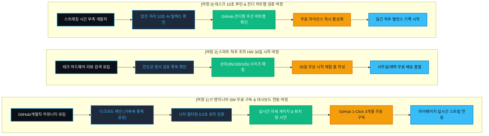

# SEUMIM(스밈) 테크 개발자 웹사이트 사이트맵 명세서 (가상클라이언트 3: 강민우)

## 1. 프로젝트 개요

- **프로젝트명**: 스밈(SEUMIM) 테크 개발자 실시간 다크모드 대시보드 & 스마트 척추 정렬 조끼 웹 플랫폼
- **브랜드명 / 타깃**: 스밈 (SEUMIM) / 강민우 (31세, 풀스택 IT 개발자)
- **비즈니스 모델**: 전도성 센서 스마트 조끼 HW 판매 + AI 미니멀 케어 SW 3개월 무료 라이선스 구독 + 개발자 전용 대시보드
- **핵심 목표**: 코딩 집중 중 거북목/디스크 방지, 타이핑/음료 섭취 시 오알림 0건 시차 필터링 검증, GitHub 1-Click 3개월 무료 구독 1만 명 모집
- **핵심 사용자층**: 일평균 10시간 이상 코딩 및 모니터 주시 환경의 소프트웨어 엔지니어, 데이터 분석가, IT 프로덕트 빌더
- **적용 매체**: 풀 다크모드(#0B0F17) 기반 고밀도 반응형 데스크톱 웹 플랫폼 (스마트워치 퀵-글랜스 링 UI 및 Web Bluetooth 연동 포함)

---

## 2. 설계 근거 및 핵심 사용자 목표

### (1) 설계 근거 (가상클라이언트 3 분석 반영)
1. **오알림 스트레스 ➔ 0.5초 단순 숙임 무시 시차 필터링 알고리즘**: 시중 센서의 무차별 진동으로 인한 코딩 몰입 붕괴를 해결하기 위해, 타이핑/기지개/물 마심 동작을 정상 패턴으로 분류하는 필터링 기술 섹션을 전면 배치.
2. **눈의 피로를 최소화하는 고밀도 다크모드(#0B0F17) 콘솔 UI**: 야간 및 어두운 개발 환경에 맞추어 사이버 블루(#38BDF8)와 터미널 그린(#10B981)을 채택한 IDE 스타일 비주얼 구축.
3. **작업 흐름을 끊지 않는 스마트워치 3초 퀵-글랜스 링 UI**: 복잡한 앱 진입 없이 손목을 살짝 들어 3초 만에 오늘의 척추 밸런스를 확인하는 미니멀 인터랙션 제공.
4. **상의(95/100/105) 기준 정밀 하드웨어 사이즈 가이드 & 30일 시착 보증**: 모호한 규격 대신 의류 사이즈 매칭을 지원하고 30일간 사무실/재택에서 입어보는 무상 체험 제공.

### (2) 핵심 사용자 목표 (User Goals)
- **Goal 1 (IT 엔지니어 본인)**: 시차 필터링 오알림 차단 로직과 다크모드 실시간 자세 점수 게이지 시연을 확인한다.
- **Goal 2 (테크 얼리어답터)**: 전도성 센서 섬유 사양과 3초 퀵-글랜스 스마트워치 연동성을 검증한다.
- **Goal 3 (무료 구독 및 체험자)**: GitHub 계정 1-Click으로 AI 케어 3개월 무료 라이선스를 활성화하고 척추 조끼 30일 시착을 신청한다.

---

## 3. 전역 내비게이션 구조 (Navigation Systems)

### (1) GNB (Global Navigation Bar - 상단 고정 헤더)
- 브랜드 다크 로고 | 1.0 척추 조끼 HW | 2.0 시차 필터링 테크 | 3.0 AI 데이터 대시보드 | 4.0 무료 체험/구독 | 5.0 데스크 케어 | [CTA: 3개월 무료 구독] | [GitHub 로그인 `[가정]`]

### (2) Utility & Console Bar
- [상단 우측]: ⚡ API 상태 정상 (Latency 12ms) | GitHub Stars | 개발자 커뮤니티
- [하단 플로팅 바]: "💻 GitHub 로그인 시 AI 미니멀 케어 3개월 라이선스 즉시 무료 발급" 1-Click 바로 시작

### (3) FNB (Footer Navigation Bar - 하단 푸터)
- 기업 기본 정보, 오픈소스 라이선스 명세, API 연동 문서, 30일 무료 반품 정책, CS 센터
- 개발자 SNS (GitHub Org, Discord 개발자 채널, 블라인드 테크 라운지)

---

## 4. 계층형 사이트맵 (Hierarchical Sitemap)

```text
스밈(SEUMIM) 테크 개발자 웹 플랫폼
├─ 0.0 메인 랜딩페이지 (Main Landing Page)
│  ├─ 0.1 다크모드 콘솔 히어로 ("몰입을 방해하지 않는 단 하나의 자세 코칭")
│  ├─ 0.2 IT 개발자 91.2% 거북목 및 만성 척추 질환 통계 리포트
│  ├─ 0.3 오알림 0건 시차 필터링 알고리즘 로직 및 근전도 완화 데이터
│  ├─ 0.4 전도성 센서 섬유 & 0.1mm 시크릿 착용 핏 룩북 갤러리
│  ├─ 0.5 상의(95/100/105) 기준 정밀 하드웨어 사이즈 가이드 [모달/팝업]
│  ├─ 0.6 실시간 자세 점수 원형 게이지 & 3초 퀵-글랜스 워치 링 UI 시연
│  ├─ 0.7 앉은 자리 10초 AI 릴렉스 루틴 & GitHub 잔디형 일간 히트맵
│  ├─ 0.8 30일 무상 시착 & AI 케어 3개월 무료 구독 배지
│  └─ 0.9 GitHub 1-Click 무료 구독 및 30일 시착 신청 폼 [모달/팝업]
│
├─ 1.0 척추 조끼 HW (Smart Vest)
│  ├─ 1.1 유연 전도성 센서 섬유 및 세탁 내구성 스펙
│  ├─ 1.2 슬림핏 맨투맨/후드티 착용 핏 비교 룩북
│  └─ 1.3 남녀 공용 상의 기준(95~110) 정밀 사이즈 가이드 [모달/팝업]
│
├─ 2.0 시차 필터링 테크 (Algorithm)
│  ├─ 2.1 0.5초 단순 숙임 오알림 차단 시계열 알고리즘
│  ├─ 2.2 타이핑 / 물 마심 / 기지개 모션 필터링 벤치마크
│  └─ 2.3 척추 하중 35% 분산 탄성 복원 프레임 구조도
│
├─ 3.0 AI 데이터 대시보드 (AI Dashboard)
│  ├─ 3.1 다크모드 실시간 자세 점수 스트림 시연
│  ├─ 3.2 스마트워치 퀵-글랜스 링 UI 인터랙션
│  └─ 3.3 GitHub 잔디형 주간/월간 척추 밸런스 히트맵
│
├─ 4.0 무료 체험/구독 (Free License & Trial)
│  ├─ 4.1 AI 미니멀 케어 3개월 무료 라이선스 키 발급 안내
│  ├─ 4.2 스마트 조끼 30일 무료 시착 및 100% 무료 반품 약관
│  ├─ 4.3 GitHub / 간편 로그인 무료 신청 폼 [모달/팝업]
│  └─ 4.4 라이선스 키 활성화 및 대시보드 연동 완료 안내 [가정]
│
├─ 5.0 데스크 케어 (Desk Care)
│  ├─ 5.1 코딩 중 앉은 자리 10초 목/어깨 릴렉스 가이드
│  ├─ 5.2 개발자 모니터 높이 & 의자 각도 90도 세팅법
│  └─ 5.3 자주 묻는 기술 질문 (FAQ 아코디언)
│
├─ 6.0 회원 서비스 [가정]
│  ├─ 6.1 GitHub / 구글 OAuth 간편 로그인 [가정]
│  └─ 6.2 마이페이지 (실시간 자세 데이터 스트림 및 API 키 관리) [가정]
│
└─ 9.0 예외 및 시스템 페이지 [가정]
   ├─ 9.1 404 Not Found (페이지를 찾을 수 없음) [가정]
   └─ 9.2 API 서버 정기 점검 안내 페이지 [가정]
```

---

## 5. 페이지별 목적, 핵심 콘텐츠, 주요 기능, 연결 페이지 표

| 페이지 ID | 뎁스 | 페이지명 | 주요 목적 | 핵심 콘텐츠 | 주요 기능 | 연결 페이지 |
|:---:|:---:|:---|:---|:---|:---|:---|
| **P-0.0** | 1차 | 메인 랜딩페이지 | 테크 신뢰 형성 및 3개월 AI 구독/30일 HW 체험 전환 | 다크 히어로, 개발자 통계, 시차 필터링, 대시보드 시연, 워치 링, 잔디 히트맵 | 실시간 게이지 시뮬레이터, GitHub 1-Click 인증, 워치 링 UI | P-1.0 ~ P-5.0 |
| **P-1.0** | 2차 | 척추 조끼 HW | 전도성 센서 섬유 및 세탁 내구성 입증 | 전도성 센서 구조, 맨투맨/후드티 룩북 화보 | 3D 센서 분해도 인터랙션, 사이즈 팝업 호출 | P-0.0, P-1.3 |
| **P-1.3** | 3차 | 하드웨어 사이즈 가이드 | 구매 실패 방지를 위한 사이즈 매칭 안내 | 상의(95/100/105) 기준 정밀 규격표 | 사이즈 자동 추천 팝업 UI | P-1.0, P-4.3 |
| **P-2.0** | 2차 | 시차 필터링 테크 | 오알림 0건의 알고리즘 원리 증명 | 0.5초 필터링 모식도, 타이핑/기지개 동작 데이터 | 인터랙티브 알고리즘 시뮬레이터 | P-0.0, P-3.0 |
| **P-3.0** | 2차 | AI 데이터 대시보드 | 실시간 데이터 코칭 가치 체감 | 다크모드 실시간 점수, 3초 퀵-글랜스 링, 잔디 히트맵 | 실시간 자세 점수 스트리밍 UI, 워치 링 조작 | P-0.0, P-4.3 |
| **P-4.0** | 2차 | 무료 체험/구독 | 3개월 AI 라이선스 및 30일 시착 혜택 안내 | 무료 라이선스 혜택표, 100% 무료 반품 정책 | 1-Click 간편 신청 모달 호출 | P-4.3, P-0.0 |
| **P-4.3** | 3차 | 무료 체험/구독 신청 폼 | 3개월 AI 라이선스 발급 및 HW 시착 접수 | GitHub 인증, 상의 사이즈, 배송지 주소 입력 | 1-Click OAuth 인증 및 신청 폼 | P-4.4, P-0.0 |
| **P-4.4** | 3차 | 라이선스 발급 완료 `[가정]` | 고유 API 키 발급 및 배송 일정 전달 | API Key, 대시보드 연동 URL, 배송 안내 | 마이페이지 대시보드 즉시 이동 `[가정]` | P-0.0, P-6.2 |
| **P-5.0** | 2차 | 데스크 케어 | 개발자 작업 환경 개선 팁 및 FAQ 제공 | 10초 릴렉스 가이드, 모니터 각도 세팅, 기술 FAQ | FAQ 아코디언 토글 | P-0.0, P-4.3 |
| **P-6.1** | 2차 | GitHub 간편 로그인 `[가정]` | 개발자 계정 인증 및 API 권한 연동 | GitHub OAuth 2.0 간편 인증 | 1-Click 인증 `[가정]` | P-0.0, P-6.2 |
| **P-6.2** | 2차 | 마이페이지 `[가정]` | 실시간 자세 데이터 및 구독 라이선스 관리 | 일간/주간 척추 밸런스 잔디 히트맵, API 키 관리 | 데이터 내보내기 (JSON/CSV) `[가정]` | P-4.4 |
| **P-9.1** | 2차 | 404 Not Found `[가정]` | 에러 대응 | 터미널 콘솔형 에러 안내, 메인 복귀 | 메인 바로가기 버튼 | P-0.0 |

---

## 6. Mermaid Flowchart 사이트맵

```mermaid
flowchart TD
    %% 노드 스타일 정의
    classDef main fill:#0B0F17,stroke:#38BDF8,stroke-width:2px,color:#FFFFFF,font-weight:bold;
    classDef depth1 fill:#1E293B,stroke:#0284C7,stroke-width:2px,color:#38BDF8;
    classDef depth2 fill:#1E293B,stroke:#38BDF8,stroke-width:1px,color:#E0F2FE;
    classDef modal fill:#F59E0B,stroke:#D97706,stroke-width:1px,color:#0F172A;
    classDef ai fill:#10B981,stroke:#059669,stroke-width:1.5px,color:#FFFFFF;
    classDef assumed fill:#334155,stroke:#64748B,stroke-width:1px,color:#94A3B8,stroke-dasharray: 5 5;

    %% 메인페이지
    MAIN["0.0 다크모드 메인 랜딩 (P-0.0)"]:::main

    %% 1차 메뉴 (GNB)
    VEST["1.0 척추 조끼 HW (P-1.0)"]:::depth1
    TECH["2.0 시차 필터링 테크 (P-2.0)"]:::depth1
    AIDATA["3.0 AI 데이터 대시보드 (P-3.0)"]:::ai
    TRIAL["4.0 무료 체험/구독 (P-4.0)"]:::depth1
    CARE["5.0 데스크 케어 (P-5.0)"]:::depth1
    MYPAGE["6.0 회원 서비스 [가정] (P-6.0)"]:::assumed
    EXCEPT["9.0 예외 페이지 [가정] (P-9.0)"]:::assumed

    MAIN --> VEST
    MAIN --> TECH
    MAIN --> AIDATA
    MAIN --> TRIAL
    MAIN --> CARE
    MAIN -.-> MYPAGE
    MAIN -.-> EXCEPT

    %% 척추 조끼 HW 하위
    VEST --> V1["1.1 전도성 센서 섬유"]:::depth2
    VEST --> V2["1.2 맨투맨/후드티 룩북"]:::depth2
    VEST --> V3["1.3 정밀 사이즈 가이드 [모달]"]:::modal

    %% 시차 필터링 테크 하위
    TECH --> T1["2.1 0.5초 오알림 차단"]:::depth2
    TECH --> T2["2.2 모션 필터링 벤치마크"]:::depth2
    TECH --> T3["2.3 척추 하중 35% 분산"]:::depth2

    %% AI 데이터 대시보드 하위
    AIDATA --> A1["3.1 다크모드 실시간 점수"]:::depth2
    AIDATA --> A2["3.2 3초 퀵-글랜스 워치 링"]:::depth2
    AIDATA --> A3["3.3 GitHub 잔디 히트맵"]:::depth2

    %% 무료 체험/구독 하위
    TRIAL --> F1["4.1 3개월 무료 라이선스"]:::depth2
    TRIAL --> F2["4.2 30일 무료 반품 약관"]:::depth2
    TRIAL --> F3["4.3 GitHub 1-Click 신청 [모달]"]:::modal
    F3 --> F4["4.4 라이선스 발급 완료 [가정]"]:::assumed

    %% 데스크 케어 하위
    CARE --> C1["5.1 앉은 자리 10초 루틴"]:::depth2
    CARE --> C2["5.2 모니터 각도 세팅법"]:::depth2
    CARE --> C3["5.3 기술 FAQ 아코디언"]:::depth2

    %% 회원 서비스 및 예외 [가정]
    MYPAGE -.-> M1["6.1 GitHub OAuth [가정]"]:::assumed
    MYPAGE -.-> M2["6.2 마이페이지 대시보드 [가정]"]:::assumed
    EXCEPT -.-> E1["9.1 404 Not Found [가정]"]:::assumed
    EXCEPT -.-> E2["9.2 시스템 점검 안내 [가정]"]:::assumed

    %% 주요 구매 동선
    V3 --> F3
    T1 --> A1
    A1 --> F3
    F3 --> F4
```



---

## 7. 핵심 사용자 전환 여정 (Key User Conversion Journeys)



### 📌 여정별 상세 시나리오

1. **여정 1 (IT 엔지니어 SW 무료 구독 & 대시보드 연동 여정 - 메인 전환)**:
   - 깃허브 또는 테크 블로그 링크 유입 ➔ 다크모드 메인에서 코딩 몰입 중 거북목 통계 확인 ➔ 타이핑 시 진동 오작동 없는 시차 필터링 로직 확인 ➔ 실시간 원형 게이지 및 스마트워치 퀵-글랜스 링 조작 ➔ GitHub 계정으로 1-Click 인증 ➔ 3개월 AI 무료 라이선스 활성화 및 마이페이지 대시보드 연동.
2. **여정 2 (스마트 척추 조끼 HW 30일 시착 여정 - 하드웨어 전환)**:
   - 개발자 장비 리뷰 검색 유입 ➔ 전도성 센서 섬유 사양 및 후드티 착용 핏 룩북 확인 ➔ 평소 입는 상의(100/105) 기준 정밀 사이즈 선택 ➔ 30일 무료 체험 폼 작성 ➔ 배송비 0원으로 자택/오피스에서 실착 시작.
3. **여정 3 (데스크 10초 루틴 & 잔디 히트맵 검증 여정 - 루틴 습관화)**:
   - 코딩 중 스트레칭할 여유가 없는 엔지니어 유입 ➔ 앉은 자리에서 10초 만에 끝나는 AI 목/어깨 릴렉스 가이드 확인 ➔ 익숙한 GitHub 잔디 형태의 자세 밸런스 히트맵 확인 ➔ 무료 구독 후 일간 자세 데이터 누적 시작.
