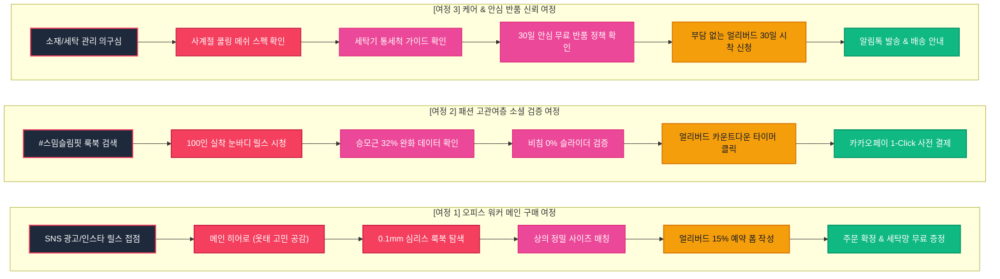

# SEUMIM(스밈) 오피스룩 슬림핏 웹사이트 사이트맵 명세서 (가상클라이언트 4: 이주은)

## 1. 프로젝트 개요

- **프로젝트명**: 스밈(SEUMIM) 오피스룩 슬림핏 승모근 제로 숄더 이너 탑 패션 D2C 랜딩페이지
- **브랜드명 / 타깃**: 스밈 (SEUMIM) / 이주은 (28세, 패션/뷰티 브랜드 마케팅 매니저)
- **비즈니스 모델**: D2C 온라인 단독 런칭 + 29CM/W컨셉 입점 연계 얼리버드 15% 사전 예약 프로모션
- **핵심 목표**: 얇은 블라우스/셔츠 안 0.1mm 심리스 승모근 릴렉스 이너웨어 사전 예약 1만 장 달성 및 고급 세탁망 증정
- **핵심 사용자층**: 2030 여성 직장인 (장시간 PC 업무로 승모근 솟음, 말린 어깨로 오피스룩 핏 붕괴를 겪는 여성)
- **적용 매체**: 패션 매거진형 데스크톱 웹사이트 메인페이지 (룩북형 비주얼 갤러리 및 숏폼 릴스 인터랙션 포함)

---

## 2. 설계 근거 및 핵심 사용자 목표

### (1) 설계 근거 (가상클라이언트 4 분석 반영)
1. **투박한 보정 속옷 거부감 ➔ 0.1mm 살구색 심리스 패션 이너웨어**: 붕대나 의료기기 같은 시중 제품의 거부감을 해소하기 위해 실크 블라우스/자켓 안에 입어도 봉제선 비침이 없는 0.1mm 초극세사 스킨 메쉬 룩북을 메인 상단에 배치함.
2. **29CM/W컨셉 감성의 감각적 에디토리얼 비주얼**: 과도한 의학 용어 대신 감성적인 패션 화보와 룩북 갤러리를 통해 '오피스룩 핏을 완성하는 헬시플레저 이너'로 포지셔닝.
3. **인플루언서 100인 내돈내산 눈바디 릴스 연동**: 직관적인 승모근 라인(직각 어깨, 목선 연장) 비포/애프터 변화를 인스타그램 숏폼 형태로 배치하여 시각적 검증 제공.
4. **얼리버드 카운트다운 타이머 & 15% 할인 긴박감 부여**: 상/하단에 실시간 잔여 시간 타이머와 전용 세탁망 증정 배지를 노출하여 즉각적인 사전 예약 전환 유도.

### (2) 핵심 사용자 목표 (User Goals)
- **Goal 1 (오피스 워커 여성)**: 화이트 블라우스 및 슬랙스 착용 시 봉제선 비침 0% 룩북과 승모근 32% 완화 데이터를 확인한다.
- **Goal 2 (패션 고관여층)**: 또래 직장인 인플루언서 100인의 실착 눈바디 릴스 후기 및 사계절 쿨링 통기성 사양을 검증한다.
- **Goal 3 (얼리버드 구매 고객)**: 오피스 상의 기준 정밀 사이즈(S/M/L)를 매칭하고 15% 할인된 가격으로 이너 탑 사전 예약을 완료한다.

---

## 3. 전역 내비게이션 구조 (Navigation Systems)

### (1) GNB (Global Navigation Bar - 상단 고정 헤더)
- 브랜드 로고 | 1.0 오피스 룩북 | 2.0 승모근 이너 핏 | 3.0 눈바디 릴스 후기 | 4.0 얼리버드 혜택 | 5.0 패션 케어 가이드 | [CTA: 얼리버드 15% 예약] | [로그인/마이페이지 `[가정]`]

### (2) Utility & Floating Bar
- [상단 우측]: 룩북 카탈로그 다운로드 | 사이즈 상담 톡 | 고객센터
- [하단 플로팅 바]: "⏰ 얼리버드 15% 할인 마감 임박! [고급 세탁망 무료 증정]" 1-Click 바로 예약하기

### (3) FNB (Footer Navigation Bar - 하단 푸터)
- 기업 기본 정보 (상호, 대표자, 사업자등록번호, 주소, CS 센터 080 무료)
- 30일 안심 무료 반품 정책, 패션 세탁망 사용 가이드, 개인정보처리방침
- SNS 링크 (인스타그램, 29CM 브랜드관, 핀터레스트, 카카오톡 채널)

---

## 4. 계층형 사이트맵 (Hierarchical Sitemap)

```text
스밈(SEUMIM) 오피스룩 슬림핏 웹사이트
├─ 0.0 메인 랜딩페이지 (Main Landing Page)
│  ├─ 0.1 패션 에디토리얼 히어로 ("오피스룩 핏을 완성하는 승모근 제로 이너 핏")
│  ├─ 0.2 굽은 어깨와 승모근이 오피스룩 옷태에 미치는 영향 비교 (비포/애프터)
│  ├─ 0.3 0.1mm 심리스 무봉제 & 살구색 스킨 메쉬 룩북 갤러리
│  ├─ 0.4 승모근 솟음 32% 완화 & 어깨 펴짐 탄성 복원 원리 모식도
│  ├─ 0.5 오피스룩 상의 기준 정밀 사이즈(S/M/L) 매칭 가이드 [모달/팝업]
│  ├─ 0.6 인플루언서 100인 내돈내산 눈바디 릴스 영상 갤러리
│  ├─ 0.7 사계절 프레시 쿨링 통기성 & 세탁기 통세척 가이드
│  ├─ 0.8 얼리버드 카운트다운 타이머 & 패션 세탁망 증정 배지
│  └─ 0.9 얼리버드 15% 할인 사전 예약 폼 & 하단 CTA [모달/팝업]
│
├─ 1.0 오피스 룩북 (Office Lookbook)
│  ├─ 1.1 화이트 셔츠 / 실크 블라우스 0mm 밀착 룩북 화보
│  ├─ 1.2 슬림핏 슬랙스 & 자켓 매칭 스타일링 가이드
│  └─ 1.3 0.1mm 살구색 스킨톤 vs 일반 교정기 비침 비교 화보
│
├─ 2.0 승모근 이너 핏 (Shoulder Tech)
│  ├─ 2.1 승모근 근전도(EMG) 하중 32% 완화 임상 데이터
│  ├─ 2.2 가슴 압박 없는 와이드 암홀 3D 입체 패턴 구조
│  └─ 2.3 오피스 상의 기준(S/M/L) 정밀 사이즈 가이드 [모달/팝업]
│
├─ 3.0 눈바디 릴스 후기 (Style Reviews)
│  ├─ 3.1 2030 직장인 100인 실착 눈바디 전후 비교 릴스
│  ├─ 3.2 블라인드 / W컨셉 찐 구매 평점 4.9점 포토 후기
│  └─ 3.3 인스타그램 해시태그 #스밈슬림핏 롤링 피드
│
├─ 4.0 얼리버드 혜택 (Earlybird Offer)
│  ├─ 4.1 얼리버드 한정 15% 단독 할인 혜택 안내
│  ├─ 4.2 사전 예약자 전원 고급 패션 세탁망 무료 증정 배지
│  ├─ 4.3 얼리버드 15% 할인 사전 예약 신청 폼 [모달/팝업]
│  └─ 4.4 예약 접수 완료 및 배송 일정 안내 [가정]
│
├─ 5.0 패션 케어 가이드 (Care Guide)
│  ├─ 5.1 사계절 통기성 쿨링 원단 스펙 & 항균 인증서
│  ├─ 5.2 형태 변형 없는 중성세제 세탁 및 건조 가이드
│  └─ 5.3 자주 묻는 질문 (FAQ 아코디언)
│
├─ 6.0 회원 서비스 [가정]
│  ├─ 6.1 카카오 / 네이버 간편 로그인 [가정]
│  └─ 6.2 마이페이지 (사전 예약 내역 및 배송 조회) [가정]
│
└─ 9.0 예외 및 시스템 페이지 [가정]
   ├─ 9.1 404 Not Found (페이지를 찾을 수 없음) [가정]
   └─ 9.2 시스템 정기 점검 안내 페이지 [가정]
```

---

## 5. 페이지별 목적, 핵심 콘텐츠, 주요 기능, 연결 페이지 표

| 페이지 ID | 뎁스 | 페이지명 | 주요 목적 | 핵심 콘텐츠 | 주요 기능 | 연결 페이지 |
|:---:|:---:|:---|:---|:---|:---|:---|
| **P-0.0** | 1차 | 메인 랜딩페이지 | 패션 감성 전달 및 얼리버드 15% 사전 예약 전환 | 에디토리얼 히어로, 옷태 비포애프터, 룩북, 릴스, 타이머 | Floating Sticky Bar, 눈바디 릴스 뷰어, 타이머 UI | P-1.0 ~ P-5.0 |
| **P-1.0** | 2차 | 오피스 룩북 | 블라우스/셔츠 안 0mm 무봉제 착용감 검증 | 화이트 셔츠 룩북, 실크 블라우스 매칭 화보 | 360도 룩북 회전 뷰어, 비침 비교 슬라이더 | P-0.0, P-4.3 |
| **P-1.3** | 3차 | 비침 비교 뷰어 | 0.1mm 살구색 스킨톤의 완벽 은폐력 증명 | 일반 교정기 vs 스밈 0.1mm 투명도 비교 화보 | 좌우 드래그 비교 슬라이더 | P-1.0, P-4.3 |
| **P-2.0** | 2차 | 승모근 이너 핏 | 승모근 하중 완화 및 가슴 무압박 입체 패턴 입증 | 승모근 하중 32% 완화 데이터, 와이드 암홀 패턴도 | 3D 패턴 분해도 인터랙션 | P-0.0, P-2.3 |
| **P-2.3** | 3차 | 정밀 사이즈 가이드 | 구매 실패 방지를 위한 상의 사이즈 매칭 | 평소 오피스 상의(55/66, S/M/L) 기준 규격표 | 사이즈 자동 추천 팝업 UI | P-2.0, P-4.3 |
| **P-3.0** | 2차 | 눈바디 릴스 후기 | 직장인 실착 릴스를 통한 착용감 및 핏 개선 검증 | 100인 실착 눈바디 릴스, W컨셉 포토 후기 | 인스타그램 숏폼 릴스 플레이어 | P-0.0, P-4.3 |
| **P-4.0** | 2차 | 얼리버드 혜택 | 얼리버드 할인 혜택 확인 및 예약 전환 | 15% 할인표, 전용 세탁망 증정 배지, FAQ | 얼리버드 카운트다운 타이머 | P-4.3, P-0.0 |
| **P-4.3** | 3차 | 얼리버드 예약 폼 | 15% 할인 사전 예약 접수 | 색상(누드/블랙), 사이즈(S/M/L), 배송지 입력 | 1-Click 간편 예약 폼 | P-4.4, P-0.0 |
| **P-4.4** | 3차 | 예약 완료 안내 `[가정]` | 예약 확정 안내 및 세탁망 증정 일정 전달 | 주문 번호, 배송 일정, 교환/반품 안내 | 카카오 알림톡 발송 `[가정]` | P-0.0, P-6.2 |
| **P-5.0** | 2차 | 패션 케어 가이드 | 사계절 통기성 및 세탁 내구성 신뢰 형성 | 쿨링 메쉬 인증서, 세탁 가이드, FAQ | FAQ 아코디언 토글 | P-0.0, P-4.3 |
| **P-6.1** | 2차 | 로그인/회원가입 `[가정]` | 회원 서비스 및 간편 결제 연동 | 카카오/네이버 1-Click 로그인 | 간편 SNS 로그인 `[가정]` | P-0.0, P-6.2 |
| **P-6.2** | 2차 | 마이페이지 `[가정]` | 예약 내역 및 배송 일정 확인 | 사전 예약 주문 내역, 배송지 변경 | 1-Click 배송지 수정 `[가정]` | P-4.4 |
| **P-9.1** | 2차 | 404 Not Found `[가정]` | 에러 대응 | 에러 안내 메시지, 룩북 메인 이동 | 메인 바로가기 버튼 | P-0.0 |

---

## 6. Mermaid Flowchart 사이트맵

```mermaid
flowchart TD
    %% 노드 스타일 정의
    classDef main fill:#1E293B,stroke:#F43F5E,stroke-width:2px,color:#FFFFFF,font-weight:bold;
    classDef depth1 fill:#F43F5E,stroke:#BE123C,stroke-width:2px,color:#FFFFFF;
    classDef depth2 fill:#FFE4E6,stroke:#FB7185,stroke-width:1px,color:#1E293B;
    classDef modal fill:#F59E0B,stroke:#D97706,stroke-width:1px,color:#0F172A;
    classDef review fill:#EC4899,stroke:#DB2777,stroke-width:1.5px,color:#FFFFFF;
    classDef assumed fill:#64748B,stroke:#475569,stroke-width:1px,color:#FFFFFF,stroke-dasharray: 5 5;

    %% 메인페이지
    MAIN["0.0 오피스룩 메인 랜딩 (P-0.0)"]:::main

    %% 1차 메뉴 (GNB)
    LOOK["1.0 오피스 룩북 (P-1.0)"]:::depth1
    FIT["2.0 승모근 이너 핏 (P-2.0)"]:::depth1
    REV["3.0 눈바디 릴스 후기 (P-3.0)"]:::review
    OFFER["4.0 얼리버드 혜택 (P-4.0)"]:::depth1
    CARE["5.0 패션 케어 가이드 (P-5.0)"]:::depth1
    MYPAGE["6.0 회원 서비스 [가정] (P-6.0)"]:::assumed
    EXCEPT["9.0 예외 페이지 [가정] (P-9.0)"]:::assumed

    MAIN --> LOOK
    MAIN --> FIT
    MAIN --> REV
    MAIN --> OFFER
    MAIN --> CARE
    MAIN -.-> MYPAGE
    MAIN -.-> EXCEPT

    %% 오피스 룩북 하위
    LOOK --> L1["1.1 셔츠/블라우스 밀착 룩북"]:::depth2
    LOOK --> L2["1.2 슬랙스/자켓 스타일링"]:::depth2
    LOOK --> L3["1.3 0.1mm 비침 비교 화보 [모달]"]:::modal

    %% 승모근 이너 핏 하위
    FIT --> F1["2.1 승모근 솟음 32% 완화"]:::depth2
    FIT --> F2["2.2 와이드 암홀 3D 패턴"]:::depth2
    FIT --> F3["2.3 정밀 사이즈 가이드 [모달]"]:::modal

    %% 눈바디 릴스 하위
    REV --> R1["3.1 100인 눈바디 릴스"]:::depth2
    REV --> R2["3.2 W컨셉 4.9점 포토 후기"]:::depth2
    REV --> R3["3.3 #스밈슬림핏 인스타 피드"]:::depth2

    %% 얼리버드 혜택 하위
    OFFER --> O1["4.1 얼리버드 15% 할인 안내"]:::depth2
    OFFER --> O2["4.2 고급 세탁망 무료 증정"]:::depth2
    OFFER --> O3["4.3 얼리버드 사전 예약 폼 [모달]"]:::modal
    O3 --> O4["4.4 예약 완료 안내 [가정]"]:::assumed

    %% 패션 케어 하위
    CARE --> C1["5.1 쿨링 메쉬 인증서"]:::depth2
    CARE --> C2["5.2 세탁 및 건조 가이드"]:::depth2
    CARE --> C3["5.3 FAQ 아코디언"]:::depth2

    %% 회원 서비스 및 예외 [가정]
    MYPAGE -.-> M1["6.1 SNS 간편 로그인 [가정]"]:::assumed
    MYPAGE -.-> M2["6.2 예약 내역 조회 [가정]"]:::assumed
    EXCEPT -.-> E1["9.1 404 Not Found [가정]"]:::assumed
    EXCEPT -.-> E2["9.2 시스템 점검 안내 [가정]"]:::assumed

    %% 주요 구매 동선 (User Journey)
    L3 --> O3
    F3 --> O3
    R1 --> O3
    O3 --> O4
```



---

## 7. 핵심 사용자 전환 여정 (Key User Conversion Journeys)



### 📌 여정별 상세 시나리오

1. **여정 1 (오피스 워커 메인 구매 여정 - 전환율 최적화)**:
   - 인스타그램 오피스룩 코디 피드에서 스밈 슬림핏 유입 ➔ 메인페이지에서 거북목/승모근으로 무너지는 셔츠 핏 공감 ➔ 0.1mm 스킨톤 메쉬 화보 확인 ➔ 평소 입는 상의(55/66) 사이즈 선택 ➔ 얼리버드 15% 할인 모달에서 주문 접수 ➔ 고급 세탁망 무료 증정 확정.
2. **여정 2 (패션 고관여층 소셜 검증 여정 - 바이럴 극대화)**:
   - 29CM 및 인스타그램 해시태그 유입 ➔ 100인 인플루언서 실착 눈바디 릴스 영상 시청 ➔ 승모근 솟음 32% 완화 임상 데이터 검증 ➔ 0mm 무봉제 비침 슬라이더 조작 ➔ 얼리버드 잔여 시간 타이머 확인 후 즉시 1-Click 결제.
3. **여정 3 (케어 & 안심 반품 신뢰 여정 - 이탈 방지)**:
   - 피부 트러블이나 세탁 변형 우려 유저 유입 ➔ 사계절 쿨링 메쉬 항균 인증서 및 세탁 가이드 확인 ➔ 30일 무상 시착 체험 및 100% 무료 반품 정책 확인 ➔ 심리적 장벽 해소 후 사전 예약 완료.
