# SEUMIM(스밈) 오프라인 동행센터 & 골반 에어셀 벨트 사이트 구조맵 (가상클라이언트 5: 최수진)

---

## 1. 개요 (Overview)

- **프로젝트명**: 스밈(SEUMIM) 골반 수평 에어셀 벨트 & 전국 교정 동행센터 1:1 체형 진단 O2O 웹 플랫폼
- **타깃 페르소나**: 최수진 (33세, 금융권 본사 대리 / 장시간 데스크 착석, 무의식적 다리 꼬기 습관 및 골반 비대칭, 하체 부종)
- **비즈니스 아키텍처**: 골반 수평 에어셀 벨트 HW 판매 + 전국 32개 제휴 동행센터 1회 무료 1:1 체형 진단 O2O 예약 + 골반 데일리 케어 루틴
- **디자인 테마**: 딥 틸(#0D9488) & 샌드 베이지(#F5F5F4), 신뢰감 있는 오프라인 웰니스 무드
- **작성 기준**: `C:\yyw\md_skill\통합_자동화\SKILL.md` 및 `설계_자동화\SKILL.md` 표준 규격 준수

---

## 2. 정보 구조도 (Information Architecture Tree)

```text
0.0 메인 랜딩페이지 (P-0.0)
 ├── 1.0 골반 에어셀 벨트 (P-1.0)
 │    ├── 1.1 에어셀 팽창 기술 사양 (P-1.1)
 │    ├── 1.2 오피스 슬랙스 착용 핏 (P-1.2)
 │    └── 1.3 골반 둘레 정밀 사이즈 가이드 [모달] (P-1.3)
 ├── 2.0 물리 차단 테크 (P-2.0)
 │    ├── 2.1 0.5초 다리 꼬기 즉각 차단 (P-2.1)
 │    ├── 2.2 골반 수평 8.4도 복원 임상 데이터 (P-2.2)
 │    └── 2.3 하체 혈류 순환 28% 개선 시험 (P-2.3)
 ├── 3.0 전국 동행센터 찾기 (P-3.0)
 │    ├── 3.1 위치 기반 32개 지점 지도 검색 (P-3.1)
 │    ├── 3.2 센터별 전문 교정 매니저 프로필 (P-3.2)
 │    └── 3.3 1:1 체형 분석 장비 안내 (P-3.3)
 ├── 4.0 1회 무료 진단 예약 (P-4.0)
 │    ├── 4.1 1회 무료 체험 혜택 안내 (P-4.1)
 │    ├── 4.2 4단계 간편 예약 Wizard [모달] (P-4.2)
 │    └── 4.3 예약 완료 및 방문 안내 [가정] (P-4.3)
 ├── 5.0 골반 케어 가이드 (P-5.0)
 │    ├── 5.1 데스크 10초 골반 리셋 루틴 (P-5.1)
 │    ├── 5.2 직장인 다리 꼬기 탈출 챌린지 (P-5.2)
 │    └── 5.3 O2O 예약 및 제품 FAQ (P-5.3)
 ├── [가정] 6.0 회원 서비스 (P-6.0)
 │    ├── 6.1 간편 로그인 / 회원가입 [가정] (P-6.1)
 │    └── 6.2 마이페이지 예약 관리 [가정] (P-6.2)
 └── [가정] 9.0 시스템 예외 (P-9.0)
      ├── 9.1 404 Not Found [가정] (P-9.1)
      └── 9.2 시스템 점검 안내 [가정] (P-9.2)
```

---

## 3. 계층별 상세 명세표 (Depth 1 ~ 3)

| 화면 ID | 사이트맵 매핑 | 화면명 | 뎁스 | 화면 유형 | 핵심 목적 및 주요 콘텐츠 |
|:---|:---|:---|:---:|:---:|:---|
| `SCR-01` | `P-0.0` | 0.0 메인 랜딩페이지 | 1차 | PAGE | 다리 꼬기 통계 제시, 에어셀 벨트 프리뷰, 전국 센터 검색 및 1회 무료 진단 예약 유도 |
| `SCR-02` | `P-1.0` | 1.0 골반 에어셀 벨트 | 2차 | PAGE | 마이크로 에어셀 팽창 구조 및 슬랙스/스커트 핏 룩북, 사계절 쾌적성 검증 |
| `SCR-03` | `P-1.3` | 1.3 골반 둘레 사이즈 가이드 [모달] | 3차 | MODAL | 골반/허리 둘레(인치/cm) 기준 정밀 사이즈 자동 매칭 및 30일 시착 연동 |
| `SCR-04` | `P-2.0` | 2.0 물리 차단 테크 | 2차 | PAGE | 0.5초 즉각 물리 차단 메커니즘 및 좌우 수평 복원 8.4도 임상 시험 데이터 확인 |
| `SCR-05` | `P-3.0` | 3.0 전국 동행센터 찾기 | 2차 | PAGE | 사용자 위치 기반 직장(여의도/강남/판교) 인접 32개 제휴 센터 지도 검색 |
| `SCR-06` | `P-3.2` | 3.2 전문 교정 매니저 프로필 | 3차 | PAGE | 지점별 물리치료사/체형교정 전문가 자격 및 1:1 상담 예약 현황 |
| `SCR-07` | `P-4.0` | 4.0 1회 무료 진단 예약 | 2차 | PAGE | 1회 무료 1:1 정밀 체형 측정 혜택 및 예약 절차 안내 |
| `SCR-08` | `P-4.2` | 4.2 4단계 간편 예약 Wizard [모달] | 3차 | MODAL | 지점선택 ➔ 일시선택 ➔ 인적사항 ➔ 예약확인 4단계 초간편 Wizard 예약 |
| `SCR-09` | `P-4.3` | 4.3 예약 완료 및 방문 안내 [가정] | 3차 | PAGE | 예약 번호, 방문 지도, 준비사항 안내 및 카카오 알림톡 자동 발송 |
| `SCR-10` | `P-5.0` | 5.0 골반 케어 가이드 | 2차 | PAGE | 데스크 10초 골반 스트레칭, 21일 챌린지, 블라인드 금융권 직장인 찐후기 |
| `SCR-11` | `P-6.1` | 6.1 간편 로그인 [가정] | 2차 | PAGE | 카카오 / 네이버 SNS 1-Click 로그인 및 예약 내역 연동 |
| `SCR-12` | `P-6.2` | 6.2 마이페이지 예약 관리 [가정] | 2차 | PAGE | O2O 센터 방문 예약 조회, 변경/취소, 골반 리포트 데이터 조회 |
| `SCR-13` | `P-9.1` | 9.1 404 Not Found [가정] | 2차 | EXCEPT | 유효하지 않은 경로 접근 시 센터 검색 메인 바로가기 안내 |
| `SCR-14` | `P-9.2` | 9.2 시스템 점검 안내 [가정] | 2차 | EXCEPT | 정기 시스템 점검 안내 및 O2O 예약 데이터 안전 보존 공지 |

---

## 4. 공통 UI 컴포넌트 규격

### (1) 글로벌 상단 헤더 (GNB)
- **높이**: 데스크톱 72px / 모바일 60px (딥 틸 #0D9488 & 화이트 상단 고정)
- **메뉴 구성**: `1.0 골반 에어셀 벨트`, `2.0 물리 차단 테크`, `3.0 전국 동행센터`, `4.0 1회 무료 예약`, `5.0 골반 케어`
- **CTA 버튼**: `[1회 무료 체형 진단 예약]` ➔ `SCR-08 (P-4.2)` 모달 즉시 호출

### (2) 플로팅 스티키 바 (Floating Sticky Bar)
- **위치**: 화면 우측 하단 (데스크톱) / 최하단 고정 바 (모바일)
- **구성**:
  1. *"🏢 퇴근 후 15분! 가까운 센터에서 1회 무료 1:1 체형 진단 받으세요"*
  2. `[가까운 센터 1회 무료 예약]` ➔ `SCR-08 (P-4.2)` Wizard 모달 오픈

### (3) 글로벌 푸터 (FNB)
- **구성 요소**: 기업 기본 정보, 전국 32개 제휴 센터 리스트, 예약 취소/변경 정책, 30일 무료 반품 약관, 1:1 카카오톡 상담 채널.

---

## 5. 핵심 사용자 전환 여정 (Key User Conversion Journeys - 3대 시나리오)

### 📍 [여정 1] 직장인 O2O 인접 센터 1회 무료 진단 예약 여정 (메인 전환)
- **유입 채널**: 블라인드/인스타그램 직장인 다리 꼬기 교정 광고 유입
- **단계별 흐름**:
  1. **문제 공감**: `0.0 메인 랜딩 (P-0.0)`에서 직장인 78% 다리 꼬기 습관 및 골반 비대칭 통계 확인
  2. **원리 확인**: `2.0 물리 차단 테크 (P-2.0)`에서 0.5초 에어셀 팽창 물리 차단 모식도 확인
  3. **지점 검색**: `3.0 전국 동행센터 찾기 (P-3.0)`에서 회사 근처(여의도/강남 등) 지점 확인
  4. **간편 예약**: `4.2 4단계 예약 Wizard [모달] (P-4.2)`에서 지점/퇴근 시간 선택 후 1-Click 접수
  5. **예약 확정**: 카카오 알림톡으로 예약 확정 번호 및 지도 수신 완료

### 📍 [여정 2] 골반 에어셀 벨트 HW 30일 시착 사전 구매 여정 (온라인 전환)
- **유입 채널**: 골반 교정 벨트/에어셀 검색 유입
- **단계별 흐름**:
  1. **룩북 탐색**: `1.0 골반 에어셀 벨트 (P-1.0)`에서 슬랙스 안 0.1mm 시크릿 핏 확인
  2. **사이즈 매칭**: `1.3 골반 둘레 가이드 [모달] (P-1.3)`에서 평소 바지 치수(26~34인치) 매칭
  3. **보증 확인**: 30일간 사무실에서 착용해보고 불만족 시 100% 무료 반품 정책 확인
  4. **신청 완료**: 30일 무료 시착 폼 작성 및 사무실 택배 배송 접수

### 📍 [여정 3] 데스크 10초 리셋 & 21일 챌린지 검증 여정 (습관화)
- **유입 채널**: 다리 꼬기 방지 스트레칭 키워드 유입
- **단계별 흐름**:
  1. **가이드 확인**: `5.0 골반 케어 가이드 (P-5.0)`에서 의자 10초 골반 수평 리셋 가이드 확인
  2. **챌린지 참여**: 21일 다리 꼬기 탈출 챌린지 참여 후 인근 센터 무료 진단권 수령
  3. **예약 전환**: `4.2 예약 Wizard [모달]`에서 주말 1:1 진단 예약 확정

---

## 6. Mermaid 사이트 구조맵 다이어그램

```mermaid
flowchart TD
    classDef main fill:#0D9488,stroke:#0F766E,stroke-width:2px,color:#FFFFFF;
    classDef menu fill:#1E293B,stroke:#0D9488,stroke-width:1.5px,color:#FFFFFF;
    classDef sub fill:#F0FDFA,stroke:#0D9488,stroke-width:1px,color:#134E4A;
    classDef modal fill:#FFFBEB,stroke:#D97706,stroke-width:1.5px,stroke-dasharray: 4 4,color:#B45309;
    classDef assumed fill:#F1F5F9,stroke:#64748B,stroke-width:1px,stroke-dasharray: 4 4,color:#475569;

    P00["0.0 메인 랜딩 (P-0.0)"]:::main

    P00 --> P10["1.0 골반 에어셀 벨트"]:::menu
    P00 --> P20["2.0 물리 차단 테크"]:::menu
    P00 --> P30["3.0 전국 동행센터 찾기"]:::menu
    P00 --> P40["4.0 1회 무료 예약"]:::menu
    P00 --> P50["5.0 골반 케어 가이드"]:::menu

    P10 --> P11["1.1 에어셀 팽창 사양"]:::sub
    P10 --> P12["1.2 오피스 슬랙스 핏"]:::sub
    P10 --> P13["1.3 골반 정밀 사이즈 (모달)"]:::modal

    P20 --> P21["2.1 0.5s 즉각 차단"]:::sub
    P20 --> P22["2.2 수평 8.4도 복원"]:::sub
    P20 --> P23["2.3 혈류 28% 개선"]:::sub

    P30 --> P31["3.1 32개 센터 지도"]:::sub
    P30 --> P32["3.2 매니저 프로필"]:::sub
    P30 --> P33["3.3 체형 장비 안내"]:::sub

    P40 --> P41["4.1 1회 무료 혜택"]:::sub
    P40 --> P42["4.2 4단계 예약 Wizard (모달)"]:::modal
    P40 --> P43["4.3 예약 완료 안내 [가정]"]:::sub

    P50 --> P51["5.1 10초 골반 리셋"]:::sub
    P50 --> P52["5.2 21일 챌린지"]:::sub
    P50 --> P53["5.3 O2O FAQ"]:::sub

    P00 -.-> P60["[가정] 6.0 회원 서비스"]:::assumed
    P00 -.-> P90["[가정] 9.0 시스템 예외"]:::assumed
```


