# SEUMIM(스밈) 주부 홈케어 1-Touch 척추 조끼 사이트 구조맵 (가상클라이언트 6: 정은숙)

---

## 1. 개요 (Overview)

- **프로젝트명**: 스밈(SEUMIM) 주부 홈케어 1-Touch 척추 조끼 & 30일 무료 체험 웹 플랫폼
- **타깃 페르소나**: 정은숙 (52세, 25년 차 전업주부 / 설거지, 청소, 빨래 등 가사 노동 시 허리 굽힘 통증, 오십견으로 뒤로 손 닿기 어려움)
- **비즈니스 아키텍처**: 1-Touch 전면 벨크로 척추 조끼 HW 단품/패키지 판매 + 080 무료 전화 주문 + 카카오톡 1-Click 간편 신청 + 30일 안심 무료 반품 체험
- **디자인 테마**: 웜 샌드/피치(#FFF7ED) & 활력 오렌지(#EA580C) & 안심 그린(#10B981), 18px 이상 큰 글씨 시니어 프렌들리 UI
- **작성 기준**: `C:\yyw\md_skill\통합_자동화\SKILL.md` 및 `설계_자동화\SKILL.md` 표준 규격 준수

---

## 2. 정보 구조도 (Information Architecture Tree)

```text
0.0 메인 랜딩페이지 (P-0.0)
 ├── 1.0 홈케어 조끼 (P-1.0)
 │    ├── 1.1 1-Touch 3초 착용 영상 (P-1.1)
 │    ├── 1.2 세탁기 통세척 및 관리법 (P-1.2)
 │    └── 1.3 상의 치수(66/77/88) 사이즈 가이드 [모달] (P-1.3)
 ├── 2.0 허리 안심 테크 (P-2.0)
 │    ├── 2.1 싱크대 허리 하중 40% 분산 (P-2.1)
 │    ├── 2.2 바이오 에르고 힌지 기술 (P-2.2)
 │    └── 2.3 오십견 배려 무간섭 패턴 (P-2.3)
 ├── 3.0 동년배 100인 후기 (P-3.0)
 │    ├── 3.1 50대 주부 싱크대 실착 후기 (P-3.1)
 │    ├── 3.2 맘카페 평점 4.9점 포토 갤러리 (P-3.2)
 │    └── 3.3 자녀 효도 선물 인터뷰 (P-3.3)
 ├── 4.0 30일 무료 체험 (P-4.0)
 │    ├── 4.1 30일 집에서 입어보기 혜택 (P-4.1)
 │    ├── 4.2 080 전화 / 카톡 간편 신청 [모달] (P-4.2)
 │    └── 4.3 주문 완료 및 배송 안내 [가정] (P-4.3)
 ├── 5.0 살림 케어 가이드 (P-5.0)
 │    ├── 5.1 설거지/청소기 허리 안 아픈 자세 (P-5.1)
 │    ├── 5.2 주부 10초 의자 스트레칭 (P-5.2)
 │    └── 5.3 080 전화 상담 및 제품 FAQ (P-5.3)
 ├── [가정] 6.0 회원 서비스 (P-6.0)
 │    ├── 6.1 전화번호 간편 조회 [가정] (P-6.1)
 │    └── 6.2 마이페이지 배송 조회 [가정] (P-6.2)
 └── [가정] 9.0 시스템 예외 (P-9.0)
      ├── 9.1 404 Not Found [가정] (P-9.1)
      └── 9.2 시스템 점검 안내 [가정] (P-9.2)
```

---

## 3. 계층별 상세 명세표 (Depth 1 ~ 3)

| 화면 ID | 사이트맵 매핑 | 화면명 | 뎁스 | 화면 유형 | 핵심 목적 및 주요 콘텐츠 |
|:---|:---|:---|:---:|:---:|:---|
| `SCR-01` | `P-0.0` | 0.0 주부 홈케어 메인 랜딩 | 1차 | PAGE | 가사 요통 공감, 1-Touch 3초 착용 시연, 080 무료 전화 주문 및 30일 무료 체험 유도 |
| `SCR-02` | `P-1.0` | 1.0 홈케어 조끼 | 2차 | PAGE | 전면 벨크로 1-Touch 구조, 세탁기 통세척 메쉬 원단, 홈웨어 실착 화보 |
| `SCR-03` | `P-1.3` | 1.3 상의 치수 사이즈 가이드 [모달] | 3차 | MODAL | 평소 입는 상의(66/77/88/99) 기준 정밀 사이즈 자동 매칭 및 2벌 동시 발송 안내 |
| `SCR-04` | `P-2.0` | 2.0 허리 안심 테크 | 2차 | PAGE | 싱크대 숙임 시 허리 하중 40% 분산 바이오 힌지 및 오십견 배려 무간섭 패턴 |
| `SCR-05` | `P-3.0` | 3.0 동년배 100인 후기 | 2차 | PAGE | 50대 전업주부 설거지/청소 실착 포토 후기 및 맘카페 추천 리뷰 갤러리 |
| `SCR-06` | `P-3.3` | 3.3 자녀 효도 선물 인터뷰 | 3차 | PAGE | 부모님 선물 만족도 99% 인터뷰 및 효도 선물 전용 고급 선물 포장 안내 |
| `SCR-07` | `P-4.0` | 4.0 30일 무료 체험 안내 | 2차 | PAGE | 집에서 30일간 입어보고 결정하는 100% 무료 반품 정책 및 안심 보증서 |
| `SCR-08` | `P-4.2` | 4.2 080 전화 / 카톡 간편 신청 [모달] | 3차 | MODAL | 080-800-1234 무료 전화 다이얼 연동 & 성함/주소 10초 간편 신청 폼 |
| `SCR-09` | `P-4.3` | 4.3 주문 완료 및 배송 안내 [가정] | 3차 | PAGE | 주문 번호, 택배 배송 일정, 30일 무료 반품 수거 안내 및 알림톡 발송 |
| `SCR-10` | `P-5.0` | 5.0 살림 케어 가이드 | 2차 | PAGE | 설거지/청소기 허리 덜 아픈 자세 영상, 10초 스트레칭, 080 전화 FAQ |
| `SCR-11` | `P-6.1` | 6.1 전화번호 간편 조회 [가정] | 2차 | PAGE | 복잡한 비밀번호 없는 휴대폰 번호 기반 간편 주문 조회 |
| `SCR-12` | `P-6.2` | 6.2 마이페이지 배송 조회 [가정] | 2차 | PAGE | 30일 무료 체험 배송 현황, 1-Click 무료 반품 신청, 교환 접수 |
| `SCR-13` | `P-9.1` | 9.1 404 Not Found [가정] | 2차 | EXCEPT | 친절한 큰 글씨 에러 안내 및 080 무료 전화 주문 바로가기 |
| `SCR-14` | `P-9.2` | 9.2 시스템 점검 안내 [가정] | 2차 | EXCEPT | 시스템 점검 중에도 080 전화 주문 정상 운영 안내 |

---

## 4. 공통 UI 컴포넌트 규격 (시니어 프렌들리)

### (1) 글로벌 상단 헤더 (GNB)
- **높이**: 데스크톱 76px / 모바일 64px (고대비 웜 샌드 #FFF7ED 상단 고정)
- **폰트 크기**: 18px 이상 큰 글씨 적용으로 가독성 극대화
- **메뉴 구성**: `1.0 홈케어 조끼`, `2.0 허리 안심 테크`, `3.0 주부 찐후기`, `4.0 30일 무료 체험`, `5.0 살림 케어`
- **CTA 버튼**: `[📞 080-800-1234 무료 전화 주문]` & `[30일 무료 체험]` ➔ `SCR-08 (P-4.2)` 호출

### (2) 플로팅 스티키 바 (Floating Sticky Bar)
- **위치**: 화면 하단 고정 바 (데스크톱/모바일 공통)
- **카피 및 버튼**:
  - *"👵 [집에서 30일간 입어보세요] 설거지할 때 허리가 편안하지 않으면 100% 무료 반품"*
  - `[📞 080 무료 전화]` & `[30일 무료 체험 신청]` ➔ `SCR-08 (P-4.2)` 모달 오픈

### (3) 글로벌 푸터 (FNB)
- **구성 요소**: 기업 기본 정보, 080 무료 전화 상담센터, 30일 안심 무료 반품 약관, KC 섬유 안전 인증, 카카오톡 1:1 상담.

---

## 5. 핵심 사용자 전환 여정 (Key User Conversion Journeys - 3대 시나리오)

### 📍 [여정 1] 080 무료 전화 & 카톡 1-Click 30일 무료 체험 여정 (메인 전환)
- **유입 채널**: 맘카페/카카오스토리 주부 허리 통증 글 링크 유입
- **단계별 흐름**:
  1. **문제 공감**: `0.0 메인 랜딩 (P-0.0)`에서 설거지/청소기 가사 노동 허리 하중 통계 확인
  2. **착용 확인**: `1.0 홈케어 조끼 (P-1.0)`에서 뒤로 손 안 돌리는 1-Touch 3초 착용 영상 확인
  3. **효과 검증**: `2.0 허리 안심 테크 (P-2.0)`에서 싱크대 허리 하중 40% 분산 데이터 확인
  4. **간편 신청**: `4.2 080 전화/카톡 신청 [모달] (P-4.2)`에서 080 전화 버튼 터치 또는 주소 간편 입력
  5. **체험 시작**: 집으로 2벌 동시 무료 배송 수령 후 30일간 설거지할 때 실착

### 📍 [여정 2] 동년배 100인 후기 확인 & 상의 사이즈 매칭 구매 여정 (신뢰 전환)
- **유입 채널**: 50대 주부 허리 보호대 검색 유입
- **단계별 흐름**:
  1. **후기 탐색**: `3.0 동년배 100인 후기 (P-3.0)`에서 50대 주부들의 싱크대 설거지 실착 포토 후기 확인
  2. **사이즈 매칭**: `1.3 상의 치수 사이즈 가이드 [모달] (P-1.3)`에서 평소 옷 치수(66/77/88) 선택
  3. **보증 확인**: 30일 무료 반품 및 세탁기 통세척 가능 여부 확인
  4. **신청 완료**: 30일 무료 체험 신청 접수 완료

### 📍 [여정 3] 자녀 효도 선물 & 10초 살림 케어 여정 (선물 전환)
- **유입 채널**: 어머니 허리 통증 효도 선물 검색 유입
- **단계별 흐름**:
  1. **선물 확인**: `3.3 자녀 효도 선물 인터뷰 (P-3.3)`에서 고급 선물 포장 및 만족도 99% 확인
  2. **케어 가이드**: `5.0 살림 케어 가이드 (P-5.0)`에서 부모님을 위한 10초 스트레칭 영상 확인
  3. **선물 주문**: 부모님 댁으로 30일 무료 체험 조끼 선물 배송 접수

---

## 6. Mermaid 사이트 구조맵 다이어그램

```mermaid
flowchart TD
    classDef main fill:#EA580C,stroke:#C2410C,stroke-width:2px,color:#FFFFFF;
    classDef menu fill:#1E293B,stroke:#EA580C,stroke-width:1.5px,color:#FFFFFF;
    classDef sub fill:#FFF7ED,stroke:#EA580C,stroke-width:1px,color:#9A3412;
    classDef modal fill:#FFFBEB,stroke:#D97706,stroke-width:1.5px,stroke-dasharray: 4 4,color:#B45309;
    classDef assumed fill:#F1F5F9,stroke:#64748B,stroke-width:1px,stroke-dasharray: 4 4,color:#475569;

    P00["0.0 메인 랜딩 (P-0.0)"]:::main

    P00 --> P10["1.0 홈케어 조끼"]:::menu
    P00 --> P20["2.0 허리 안심 테크"]:::menu
    P00 --> P30["3.0 동년배 100인 후기"]:::menu
    P00 --> P40["4.0 30일 무료 체험"]:::menu
    P00 --> P50["5.0 살림 케어 가이드"]:::menu

    P10 --> P11["1.1 1-Touch 착용 영상"]:::sub
    P10 --> P12["1.2 세탁기 통세척 관리"]:::sub
    P10 --> P13["1.3 상의 사이즈 (모달)"]:::modal

    P20 --> P21["2.1 허리 하중 40% 분산"]:::sub
    P20 --> P22["2.2 바이오 힌지 기술"]:::sub
    P20 --> P23["2.3 오십견 무간섭 패턴"]:::sub

    P30 --> P31["3.1 50대 주부 실착 후기"]:::sub
    P30 --> P32["3.2 맘카페 포토 갤러리"]:::sub
    P30 --> P33["3.3 자녀 효도 선물"]:::sub

    P40 --> P41["4.1 30일 무료 혜택"]:::sub
    P40 --> P42["4.2 080전화/카톡 신청 (모달)"]:::modal
    P40 --> P43["4.3 주문 완료 안내 [가정]"]:::sub

    P50 --> P51["5.1 허리 안 아픈 자세"]:::sub
    P50 --> P52["5.2 10초 의자 스트레칭"]:::sub
    P50 --> P53["5.3 080 전화 FAQ"]:::sub

    P00 -.-> P60["[가정] 6.0 회원 서비스"]:::assumed
    P00 -.-> P90["[가정] 9.0 시스템 예외"]:::assumed
```


