# SEUMIM(스밈) e스포츠 프로 햅틱 기어 사이트 구조맵 (가상클라이언트 7: 한태준)

---

## 1. 개요 (Overview)

- **프로젝트명**: 스밈(SEUMIM) e스포츠 프로 햅틱 넥-숄더 기어 & 디스코드 HUD 플랫폼
- **타깃 페르소나**: 한태준 (24세, LoL 프로 지망생 & 트위치 스트리머 / 하루 14시간 게이밍, 거북목으로 에임 저하)
- **비즈니스 아키텍처**: 0.01초 햅틱 넥 기어 HW 판매 + 디스코드/스팀 오버레이 위젯 연동 + 30일 무상 게이머 시착 체험
- **디자인 테마**: 사이버 다크(#0A0E17) & 네온 사이안(#00F0FF) & 레이저 바이올렛(#8B5CF6)
- **작성 기준**: `C:\yyw\md_skill\통합_자동화\SKILL.md` 및 `설계_자동화\SKILL.md` 표준 규격 준수

---

## 2. 정보 구조도 (Information Architecture Tree)

```text
0.0 메인 랜딩페이지 (P-0.0)
 ├── 1.0 프로 게이밍 기어 (P-1.0)
 │    ├── 1.1 95g 초경량 0.1mm 져지 핏 (P-1.1)
 │    ├── 1.2 헤드셋 무간섭 넥 서포트 (P-1.2)
 │    └── 1.3 게이밍 상의 사이즈 가이드 [모달] (P-1.3)
 ├── 2.0 0.01s 햅틱 테크 (P-2.0)
 │    ├── 2.1 화면 가림 없는 척추 미세 진동 (P-2.1)
 │    ├── 2.2 목 각도 45도 에임 0.2s 지연 데이터 (P-2.2)
 │    └── 2.3 반응속도 23% 개선 성적서 (P-2.3)
 ├── 3.0 디스코드 HUD 오버레이 (P-3.0)
 │    ├── 3.1 디스코드 봇 1-Click 연동 (P-3.1)
 │    ├── 3.2 파티원 실시간 자세 랭킹 (P-3.2)
 │    └── 3.3 스팀 라이브러리 연동 가이드 (P-3.3)
 ├── 4.0 30일 무상 시착 체험 (P-4.0)
 │    ├── 4.1 프로 구단 30일 무상 체험 혜택 (P-4.1)
 │    ├── 4.2 디스코드 1-Click 신청 [모달] (P-4.2)
 │    └── 4.3 주문 완료 및 배송 안내 [가정] (P-4.3)
 ├── 5.0 에임 10초 케어 (P-5.0)
 │    ├── 5.1 큐 대기 시간 10초 손목/목 리셋 (P-5.1)
 │    ├── 5.2 LCK 프로게이머 100인 후기 (P-5.2)
 │    └── 5.3 게이밍 하드웨어 & 봇 FAQ (P-5.3)
 ├── [가정] 6.0 회원 서비스 (P-6.0)
 │    ├── 6.1 디스코드 / 스팀 OAuth 로그인 [가정] (P-6.1)
 │    └── 6.2 마이페이지 자세 통계 [가정] (P-6.2)
 └── [가정] 9.0 시스템 예외 (P-9.0)
      ├── 9.1 404 Not Found [가정] (P-9.1)
      └── 9.2 API 서버 점검 안내 [가정] (P-9.2)
```

---

## 3. 계층별 상세 명세표 (Depth 1 ~ 3)

| 화면 ID | 사이트맵 매핑 | 화면명 | 뎁스 | 화면 유형 | 핵심 목적 및 주요 콘텐츠 |
|:---|:---|:---|:---:|:---:|:---|
| `SCR-01` | `P-0.0` | 0.0 네온 다크 메인 랜딩 | 1차 | PAGE | 거북목 에임 저하 통계, 0.01s 햅틱 테크, 디스코드 1-Click 30일 시착 유도 |
| `SCR-02` | `P-1.0` | 1.0 프로 게이밍 기어 | 2차 | PAGE | 95g 초경량 설계, 헤드셋 무간섭 넥 라인, 게이밍 져지/후드 핏 룩북 |
| `SCR-03` | `P-1.3` | 1.3 게이밍 사이즈 가이드 [모달] | 3차 | MODAL | 게이밍 의류 치수(95/100/105) 기준 정밀 사이즈 매칭 |
| `SCR-04` | `P-2.0` | 2.0 0.01s 햅틱 테크 | 2차 | PAGE | 게임 화면 가림 없는 0.01초 척추 햅틱 넛지 및 에임 반응속도 23% 개선 성적서 |
| `SCR-05` | `P-3.0` | 3.0 디스코드 HUD 오버레이 | 2차 | PAGE | 디스코드 봇 실시간 자세 점수, 파티원 랭킹, 스팀 인게임 오버레이 설정 |
| `SCR-06` | `P-3.2` | 3.2 파티원 실시간 자세 랭킹 | 3차 | PAGE | 롤/발로란트 5인 파티원 자세 점수 및 에임 컨디션 리더보드 |
| `SCR-07` | `P-4.0` | 4.0 30일 무상 시착 안내 | 2차 | PAGE | 30일간 랭크 게임 중 실착해보고 불만족 시 100% 무료 반품 보증 안내 |
| `SCR-08` | `P-4.2` | 4.2 디스코드 1-Click 신청 [모달] | 3차 | MODAL | 디스코드 계정 승인 후 배송지 입력 10초 간편 시착 접수 |
| `SCR-09` | `P-4.3` | 4.3 주문 완료 및 배송 안내 [가정] | 3차 | PAGE | 주문 번호, 게이밍 기어 배송 현황, 디스코드 봇 초대 링크 발송 |
| `SCR-10` | `P-5.0` | 5.0 에임 10초 케어 | 2차 | PAGE | 매칭 대기 시간 10초 손목/목 리셋 루틴, LCK 100인 실착 리뷰, FAQ |
| `SCR-11` | `P-6.1` | 6.1 디스코드 간편 로그인 [가정] | 2차 | PAGE | 디스코드 OAuth 1-Click 연동 로그인 |
| `SCR-12` | `P-6.2` | 6.2 마이페이지 자세 통계 [가정] | 2차 | PAGE | 일별/판수별 척추 밸런스 히트맵 및 에임 연동 그래프 조회 |
| `SCR-13` | `P-9.1` | 9.1 404 Not Found [가정] | 2차 | EXCEPT | 친절한 게이밍 에러 안내 및 메인 바로가기 |
| `SCR-14` | `P-9.2` | 9.2 API 서버 점검 [가정] | 2차 | EXCEPT | 디스코드 봇 정기 점검 안내 |

---

## 4. 공통 UI 컴포넌트 규격 (사이버 다크 테마)

### (1) 글로벌 상단 헤더 (GNB)
- **높이**: 데스크톱 72px / 모바일 60px (매트 블랙 #0A0E17 & 네온 사이안 #00F0FF 상단 고정)
- **메뉴 구성**: `1.0 게이밍 기어`, `2.0 햅틱 테크`, `3.0 디스코드 HUD`, `4.0 30일 무상 시착`, `5.0 에임 케어`
- **CTA 버튼**: `[👾 Discord로 30일 시착 신청]` ➔ `SCR-08 (P-4.2)` 모달 오픈

### (2) 플로팅 스티키 바 (Floating Sticky Bar)
- **위치**: 화면 우측 하단 (데스크톱) / 최하단 고정 바 (모바일)
- **카피 및 버튼**:
  - *"🎯 [랭커의 비밀] 목 각도 바로잡고 반응속도 0.2초 단축! 30일 무상 시착"*
  - `[30일 무료 시착 신청]` ➔ `SCR-08 (P-4.2)` 모달 즉시 호출

---

## 5. 핵심 사용자 전환 여정 (Key User Conversion Journeys - 3대 시나리오)

### 📍 [여정 1] 디스코드 1-Click 연동 30일 무상 시착 여정 (메인 전환)
- **유입 채널**: 트위치/유튜브 게이밍 스트리머 추천 링크 유입
- **단계별 흐름**:
  1. `0.0 메인 랜딩 (P-0.0)`에서 거북목으로 인한 에임 흔들림 통계 확인
  2. `2.0 햅틱 테크 (P-2.0)`에서 0.01s 무소음 미세 진동 넛지 원리 확인
  3. `3.0 디스코드 HUD (P-3.0)`에서 파티원 자세 랭킹 위젯 확인
  4. `4.2 디스코드 1-Click 신청 [모달]`에서 계정 승인 후 주소 입력
  5. 30일간 랭크 게임 중 실착 체험 시작

### 📍 [여정 2] 게이밍 기어 룩북 & 상의 사이즈 매칭 여정 (하드웨어 전환)
- **유입 채널**: 게이밍 넥 기어 검색 유입
- **단계별 흐름**:
  1. `1.0 프로 게이밍 기어 (P-1.0)`에서 95g 초경량 및 헤드셋 무간섭 확인
  2. `1.3 게이밍 사이즈 가이드 [모달]`에서 상의 치수(95/100/105) 매칭
  3. 30일 100% 무료 반품 보증 확인 후 무료 시착 신청

### 📍 [여정 3] 에임 10초 케어 & LCK 100인 검증 여정 (신뢰 형성)
- **유입 채널**: 롤/발로란트 에임 향상 스트레칭 검색 유입
- **단계별 흐름**:
  1. `5.0 에임 케어 (P-5.0)`에서 큐 대기 시간 10초 손목/목 리셋 영상 확인
  2. LCK 프로 100인 실착 후기 확인 후 `4.2 신청 모달`에서 30일 시착 신청

---

## 6. Mermaid 사이트 구조맵 다이어그램

```mermaid
flowchart TD
    classDef main fill:#00F0FF,stroke:#0A0E17,stroke-width:2px,color:#0A0E17;
    classDef menu fill:#0A0E17,stroke:#00F0FF,stroke-width:1.5px,color:#00F0FF;
    classDef sub fill:#111827,stroke:#00F0FF,stroke-width:1px,color:#38BDF8;
    classDef modal fill:#1F2937,stroke:#8B5CF6,stroke-width:1.5px,stroke-dasharray: 4 4,color:#C4B5FD;
    classDef assumed fill:#111827,stroke:#64748B,stroke-width:1px,stroke-dasharray: 4 4,color:#94A3B8;

    P00["0.0 네온 다크 메인 (P-0.0)"]:::main

    P00 --> P10["1.0 프로 게이밍 기어"]:::menu
    P00 --> P20["2.0 0.01s 햅틱 테크"]:::menu
    P00 --> P30["3.0 디스코드 HUD"]:::menu
    P00 --> P40["4.0 30일 무상 시착"]:::menu
    P00 --> P50["5.0 에임 케어"]:::menu

    P10 --> P11["1.1 95g 초경량 핏"]:::sub
    P10 --> P12["1.2 헤드셋 무간섭 넥"]:::sub
    P10 --> P13["1.3 상의 사이즈 (모달)"]:::modal

    P20 --> P21["2.1 화면 가림 없는 햅틱"]:::sub
    P20 --> P22["2.2 목 각도 45도 데이터"]:::sub
    P20 --> P23["2.3 반응속도 23% 개선"]:::sub

    P30 --> P31["3.1 디스코드 봇 연동"]:::sub
    P30 --> P32["3.2 파티원 실시간 랭킹"]:::sub
    P30 --> P33["3.3 스팀 오버레이 가이드"]:::sub

    P40 --> P41["4.1 30일 무상 혜택"]:::sub
    P40 --> P42["4.2 디스코드 신청 (모달)"]:::modal
    P40 --> P43["4.3 주문 완료 안내 [가정]"]:::sub

    P50 --> P51["5.1 10초 큐 대기 리셋"]:::sub
    P50 --> P52["5.2 LCK 100인 후기"]:::sub
    P50 --> P53["5.3 게이밍 FAQ"]:::sub

    P00 -.-> P60["[가정] 6.0 회원 서비스"]:::assumed
    P00 -.-> P90["[가정] 9.0 시스템 예외"]:::assumed
```


