# SEUMIM(스밈) 서비스 흐름도 명세서 (Service Flowchart)

## 1. 서비스 흐름 개요

본 문서는 **스밈(SEUMIM) 통합형 스마트 홈케어 체형 교정 플랫폼(가상클라이언트 1: 박서준 총괄)**의 사이트맵과 서비스 분석 결과를 기반으로 설계된 서비스 흐름도(Service Flowchart) 명세서입니다.

스밈의 핵심 비즈니스 모델인 **[HW 판매(3대 시그니처) + SW 구독(AI 미니멀 케어) + O2O 오프라인 동행센터 3중 선순환 모델]**을 완결성 있게 구현하기 위해, 사용자의 탐색부터 핵심 가치 체험, 최종 전환(사전예약/구독/지점예약) 및 예외 처리까지의 전 과정을 유기적으로 연결하였습니다.

```text
[서비스 기본 여정 구조]
탐색 (Discovery) ──> 선택 (Selection) ──> 상세 확인 (Detail View) ──> 핵심 행동 (Core Action) ──> 결과 확인 (Confirmation)
```

---

## 2. 사용자 유형과 시작 조건

| 사용자 유형 (User Persona) | 시작 조건 (Entry Point) | 주요 니즈 및 목표 (Primary Goal) | 최종 도달 결과 (Target Result) |
|:---|:---|:---|:---|
| **유형 1: 직장인/신규 고객**<br>(일평균 9.4시간 착석 근무자) | • SNS/포털 검색 광고 유입<br>• 메인 랜딩페이지(`P-0.0`) 진입 | • 0.1mm 시크릿 착용 핏 확인<br>• 의류 사이즈(95/100) 매칭<br>• 부담 없는 30일 시착 체험 신청 | `5.2 30일 무료 체험 사전 신청 [모달] (P-5.2)` 완료 ➔ 사전 예약 접수 |
| **유형 2: 테크/데이터 유저**<br>(IT 개발자, 마케터 등) | • 오작동 없는 센서 기술 검색<br>• `1.0 브랜드` 또는 `3.0 AI 케어` 진입 | • 시차 필터링 알고리즘 검증<br>• 다크모드 대시보드 & 워치 링 UI 확인<br>• 실시간 자세 코칭 데이터 구독 | `3.0 AI 데이터 케어 (P-3.0)` 무료 구독 신청 ➔ `6.2 마이페이지 (P-6.2)` 연동 |
| **유형 3: 불균형/통증 유저**<br>(거북목, 골반 불균형 호소자) | • 오프라인 1회 무료 진단 배너 클릭<br>• `4.0 오프라인 동행센터` 진입 | • 위치 기반 인접 제휴 센터 검색<br>• 1:1 체형 정밀 진단 일정 예약<br>• 방문 전 안내 및 확정 알림 수신 | `4.2 1회 무료 체험 4단계 예약 [모달] (P-4.2)` 완료 ➔ `4.3 예약 완료 안내 (P-4.3)` |

---

## 3. 핵심 정상 흐름 (Core Happy Path)

스밈 플랫폼의 3대 핵심 비즈니스 축에 맞춘 3가지 정상 흐름(Flow A, Flow B, Flow C)으로 구성됩니다.

### (1) Flow A: 하드웨어 30일 무료 체험 및 사전 신청 흐름 (HW 중심)
1. **탐색 (Discovery)**: 사용자가 `0.0 메인 랜딩페이지 (P-0.0)` 접속 후 척추 질환 통계 및 3대 원천기술을 확인하고 GNB에서 `2.0 시그니처 HW (P-2.0)`로 이동.
2. **선택 (Selection)**: 3대 라인업(어깨 밴드, 척추 조끼, 골반 벨트) 중 원하는 제품 탭을 선택하고 0.1mm 시크릿 핏 비주얼 확인.
3. **상세 확인 (Detail View)**: 사이즈 선택의 모호함을 해소하기 위해 `2.4 정밀 사이즈 가이드 [모달] (P-2.4)`을 열어 상의(95/100/105) 기준 최적 사이즈 매칭 확인.
4. **핵심 행동 (Core Action)**: `5.2 30일 무료 체험 사전 신청 [모달] (P-5.2)` 호출 ➔ 신청자 정보(이름, 연락처, 주소, 제품 및 사이즈) 입력 및 제출.
5. **결과 확인 (Confirmation)**: 시스템 신청 처리 완료 및 접수 완료 화면 노출, 메인페이지 복귀 또는 추가 제품 탐색.

### (2) Flow B: AI 데이터 케어 무료 구독 흐름 (SW 중심)
1. **탐색 (Discovery)**: `0.0 메인 랜딩페이지` 또는 GNB를 통해 `3.0 AI 데이터 케어 (P-3.0)` 진입.
2. **선택 (Selection)**: `3.1 다크모드 대시보드` 및 `3.2 스마트워치 퀵-글랜스 UI` 인터랙션을 직접 시연·체험.
3. **상세 확인 (Detail View)**: '앉은 자리 10초 AI 미니멀 케어 루틴' 및 3개월 무료 구독 혜택 확인.
4. **핵심 행동 (Core Action)**: "3개월 무료 구독 시작하기" CTA 클릭 ➔ 로그인 상태 확인(비로그인 시 간편 로그인 진행) ➔ 구독 신청 승인.
5. **결과 확인 (Confirmation)**: `6.2 마이페이지 [가정] (P-6.2)`로 자동 이동하여 실시간 자세 점수 원형 게이지 대시보드 연동 확인.

### (3) Flow C: 오프라인 동행센터 1회 무료 체형 진단 예약 흐름 (O2O 중심)
1. **탐색 (Discovery)**: `0.0 메인 랜딩페이지`의 O2O 배너 또는 GNB의 `4.0 오프라인 동행센터 (P-4.0)` 클릭 진입.
2. **선택 (Selection)**: `4.1 위치 기반 지도 검색`에서 현재 위치 또는 지역명을 검색하여 가까운 제휴 센터 선택.
3. **상세 확인 (Detail View)**: 선택한 지점의 전문 체형 교정 매니저 프로필과 1:1 진단 프로그램 내용 확인 후 "1회 무료 체험 예약" 클릭.
4. **핵심 행동 (Core Action)**: `4.2 1회 무료 체험 4단계 예약 [모달] (P-4.2)` 진행
   - **1단계**: 지점 확인
   - **2단계**: 날짜 및 시간대 선택 (실시간 예약 잔여 슬롯 반영)
   - **3단계**: 예약자 정보 및 주요 불편 부위(목/어깨/허리/골반) 체크
   - **4단계**: 최종 예약 정보 확인 및 동의 후 제출.
5. **결과 확인 (Confirmation)**: `4.3 예약 완료 안내 [가정] (P-4.3)` 화면으로 이동하여 예약 번호, 방문 지도, 준비사항 확인 및 카카오톡/SMS 확정 알림톡 수신.

---

## 4. 분기, 오류, 이탈, 재진입 흐름 (Branching & Exception Flows)

```text
[주요 분기 및 예외 대응 체계]
├─ 1. 로그인 여부 분기 (Authentication Branch)
│  ├─ 로그인 상태 ➔ 즉시 구독/예약 프로세스 진행
│  └─ 비로그인 상태 ➔ 6.1 로그인/회원가입 [가정] 이동 (SNS 1-Click 간편인증) ➔ 인증 성공 후 기존 진행 화면으로 복귀 (Return URL)
│
├─ 2. 입력값 유효성 오류 분기 (Validation Error Branch)
│  ├─ 누락/형식 오류 (연락처, 배송지 주소 등)
│  └─ 에러 필드 하이라이트 + 안내 메시지 표시 ➔ 데이터 보존 상태로 재입력 유도 (무한 루프 방지)
│
├─ 3. O2O 검색 결과 없음 분기 (Empty State Branch)
│  ├─ 해당 지역 제휴 센터 미존재 시
│  └─ "인접 추천 지점" 안내 또는 "온라인 AI 홈케어 우선 체험" 대체 CTA 제공
│
├─ 4. 이전 단계 이동 및 폼 취소 흐름 (Back / Cancellation Flow)
│  ├─ Wizard 진행 중 '이전 단계' 클릭 ➔ 기존 입력값 유지하며 직전 Step 복귀
│  └─ 닫기(X) 또는 배경 클릭 ➔ "작성 중인 내용이 저장되지 않습니다" 확인 컨펌 ➔ 모달 닫기 및 기존 화면 유지
│
└─ 5. 시스템 및 비정상 접근 예외 (System Exception Flow)
   ├─ 잘못된 URL / 유실된 링크 ➔ 9.1 404 Not Found [가정] ➔ 메인페이지(P-0.0) 이동 CTA
   └─ 시스템 정기 점검 ➔ 9.2 시스템 점검 안내 [가정] ➔ 점검 일정 안내
```

---

## 5. 단계별 서비스 흐름 상세 정의표

| 단계 ID | 단계명 | 사용자 행동 (User Action) | 시스템 처리 (System Process) | 화면 / UI 요소 | 다음 조건 및 분기 (Next Condition) |
|:---|:---|:---|:---|:---|:---|
| **ST-01** | 웹사이트 접속 | 브라우저에 URL 입력 또는 검색 결과 클릭 | • 초기 페이지 리소스 로딩<br>• 반응형 뷰포트 감지 및 GNB 렌더링 | `0.0 메인 랜딩페이지 (P-0.0)` | • GNB 메뉴 클릭 ➔ ST-02, ST-04, ST-07, ST-10<br>• 메인 CTA 클릭 ➔ ST-06 |
| **ST-02** | 브랜드 및 기술 탐색 | GNB `1.0 브랜드` 메뉴 또는 슬로건 클릭 | • Effort-Free 브랜드 철학 노출<br>• 2030 직장인 척추 통계 및 3대 원천기술 렌더링 | `1.0 브랜드 스토리 (P-1.0)` | • HW 제품 확인 ➔ ST-04<br>• AI 데이터 확인 ➔ ST-07 |
| **ST-03** | 찐후기 및 FAQ 확인 | GNB `5.0 혜택 & 체험` 메뉴 클릭 | • 직장인/개발자 실사용 후기 필터링 노출<br>• FAQ 아코디언 토글 제공 | `5.0 혜택 & 체험 (P-5.0)` | • 30일 무료체험 신청 ➔ ST-06<br>• 메인 이동 ➔ ST-01 |
| **ST-04** | HW 제품 탐색 | GNB `2.0 시그니처 HW` 클릭 및 제품 선택 | • 어깨 밴드, 척추 조끼, 골반 벨트 탭 전환<br>• 0.1mm 시크릿 핏 착용 투명도 조절 UI 렌더링 | `2.0 시그니처 HW (P-2.0)` | • 사이즈 모호함 발생 ➔ ST-05<br>• 즉시 체험 신청 ➔ ST-06 |
| **ST-05** | 의류 사이즈 가이드 확인 | "내 옷 사이즈로 맞추기" 버튼 클릭 | • 상의 95/100/105 연계 정밀 규격표 팝업 호출<br>• 신체 치수 기반 자동 추천값 계산 | `2.4 정밀 사이즈 가이드 [모달] (P-2.4)` | • 사이즈 선택 완료 ➔ ST-06<br>• 모달 닫기 ➔ ST-04 복귀 |
| **ST-06** | 30일 무료 체험 신청 | "30일 무료 체험 신청" CTA 클릭 | • 30일 무료 체험 신청 폼 렌더링<br>• 선택된 제품 및 사이즈 자동 프리필(Prefill) | `5.2 30일 무료 체험 사전 신청 [모달] (P-5.2)` | • 유효성 통과 ➔ ST-06A<br>• 유효성 오류 ➔ ST-06E<br>• 취소 ➔ 기존 화면 |
| **ST-06A** | HW 사전예약 완료 | 필수 항목 입력 후 "사전 신청 완료" 클릭 | • 신청 데이터 DB 저장 및 접수 번호 생성<br>• 완료 알림 팝업 노출 | `5.2 30일 무료 체험 사전 신청 [모달] (P-5.2)` | • 완료 후 메인 복귀 ➔ ST-01<br>• 마이페이지 이동 ➔ ST-09 |
| **ST-06E** | HW 입력값 오류 | 미입력 또는 잘못된 번호 입력 후 제출 시도 | • 미입력/형식 오류 필드 붉은색 강조<br>• 오류 안내 툴팁 노출 및 포커스 이동 | `5.2 30일 무료 체험 사전 신청 [모달] (P-5.2)` | • 재입력 후 재제출 ➔ ST-06 |
| **ST-07** | AI 데이터 케어 탐색 | GNB `3.0 AI 데이터 케어` 클릭 | • 다크모드 대시보드 시연 UI 노출<br>• 스마트워치 퀵-글랜스 링 인터랙션 로딩 | `3.0 AI 데이터 케어 (P-3.0)` | • 구독 CTA 클릭 ➔ ST-08<br>• HW 연계 확인 ➔ ST-04 |
| **ST-08** | AI 케어 구독 시작 | "3개월 무료 구독 시작" 버튼 클릭 | • 사용자 로그인 세션 검증 | `3.0 AI 데이터 케어 (P-3.0)` | • 비로그인 상태 ➔ ST-08L<br>• 로그인 상태 ➔ ST-08A |
| **ST-08L** | 회원 로그인/가입 | 소셜 간편 로그인(카카오/네이버/구글) 클릭 | • OAuth 2.0 간편 인증 처리<br>• 세션 생성 및 이전 화면(Return URL) 복귀 | `6.1 로그인 / 회원가입 [가정] (P-6.1)` | • 로그인 성공 ➔ ST-08A<br>• 취소/실패 ➔ ST-07 복귀 |
| **ST-08A** | AI 구독 완료 및 대시보드 | 구독 플랜 승인 및 계정 구독 권한 부여 | • AI 미니멀 케어 3개월 무료 라이선스 활성화<br>• 마이페이지 실시간 데이터 대시보드 연동 | `6.2 마이페이지 [가정] (P-6.2)` | • 자세 리포트 확인 ➔ ST-09<br>• 메인 복귀 ➔ ST-01 |
| **ST-09** | 마이페이지 관리 | 마이페이지 진입 | • 실시간 자세 점수 및 일간 밸런스 리포트<br>• 30일 체험/예약 내역 및 구독 상태 표시 | `6.2 마이페이지 [가정] (P-6.2)` | • 오프라인 예약 조회 ➔ ST-10<br>• 메인 복귀 ➔ ST-01 |
| **ST-10** | 오프라인 동행센터 검색 | GNB `4.0 오프라인 동행센터` 클릭 | • 위치 기반 전국 제휴 지점 지도 API 로딩<br>• 지역/지하철역 검색창 렌더링 | `4.0 오프라인 동행센터 (P-4.0)` | • 지점 검색 성공 ➔ ST-11<br>• 검색 결과 없음 ➔ ST-10E |
| **ST-10E** | 지점 검색 결과 없음 | 등록되지 않은 지역명 검색 시 | • "해당 지역에는 제휴 센터가 없습니다" 안내<br>• 인접 지점 리스트 및 온라인 케어 CTA 제공 | `4.0 오프라인 동행센터 (P-4.0)` | • 검색어 재입력 ➔ ST-10<br>• AI 데이터 탐색 ➔ ST-07 |
| **ST-11** | 1회 무료 체험 예약 (4단계) | 지점 선택 후 "1회 무료 체험 예약" 클릭 | • 4단계 Wizard 예약 폼 모달 호출<br>• 지점 정보 및 실시간 타임테이블 조회 | `4.2 1회 무료 체험 4단계 예약 [모달] (P-4.2)` | • 4단계 입력 완료 ➔ ST-12<br>• 이전 단계 클릭 ➔ Step 1~3 복귀<br>• 취소/닫기 ➔ ST-10 |
| **ST-12** | 오프라인 예약 완료 | 4단계 정보 확인 후 "예약 확정" 클릭 | • 예약 DB 등록 및 매니저 배정<br>• 카카오 알림톡/SMS 확정 안내 발송 | `4.3 예약 완료 안내 [가정] (P-4.3)` | • 방문 지도 확인 ➔ 종료<br>• 마이페이지 확인 ➔ ST-09<br>• 메인 복귀 ➔ ST-01 |
| **ST-91** | 404 예외 처리 | 유효하지 않은 URL 접근 | • 에러 페이지 안내 및 메인 바로가기 링크 | `9.1 404 Not Found [가정] (P-9.1)` | • 메인 이동 ➔ ST-01 |
| **ST-92** | 점검 안내 예외 처리 | 정기 점검 시간대 접근 | • 서비스 점검 안내문 및 점검 시간 표시 | `9.2 시스템 점검 안내 [가정] (P-9.2)` | • 점검 종료 후 메인 ➔ ST-01 |

---

## 6. Mermaid Flowchart 전체 서비스 흐름도

```mermaid
flowchart TD
    %% ==========================================
    %% 1. 스타일 클래스 정의
    %% ==========================================
    classDef startEnd fill:#0F172A,stroke:#0284C7,stroke-width:2px,color:#FFFFFF,font-weight:bold;
    classDef screen fill:#F0F9FF,stroke:#0284C7,stroke-width:2px,color:#0F172A,font-weight:bold;
    classDef modalScreen fill:#FEF3C7,stroke:#D97706,stroke-width:2px,color:#92400E,font-weight:bold;
    classDef userAction fill:#EEF2FF,stroke:#4F46E5,stroke-width:1.5px,color:#312E81;
    classDef systemProcess fill:#ECFDF5,stroke:#059669,stroke-width:1.5px,color:#065F46;
    classDef decision fill:#FEF9C3,stroke:#CA8A04,stroke-width:2px,color:#854D0E;
    classDef exception fill:#FEE2E2,stroke:#DC2626,stroke-width:1.5px,color:#991B1B;
    classDef assumed fill:#F1F5F9,stroke:#64748B,stroke-width:1.5px,stroke-dasharray: 4 4,color:#334155;

    %% ==========================================
    %% 2. 시작 및 공통 진입
    %% ==========================================
    START(["● 시작: 사용자 웹사이트 접속"]):::startEnd
    PAGE_MAIN["0.0 메인 랜딩페이지 (P-0.0)"]:::screen
    URL_CHECK{"접근 URL 유효성 검사"}:::decision
    PAGE_404["9.1 404 Not Found [가정] (P-9.1)"]:::exception

    START --> URL_CHECK
    URL_CHECK -- "정상 URL" --> PAGE_MAIN
    URL_CHECK -- "잘못된 URL" --> PAGE_404
    PAGE_404 -- "메인 바로가기" --> PAGE_MAIN

    %% ==========================================
    %% 3. 메인 내비게이션 분기
    %% ==========================================
    NAV_SELECT{"GNB / CTA 메뉴 선택"}:::decision
    PAGE_MAIN --> NAV_SELECT

    PAGE_BRAND["1.0 브랜드 스토리 (P-1.0)"]:::screen
    PAGE_PRODUCT["2.0 시그니처 HW (P-2.0)"]:::screen
    PAGE_AIDATA["3.0 AI 데이터 케어 (P-3.0)"]:::screen
    PAGE_O2O["4.0 오프라인 동행센터 (P-4.0)"]:::screen
    PAGE_OFFER["5.0 혜택 & 체험 (P-5.0)"]:::screen

    NAV_SELECT -- "1.0 브랜드" --> PAGE_BRAND
    NAV_SELECT -- "2.0 시그니처 HW" --> PAGE_PRODUCT
    NAV_SELECT -- "3.0 AI 데이터" --> PAGE_AIDATA
    NAV_SELECT -- "4.0 동행센터" --> PAGE_O2O
    NAV_SELECT -- "5.0 혜택&체험" --> PAGE_OFFER
    NAV_SELECT -- "메인 플로팅 CTA" --> MODAL_HW_APPLY

    PAGE_BRAND -- "제품 보러가기" --> PAGE_PRODUCT
    PAGE_OFFER -- "체험 신청" --> MODAL_HW_APPLY

    %% ==========================================
    %% 4. [Flow A] HW 라인업 & 30일 무료체험 흐름
    ==========================================
    ACT_PROD_SELECT["사용자: 3대 HW 라인업 탐색"]:::userAction
    DEC_SIZE{"사이즈 가이드 필요 여부"}:::decision
    MODAL_SIZE["2.4 정밀 사이즈 가이드 [모달] (P-2.4)"]:::modalScreen
    ACT_SIZE_MATCH["사용자: 상의 95/100 매칭 선택"]:::userAction
    MODAL_HW_APPLY["5.2 30일 무료 체험 사전 신청 [모달] (P-5.2)"]:::modalScreen
    ACT_HW_INPUT["사용자: 신청 정보 및 배송지 입력"]:::userAction
    SYS_HW_VALID{"입력값 유효성 검증"}:::decision
    SYS_HW_ERR["시스템: 에러 필드 표시 및 재입력 유도"]:::exception
    SYS_HW_SAVE["시스템: 사전 예약 데이터 저장"]:::systemProcess
    END_HW(["◎ 완료: 30일 체험/사전예약 완료"]):::startEnd

    PAGE_PRODUCT --> ACT_PROD_SELECT
    ACT_PROD_SELECT --> DEC_SIZE
    DEC_SIZE -- "가이드 필요" --> MODAL_SIZE
    MODAL_SIZE --> ACT_SIZE_MATCH
    ACT_SIZE_MATCH --> MODAL_HW_APPLY
    DEC_SIZE -- "직접 선택" --> MODAL_HW_APPLY
    MODAL_HW_APPLY --> ACT_HW_INPUT
    ACT_HW_INPUT --> SYS_HW_VALID
    SYS_HW_VALID -- "입력 오류" --> SYS_HW_ERR
    SYS_HW_ERR --> ACT_HW_INPUT
    SYS_HW_VALID -- "검증 성공" --> SYS_HW_SAVE
    SYS_HW_SAVE --> END_HW
    END_HW -.-> PAGE_MAIN

    %% ==========================================
    %% 5. [Flow B] AI 데이터 케어 무료 구독 흐름
    %% ==========================================
    ACT_AI_DEMO["사용자: 다크모드 대시보드/워치 UI 시연"]:::userAction
    ACT_AI_SUB_CLICK["사용자: 3개월 무료 구독 시작 클릭"]:::userAction
    DEC_AUTH{"로그인 여부 확인"}:::decision
    PAGE_LOGIN["6.1 로그인 / 회원가입 [가정] (P-6.1)"]:::assumed
    SYS_AUTH_PROCESS["시스템: 1-Click SNS 간편 인증"]:::systemProcess
    SYS_AI_SUBSCRIBE["시스템: AI 미니멀 케어 라이선스 활성화"]:::systemProcess
    PAGE_MYPAGE["6.2 마이페이지 [가정] (P-6.2)"]:::assumed
    END_AI(["◎ 완료: AI 데이터 케어 구독 완료"]):::startEnd

    PAGE_AIDATA --> ACT_AI_DEMO
    ACT_AI_DEMO --> ACT_AI_SUB_CLICK
    ACT_AI_SUB_CLICK --> DEC_AUTH
    DEC_AUTH -- "비로그인" --> PAGE_LOGIN
    PAGE_LOGIN --> SYS_AUTH_PROCESS
    SYS_AUTH_PROCESS --> SYS_AI_SUBSCRIBE
    DEC_AUTH -- "로그인 상태" --> SYS_AI_SUBSCRIBE
    SYS_AI_SUBSCRIBE --> PAGE_MYPAGE
    PAGE_MYPAGE --> END_AI

    %% ==========================================
    %% 6. [Flow C] 오프라인 동행센터 1회 무료 체험 예약 흐름
    %% ==========================================
    ACT_SEARCH_GEO["사용자: 위치 기반 제휴 지점 검색"]:::userAction
    DEC_SEARCH_RESULT{"지점 검색 결과 존재 여부"}:::decision
    SYS_EMPTY_BRANCH["시스템: 인접 지점 추천 및 대체 안내"]:::exception
    MODAL_O2O_WIZARD["4.2 1회 무료 체험 4단계 예약 [모달] (P-4.2)"]:::modalScreen
    ACT_WIZARD_INPUT["사용자: 4단계 Wizard 정보 입력\n(지점→일시→인적사항→확인)"]:::userAction
    DEC_WIZARD_NAV{"Wizard 네비게이션 분기"}:::decision
    SYS_O2O_VALID{"예약 정보 유효성 검사"}:::decision
    SYS_O2O_ERR["시스템: 잔여 슬롯 마감 또는 입력 오류 안내"]:::exception
    SYS_O2O_CONFIRM["시스템: 예약 확정 & SMS 알림톡 발송"]:::systemProcess
    PAGE_O2O_CONFIRM["4.3 예약 완료 안내 [가정] (P-4.3)"]:::assumed
    END_O2O(["◎ 완료: 오프라인 1회 무료 진단 예약 확정"]):::startEnd

    PAGE_O2O --> ACT_SEARCH_GEO
    ACT_SEARCH_GEO --> DEC_SEARCH_RESULT
    DEC_SEARCH_RESULT -- "결과 없음" --> SYS_EMPTY_BRANCH
    SYS_EMPTY_BRANCH -- "재검색" --> ACT_SEARCH_GEO
    SYS_EMPTY_BRANCH -- "AI 케어 전환" --> PAGE_AIDATA
    DEC_SEARCH_RESULT -- "지점 선택" --> MODAL_O2O_WIZARD
    MODAL_O2O_WIZARD --> ACT_WIZARD_INPUT
    ACT_WIZARD_INPUT --> DEC_WIZARD_NAV
    DEC_WIZARD_NAV -- "이전 단계 이동" --> MODAL_O2O_WIZARD
    DEC_WIZARD_NAV -- "작성 취소" --> PAGE_O2O
    DEC_WIZARD_NAV -- "예약 신청 완료" --> SYS_O2O_VALID
    SYS_O2O_VALID -- "검증 실패" --> SYS_O2O_ERR
    SYS_O2O_ERR --> ACT_WIZARD_INPUT
    SYS_O2O_VALID -- "검증 통과" --> SYS_O2O_CONFIRM
    SYS_O2O_CONFIRM --> PAGE_O2O_CONFIRM
    PAGE_O2O_CONFIRM --> END_O2O
    PAGE_O2O_CONFIRM -.-> PAGE_MYPAGE
```


