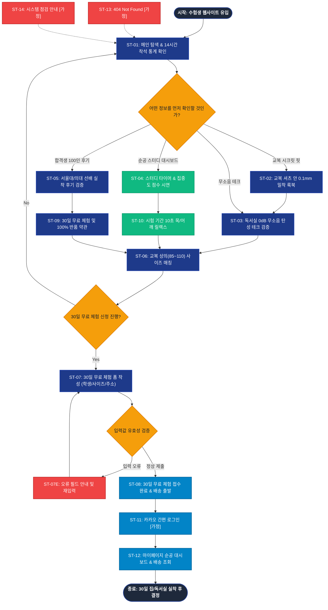

# SEUMIM(스밈) 고3 수험생 서비스 흐름도 명세서 (가상클라이언트 2: 김도윤)

## 1. 서비스 흐름 개요 (Service Flow Overview)

본 문서는 **스밈(SEUMIM) 고3 수험생 집중력 강화 척추 조끼 & 스터디 플래너 연동 웹 플랫폼(가상클라이언트 2: 김도윤)**의 사이트맵과 사용자 분석 결과를 기반으로 설계된 서비스 흐름도(Service Flowchart) 명세서입니다.

하루 14시간 이상 착석 공부 중 목/어깨 결림과 집중력 저하를 겪는 수험생 및 자녀의 바른 자세와 성적 향상을 지원하려는 학부모를 위해, **[메인 탐색 ➔ 교복 0mm 비침 검증 ➔ 독서실 0dB 무소음 탄성 지지 확인 ➔ 스터디 타이머 시연 ➔ 교복 상의 사이즈 매칭 ➔ 30일 무료 체험 신청 ➔ 배송 및 순공 대시보드 연동]**으로 이어지는 정밀한 전환 흐름을 정의합니다.

```text
[서비스 기본 여정 구조]
탐색 (Discovery) ──> 스펙/후기 검증 (Verification) ──> 사이즈 매칭 (Size Fit) ──> 30일 체험 신청 (Core Action) ──> 무료 배송 확정 (Confirmation)
```

---

## 2. 사용자 유형과 시작 조건 (User Personas & Entry Points)

| 사용자 유형 (User Persona) | 시작 조건 (Entry Point) | 주요 니즈 및 목표 (Primary Goal) | 최종 도달 결과 (Target Result) |
|:---|:---|:---|:---|
| **유형 1: 고3 수험생/N수생**<br>(하루 14시간 순공 착석자) | • 공스타/유튜브 수험생 채널 유입<br>• 메인 랜딩페이지(`P-0.0`) 진입 | • 교복/후드티 안 0.1mm 티 안 나는 룩북 확인<br>• 독서실 소음 0dB 무소음 탄성 지지 확인<br>• 30일 무료 체험 신청 | `4.3 30일 무료 체험 신청 폼 [모달] (P-4.3)` 접수 완료 ➔ 무료 배송 |
| **유형 2: 수험생 학부모**<br>(대치동/학부모 커뮤니티 유저) | • 맘카페 입시 건강 꿀팁 유입<br>• `5.0 학부모 후기 (P-5.0)` 진입 | • 서울대/의대 합격생 100인 실착 후기 검증<br>• 30일 무상 시착 후 100% 무료 반품 정책 확인<br>• 자녀를 위한 안심 체험 대리 신청 | `4.3 30일 무료 체험 폼 [모달]` ➔ 학부모 안심 신청 완료 |
| **유형 3: 스터디 플래너 유저**<br>(순공 시간 관리 집중자) | • 열품타/타이머 연동 키워드 유입<br>• `3.0 순공 대시보드 (P-3.0)` 진입 | • 스터디 타이머 연동 실시간 자세 점수 시연<br>• 시험 기간 10초 목/어깨 스트레칭 루틴 확인<br>• 순공 대시보드 무료 연동 | `3.0 순공 대시보드 (P-3.0)` ➔ 조끼 30일 시착 신청 |

---

## 3. 다중 핵심 정상 흐름 (Multiple Happy Paths)

### (1) Flow A: 교복 비침 검증 및 30일 무료 체험 신청 흐름 (수험생 메인 여정)
1. **탐색 (Discovery)**: 사용자가 `0.0 메인 랜딩페이지 (P-0.0)` 접속 후 14시간 착석 통계 및 시크릿 핏 비주얼 확인.
2. **검증 (Verification)**: `1.0 수험생 조끼 (P-1.0)` 및 `1.2 교복/체육복 착용 핏`에서 0.1mm 스킨 메쉬 비침 0% 확인.
3. **사이즈 매칭 (Size Fit)**: `1.3 교복 정밀 사이즈 가이드 [모달]`에서 교복 상의(85~110) 기준 사이즈 선택.
4. **핵심 행동 (Core Action)**: `4.3 30일 무료 체험 신청 폼 [모달] (P-4.3)` 호출 ➔ 학생 정보, 교복 사이즈, 배송지 입력 및 제출.
5. **확정 안내 (Confirmation)**: `4.4 신청 완료 안내 (P-4.4)` 화면 노출 및 카카오 알림톡으로 30일 무료 체험 배송 안내 수신.

### (2) Flow B: 합격 선배 100인 후기 검증 및 학부모 안심 대리 신청 흐름 (학부모 여정)
1. **탐색 (Discovery)**: GNB `5.0 학부모 후기 (P-5.0)` 클릭 진입.
2. **검증 (Verification)**: 서울대/의대 합격 선배 100인의 순공 후기 및 근전도 38% 이완 시험 성적서 확인.
3. **상세 확인 (Detail View)**: 30일간 입어보고 불만족 시 100% 무료 반품/교환 보증 확인.
4. **핵심 행동 (Core Action)**: 하단 플로팅 바 클릭 ➔ `4.3 30일 무료 체험 폼 [모달]` 작성 완료.

### (3) Flow C: 순공 스터디 타이머 시연 및 대시보드 연동 흐름 (학습 동기부여)
1. **탐색 (Discovery)**: GNB `3.0 순공 대시보드 (P-3.0)` 클릭 진입.
2. **시연 (Demo View)**: 스터디 타이머 인터랙션 조작 및 일간 집중도 스코어 확인.
3. **핵심 행동 (Core Action)**: "순공 척추 조끼 무료 체험하고 대시보드 연동하기" 클릭 ➔ `4.3 30일 무료 체험 신청 폼 [모달]` 완료.

---

## 4. 분기, 오류, 이탈, 재진입 흐름 (Branching & Exception Flows)

```text
[주요 분기 및 예외 대응 체계]
├─ 1. 교복 사이즈 애매함 분기 (Size Fit Branch)
│  ├─ 상의 90과 95 사이 고민 시 ➔ "체육복/셔츠 겸용 넉넉한 핏 추천" 툴팁 표시
│  └─ "2가지 사이즈 동시 발송 후 맞지 않는 사이즈 무료 회수" 안심 옵션 노출
│
├─ 2. 신청자 구분 분기 (Applicant Type Branch)
│  ├─ 신청자가 '학부모'일 경우 ➔ 학생 이름/학년/학부모 연락처 입력 필드 활성화
│  └─ 신청자가 '학생 본인'일 경우 ➔ 기본 연락처와 배송지만으로 초간편 접수
│
├─ 3. 입력값 유효성 오류 분기 (Validation Error Branch)
│  ├─ 배송지 주소 또는 연락처 누락 시 ➔ 에러 필드 네이비/레드 하이라이트 + 툴팁 노출
│  └─ 기존 입력 데이터(교복 사이즈, 이름 등) 100% 보존 상태로 재포커스
│
├─ 4. 모달 취소 및 뒤로가기 흐름 (Back Flow)
│  ├─ 폼 작성 중 닫기(X) 클릭 시 "30일 무료 체험 혜택이 취소됩니다" 안내 후 메인 룩북으로 안전 복귀
│
└─ 5. 시스템 및 비정상 접근 예외 (System Exception Flow)
   ├─ 잘못된 URL ➔ 9.1 404 Not Found [가정] ➔ 수험생 메인 이동
   └─ 정기 점검 ➔ 9.2 시스템 점검 안내 [가정] ➔ 무료 체험 예약 데이터 보존 안내
```

---

## 5. 단계별 서비스 흐름 상세 정의표 (ST-01 ~ ST-14)

| 단계 ID | 단계명 | 사용자 행동 (User Action) | 시스템 처리 (System Process) | 화면 / UI 요소 | 다음 조건 및 분기 (Next Condition) |
|:---|:---|:---|:---|:---|:---|
| **ST-01** | 수험생 웹사이트 접속 | 브라우저 URL 입력 또는 공스타 링크 클릭 | • 네이비/민트 테마 렌더링<br>• 수험생 14시간 착석 통계 및 GNB 로딩 | `0.0 메인 랜딩페이지 (P-0.0)` | • GNB 조끼 ➔ ST-02<br>• 무소음 테크 ➔ ST-03<br>• 순공 대시보드 ➔ ST-04<br>• 학부모 후기 ➔ ST-05 |
| **ST-02** | 교복 시크릿 핏 룩북 탐색 | GNB `1.0 수험생 조끼` 클릭 | • 교복 셔츠/후드티 안 0.1mm 밀착 화보 노출<br>• 사계절 에어로 쿨링 메쉬 스펙 렌더링 | `1.0 수험생 조끼 (P-1.0)` | • 사이즈 매칭 ➔ ST-06<br>• 무소음 테크 ➔ ST-03 |
| **ST-03** | 독서실 무소음 테크 검증 | GNB `2.0 무소음 테크` 클릭 | • 독서실 0dB 탄성 힌지 구조공학 다이어그램 노출<br>• 근전도 38% 이완 시험 성적서 렌더링 | `2.0 무소음 테크 (P-2.0)` | • 사이즈 매칭 ➔ ST-06<br>• 순공 대시보드 ➔ ST-04 |
| **ST-04** | 순공 스터디 대시보드 시연 | GNB `3.0 순공 대시보드` 클릭 | • 스터디 타이머 인터랙션 로딩<br>• 순공 시간 대비 집중력 스코어 렌더링 | `3.0 순공 대시보드 (P-3.0)` | • 사이즈 매칭 ➔ ST-06<br>• 체험 신청 ➔ ST-07 |
| **ST-05** | 합격생 100인 후기 확인 | GNB `5.0 학부모 후기` 클릭 | • 서울대/의대 합격생 실착 포토 후기 노출<br>• 30일 100% 무료 반품 보증 배지 렌더링 | `5.0 학부모 후기 (P-5.0)` | • 무료 체험 신청 ➔ ST-07<br>• 메인 복귀 ➔ ST-01 |
| **ST-06** | 교복 상의 사이즈 매칭 | "교복 사이즈로 맞추기" 클릭 | • 교복 상의(85~110) 기준 정밀 규격표 팝업 호출<br>• 학생 체형 기반 맞춤 추천값 계산 | `1.3 교복 정밀 사이즈 [모달] (P-1.3)` | • 사이즈 선택 완료 ➔ ST-07<br>• 닫기 ➔ 기존 화면 |
| **ST-07** | 30일 무료 체험 신청 폼 작성 | "30일 무료 체험 신청" CTA 클릭 | • 30일 무료 체험 신청 폼 렌더링<br>• 선택된 교복 사이즈 자동 반영 | `4.3 30일 무료 체험 신청 [모달] (P-4.3)` | • 유효성 통과 ➔ ST-08<br>• 입력 오류 ➔ ST-07E<br>• 취소 ➔ 기존 화면 |
| **ST-07E** | 입력값 유효성 오류 | 필수 정보 누락 후 제출 시도 | • 미입력 필드 네이비 하이라이트 및 안내 툴팁 노출<br>• 데이터 보존 후 재포커스 | `4.3 30일 무료 체험 신청 [모달] (P-4.3)` | • 재입력 후 재제출 ➔ ST-07 |
| **ST-08** | 무료 체험 접수 완료 | 정보 입력 후 "신청 완료" 클릭 | • 무료 체험 주문 DB 저장 및 고유 접수번호 발급<br>• 카카오 알림톡 자동 발송 | `4.4 신청 완료 안내 (P-4.4)` | • 메인 복귀 ➔ ST-01<br>• 마이페이지 ➔ ST-12 |
| **ST-09** | 30일 무료 체험 약관 확인 | GNB `4.0 30일 무료 체험` 클릭 | • 30일간 무료 시착 혜택 상세 안내<br>• 왕복 배송비 0원 100% 무료 반품 규정 렌더링 | `4.0 30일 무료 체험 (P-4.0)` | • 신청 폼 호출 ➔ ST-07<br>• 메인 복귀 ➔ ST-01 |
| **ST-10** | 시험 기간 10초 스트레칭 | 10초 루틴 가이드 클릭 | • 앉은 자리 10초 목/어깨 릴렉스 가이드 영상 노출 | `3.3 10초 릴렉스 루틴 (P-3.3)` | • 대시보드 ➔ ST-04 |
| **ST-11** | 간편 로그인 / 회원가입 | [로그인] 버튼 클릭 | • 카카오 / 네이버 SNS 1-Click 간편 인증 모달 렌더링 | `6.1 간편 로그인 [가정] (P-6.1)` | • 로그인 완료 ➔ ST-12 |
| **ST-12** | 마이페이지 순공 관리 | [마이페이지] 클릭 | • 30일 무료 체험 배송 상태 및 순공 리포트 표시<br>• 1-Click 무료 반품 접수 | `6.2 마이페이지 [가정] (P-6.2)` | • 반품 접수 ➔ 완료<br>• 메인 이동 ➔ ST-01 |
| **ST-13** | 404 Not Found 에러 대응 | 잘못된 URL 접근 시 | • 사용자 친화적 에러 안내 및 메인 이동 버튼 노출 | `9.1 404 Not Found [가정] (P-9.1)` | • 메인 이동 ➔ ST-01 |
| **ST-14** | 시스템 점검 대응 | 점검 중 접속 시 | • 정기 점검 안내 및 체험 신청 데이터 보존 공지 | `9.2 시스템 점검 [가정] (P-9.2)` | • 점검 종료 후 ➔ ST-01 |

---

## 6. Mermaid 서비스 흐름도 다이어그램 (Full Flowchart)


