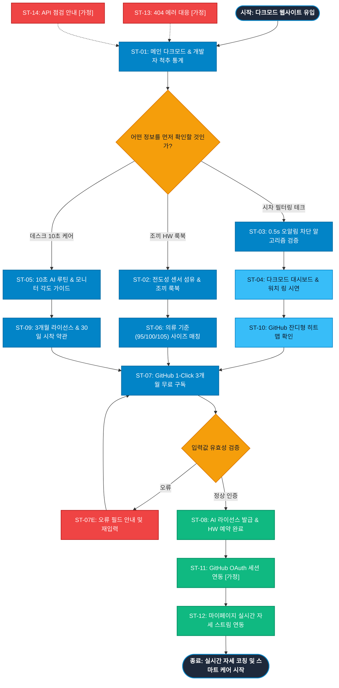

# SEUMIM(스밈) 테크 개발자 서비스 흐름도 명세서 (가상클라이언트 3: 강민우)

## 1. 서비스 흐름 개요 (Service Flow Overview)

본 문서는 **스밈(SEUMIM) 테크 개발자 실시간 다크모드 대시보드 & 스마트 척추 정렬 조끼 웹 플랫폼(가상클라이언트 3: 강민우)**의 사이트맵과 사용자 분석 결과를 기반으로 설계된 서비스 흐름도(Service Flowchart) 명세서입니다.

장시간 코딩 및 PC 집중 업무로 거북목과 허리 통증을 겪는 IT 개발자/엔지니어의 핵심 Pain Point인 **[작업 몰입 시 잦은 진동 오알림 스트레스, 복잡한 UI 조작 피로감]**을 해결하기 위해, **[다크모드 메인 탐색 ➔ 시차 필터링 알고리즘 검증 ➔ 3초 퀵-글랜스 스마트워치 링 UI 시연 ➔ 상의(95~110) 사이즈 매칭 ➔ GitHub 1-Click 3개월 무료 AI 구독 및 30일 HW 시착 신청 ➔ 마이페이지 실시간 스트림 연동]**으로 이어지는 정밀한 전환 여정을 정의합니다.

```text
[서비스 기본 여정 구조]
탐색 (Discovery) ──> 알고리즘 검증 (Verification) ──> 대시보드 시연 (Interactive Demo) ──> 무료 구독 신청 (Core Action) ──> 대시보드 연동 (Confirmation)
```

---

## 2. 사용자 유형과 시작 조건 (User Personas & Entry Points)

| 사용자 유형 (User Persona) | 시작 조건 (Entry Point) | 주요 니즈 및 목표 (Primary Goal) | 최종 도달 결과 (Target Result) |
|:---|:---|:---|:---|
| **유형 1: 풀스택 IT 개발자**<br>(일평균 10시간 이상 코딩 직군) | • 깃허브/개발자 커뮤니티 배너 유입<br>• 다크모드 메인(`P-0.0`) 진입 | • 0.5초 단순 기울임 무시 시차 필터링 알고리즘 확인<br>• 스마트워치 퀵-글랜스 링 UI 실시간 연동 시연<br>• AI 미니멀 케어 3개월 무료 구독 | `3.0 AI 데이터 케어 (P-3.0)` ➔ `6.2 마이페이지 대시보드 (P-6.2)` 연동 완료 |
| **유형 2: 하드웨어 얼리어답터**<br>(스마트 척추 조끼 관심 유저) | • 테크 하드웨어 리뷰 검색 유입<br>• `1.0 척추 조끼 HW (P-1.0)` 진입 | • 전도성 센서 섬유 및 탄성 복원 프레임 스펙 확인<br>• 상의(100/105) 기준 정밀 사이즈 매칭<br>• 30일 무료 체험 사전 신청 | `4.3 30일 무료 체험 신청 [모달] (P-4.3)` 접수 완료 ➔ 하드웨어 배송 |
| **유형 3: 미니멀 케어 루틴 유저**<br>(스트레칭 시간 부족 개발자) | • 데스크 스트레칭 키워드 유입<br>• `5.0 데스크 케어 (P-5.0)` 진입 | • 자리에서 10초 만에 끝나는 AI 목/어깨 릴렉스 루틴 확인<br>• GitHub 잔디 형태 일간 자세 밸런스 히트맵 검증<br>• 부담 없는 무료 라이선스 활성화 | `5.0 데스크 케어 (P-5.0)` ➔ AI 라이선스 활성화 |

---

## 3. 다중 핵심 정상 흐름 (Multiple Happy Paths)

### (1) Flow A: 시차 필터링 검증 및 실시간 대시보드 무료 구독 흐름 (SW 핵심 여정)
1. **탐색 (Discovery)**: 사용자가 `0.0 메인 랜딩페이지 (P-0.0)` 접속 후 개발자 거북목 통계 및 다크모드(#0B0F17) 히어로 확인.
2. **알고리즘 검증 (Verification)**: `2.0 시차 필터링 테크 (P-2.0)`에서 단순 타이핑/물 마심 시 오알림 0건 필터링 로직 확인.
3. **대시보드 시연 (Interactive Demo)**: `3.0 AI 데이터 대시보드 (P-3.0)`에서 실시간 자세 점수 게이지 및 스마트워치 링 UI 인터랙션 조작.
4. **핵심 행동 (Core Action)**: "AI 미니멀 케어 3개월 무료 구독" CTA 클릭 ➔ GitHub / 간편 로그인 진행.
5. **대시보드 연동 (Confirmation)**: `6.2 마이페이지 [가정] (P-6.2)`로 즉시 이동하여 실시간 자세 데이터 스트림 연동 확인.

### (2) Flow B: 스마트 척추 정렬 조끼 30일 시착 신청 흐름 (HW 여정)
1. **탐색 (Discovery)**: GNB `1.0 척추 조끼 HW (P-1.0)` 클릭 진입.
2. **스펙 확인 (Spec View)**: 전도성 센서 섬유 구조 및 탄성 복원 프레임 3D 매크로 뷰 확인.
3. **사이즈 매칭 (Size Fit)**: `1.3 정밀 사이즈 가이드 [모달]`에서 상의(95/100/105) 기준 사이즈 선택.
4. **핵심 행동 (Core Action)**: `4.3 30일 무료 체험 신청 폼 [모달]` 호출 ➔ 성함/주소 입력 및 사전 예약 완료.
5. **확정 안내 (Confirmation)**: 30일간 사무실/재택에서 입어보고 결정하는 무료 배송 접수 완료.

### (3) Flow C: 데스크 10초 루틴 & 잔디 히트맵 확인 흐름 (케어 여정)
1. **탐색 (Discovery)**: GNB `5.0 데스크 케어 (P-5.0)` 클릭 진입.
2. **루틴 확인 (Routine View)**: 앉은 자리 10초 AI 목/어깨 릴렉스 가이드 및 주간 자세 히트맵 확인.
3. **핵심 행동 (Core Action)**: 하단 고정 CTA 클릭 ➔ AI 케어 3개월 무료 체험 활성화.

---

## 4. 분기, 오류, 이탈, 재진입 흐름 (Branching & Exception Flows)

```text
[주요 분기 및 예외 대응 체계]
├─ 1. GitHub 간편 인증 분기 (OAuth Branch)
│  ├─ 인증 성공 시 ➔ 3개월 무료 라이선스 키 즉시 발급 및 마이페이지 대시보드로 리다이렉트
│  └─ 인증 취소/실패 시 ➔ 이메일 간편 인증 대체 옵션 제공
│
├─ 2. 센서 블루투스 연동 실패 분기 (Device Pairing Branch)
│  ├─ Web Bluetooth 페어링 오류 시 ➔ "문제 해결 가이드 팝업" 호출 및 수동 데이터 동기화 모드 전환
│  └─ 센서 재연결 성공 시 ➔ 실시간 스트림 자동 재개
│
├─ 3. 입력값 유효성 오류 분기 (Validation Error Branch)
│  ├─ HW 배송지 주소 누락 시 ➔ 에러 필드 사이버 블루(#38BDF8) 하이라이트 + 툴팁 노출
│  └─ 기존 선택 옵션(상의 사이즈, GitHub 계정) 100% 보존 상태로 재포커스
│
├─ 4. 모달 취소 및 뒤로가기 흐름 (Back Flow)
│  ├─ 폼 작성 중 닫기(X) 클릭 시 기존 대시보드 시연 화면으로 안전 복귀
│
└─ 5. 시스템 예외 처리 (System Exception Flow)
   ├─ 잘못된 URL ➔ 9.1 404 Not Found [가정] ➔ 다크모드 메인 복귀
   └─ 정기 점검 ➔ 9.2 API 서버 점검 안내 [가정] ➔ API 상태 안내
```

---

## 5. 단계별 서비스 흐름 상세 정의표 (ST-01 ~ ST-14)

| 단계 ID | 단계명 | 사용자 행동 (User Action) | 시스템 처리 (System Process) | 화면 / UI 요소 | 다음 조건 및 분기 (Next Condition) |
|:---|:---|:---|:---|:---|:---|
| **ST-01** | 다크모드 메인 접속 | 브라우저 URL 입력 또는 깃허브 링크 유입 | • 다크모드(#0B0F17) 테마 렌더링<br>• 개발자 91.2% 척추 통계 및 GNB 로딩 | `0.0 메인 랜딩페이지 (P-0.0)` | • HW 탐색 ➔ ST-02<br>• 알고리즘 ➔ ST-03<br>• 대시보드 ➔ ST-04<br>• 데스크 케어 ➔ ST-05 |
| **ST-02** | 스마트 척추 조끼 탐색 | GNB `1.0 척추 조끼 HW` 클릭 | • 전도성 센서 섬유 및 프레임 룩북 노출<br>• 맨투맨/후드티 안 0.1mm 시크릿 핏 렌더링 | `1.0 척추 조끼 HW (P-1.0)` | • 사이즈 매칭 ➔ ST-06<br>• 알고리즘 ➔ ST-03 |
| **ST-03** | 시차 필터링 테크 검증 | GNB `2.0 시차 필터링 테크` 클릭 | • 0.5초 단순 숙임 오알림 차단 모식도 노출<br>• 타이핑/물 마심 필터링 벤치마크 렌더링 | `2.0 시차 필터링 테크 (P-2.0)` | • 대시보드 시연 ➔ ST-04<br>• 사이즈 매칭 ➔ ST-06 |
| **ST-04** | AI 실시간 대시보드 시연 | GNB `3.0 AI 데이터 대시보드` 클릭 | • 다크모드 실시간 자세 점수 게이지 시연<br>• 스마트워치 퀵-글랜스 링 인터랙션 로딩 | `3.0 AI 데이터 대시보드 (P-3.0)` | • 무료 구독 ➔ ST-07<br>• 잔디 히트맵 ➔ ST-10 |
| **ST-05** | 데스크 10초 케어 가이드 | GNB `5.0 데스크 케어` 클릭 | • 10초 AI 스트레칭 루틴 동영상 노출<br>• 모니터 높이 세팅 가이드 렌더링 | `5.0 데스크 케어 (P-5.0)` | • 무료 구독 ➔ ST-07<br>• 메인 복귀 ➔ ST-01 |
| **ST-06** | 의류 기준 사이즈 매칭 | "내 옷 사이즈로 맞추기" 클릭 | • 상의(95/100/105) 기준 정밀 규격표 팝업 호출<br>• 실측 치수 자동 추천값 계산 | `1.3 정밀 사이즈 가이드 [모달] (P-1.3)` | • 사이즈 선택 완료 ➔ ST-07<br>• 닫기 ➔ 기존 화면 |
| **ST-07** | 3개월 무료 구독 또는 HW 예약 | "GitHub 3개월 무료 구독" CTA 클릭 | • GitHub 간편 로그인 및 신청 모달 렌더링<br>• 3개월 무료 라이선스 키 생성 준비 | `4.3 무료 체험/구독 신청 [모달] (P-4.3)` | • 인증 완료 ➔ ST-08<br>• 입력 오류 ➔ ST-07E<br>• 취소 ➔ 기존 화면 |
| **ST-07E** | 입력값 오류 | 필수 항목 누락 시 | • 미입력 필드 사이버 블루 하이라이트 및 안내 툴팁 노출<br>• 데이터 보존 후 재포커스 | `4.3 무료 체험/구독 신청 [모달] (P-4.3)` | • 재입력 후 재제출 ➔ ST-07 |
| **ST-08** | 라이선스 발급 완료 | GitHub OAuth 인증 성공 | • 구독 DB 활성화 및 고유 API 키 발급<br>• 라이선스 발급 완료 화면 노출 | `4.4 라이선스 발급 완료 [가정] (P-4.4)` | • 마이페이지 이동 ➔ ST-12<br>• 메인 복귀 ➔ ST-01 |
| **ST-09** | 30일 무료 시착 약관 확인 | GNB `4.0 무료 체험/구독` 클릭 | • AI 3개월 무료 라이선스 혜택표 노출<br>• HW 30일 시착 및 100% 무료 반품 약관 렌더링 | `4.0 무료 체험/구독 (P-4.0)` | • 신청 폼 호출 ➔ ST-07<br>• 메인 복귀 ➔ ST-01 |
| **ST-10** | GitHub 잔디 히트맵 확인 | 대시보드 잔디 탭 클릭 | • 연간 척추 밸런스 잔디 히트맵 시뮬레이터 렌더링 | `3.3 GitHub 잔디 히트맵 (P-3.3)` | • 무료 구독 ➔ ST-07 |
| **ST-11** | GitHub OAuth 간편 인증 | [로그인] 버튼 클릭 | • GitHub OAuth 2.0 팝업 호출 및 세션 연동 | `6.1 GitHub 간편 로그인 [가정] (P-6.1)` | • 로그인 완료 ➔ ST-12 |
| **ST-12** | 마이페이지 자세 스트림 연동 | [마이페이지] 클릭 | • 실시간 자세 데이터 스트림 및 API 키 관리 표시<br>• 데이터 내보내기 (JSON/CSV) | `6.2 마이페이지 [가정] (P-6.2)` | • API 복사 ➔ 완료<br>• 메인 이동 ➔ ST-01 |
| **ST-13** | 404 Not Found 에러 대응 | 잘못된 URL 접근 시 | • 터미널 콘솔형 에러 안내 및 메인 이동 버튼 노출 | `9.1 404 Not Found [가정] (P-9.1)` | • 메인 이동 ➔ ST-01 |
| **ST-14** | API 서버 점검 대응 | 점검 중 접속 시 | • API 상태 안내 및 구독 라이선스 보존 공지 | `9.2 API 서버 점검 [가정] (P-9.2)` | • 점검 종료 후 ➔ ST-01 |

---

## 6. Mermaid 서비스 흐름도 다이어그램 (Full Flowchart)


