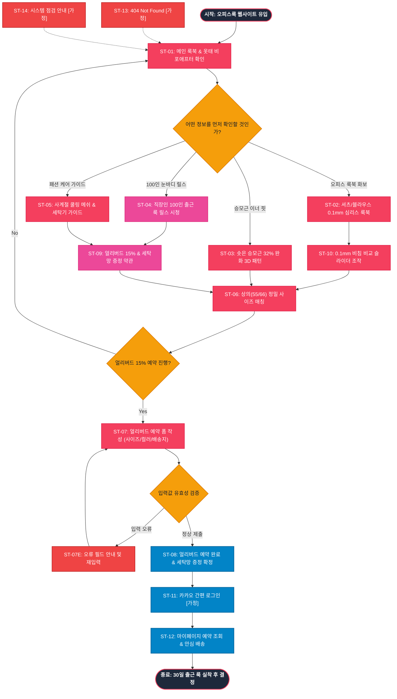

# SEUMIM(스밈) 오피스룩 슬림핏 서비스 흐름도 명세서 (가상클라이언트 4: 이주은)

## 1. 서비스 흐름 개요 (Service Flow Overview)

본 문서는 **스밈(SEUMIM) 2030 오피스 워커를 위한 슬림핏 심리스 이너웨어 & 승모근 완화 웹 플랫폼(가상클라이언트 4: 이주은)**의 사이트맵과 사용자 분석 결과를 기반으로 설계된 서비스 흐름도(Service Flowchart) 명세서입니다.

출근 룩(셔츠, 블라우스, 슬랙스) 착용 시 두꺼운 교정기의 핏 망가짐과 여름철 땀/비침 문제, 승모근 솟음으로 고민하는 직장인 여성을 위해, **[오피스룩 비포애프터 공감 ➔ 0.1mm 심리스 무봉제 룩북 검증 ➔ 승모근 32% 완화 데이터 확인 ➔ 100인 눈바디 릴스 시청 ➔ 상의(55/66) 사이즈 매칭 ➔ 얼리버드 15% 예약 & 세탁망 증정 신청 ➔ 30일 안심 시착]**으로 이어지는 정밀한 전환 여정을 정의합니다.

```text
[서비스 기본 여정 구조]
탐색 (Discovery) ──> 룩북/릴스 검증 (Verification) ──> 사이즈 매칭 (Size Fit) ──> 얼리버드 예약 (Core Action) ──> 안심 시착 확정 (Confirmation)
```

---

## 2. 사용자 유형과 시작 조건 (User Personas & Entry Points)

| 사용자 유형 (User Persona) | 시작 조건 (Entry Point) | 주요 니즈 및 목표 (Primary Goal) | 최종 도달 결과 (Target Result) |
|:---|:---|:---|:---|
| **유형 1: 2030 오피스 워커**<br>(출근 셔츠/블라우스 착용 직장인) | • 인스타그램/29CM 코디 릴스 광고 유입<br>• 오피스룩 메인(`P-0.0`) 진입 | • 셔츠 안 비침 0% 및 0.1mm 무봉제 심리스 룩북 확인<br>• 솟은 승모근 32% 완화 데이터 검증<br>• 얼리버드 15% 할인 예약 | `4.3 얼리버드 예약 폼 [모달] (P-4.3)` 접수 완료 ➔ 세탁망 무료 증정 |
| **유형 2: 패션 고관여층**<br>(눈바디 핏 & 라인 중시 유저) | • #스밈슬림핏 해시태그 검색 유입<br>• `3.0 눈바디 릴스 후기 (P-3.0)` 진입 | • 직장인 100인의 실제 출근 룩 릴스 영상 시청<br>• 승모근 라인 비포애프터 포토 검증<br>• 카카오페이 1-Click 사전 예약 | `3.0 눈바디 릴스 후기 (P-3.0)` ➔ `4.3 얼리버드 예약 폼 [모달]` 완료 |
| **유형 3: 소재/세탁 안심 유저**<br>(사계절 착용 관리 중시 유저) | • 여름 쿨링 이너웨어 검색 유입<br>• `5.0 패션 케어 가이드 (P-5.0)` 진입 | • 사계절 에어로 쿨링 메쉬 및 세탁기 통세척 확인<br>• 30일 안심 무료 반품 보증 확인<br>• 부담 없는 30일 시착 신청 | `5.0 패션 케어 가이드 (P-5.0)` ➔ 30일 안심 시착 접수 |

---

## 3. 다중 핵심 정상 흐름 (Multiple Happy Paths)

### (1) Flow A: 오피스 룩북 검증 및 얼리버드 15% 예약 흐름 (메인 구매 여정)
1. **탐색 (Discovery)**: 사용자가 `0.0 메인 랜딩페이지 (P-0.0)` 접속 후 옷태 고민 비포애프터 및 로즈핑크 테마 확인.
2. **검증 (Verification)**: `1.0 오피스 룩북 (P-1.0)` 및 `2.0 승모근 이너 핏 (P-2.0)`에서 0.1mm 심리스 핏과 승모근 32% 이완 데이터 확인.
3. **사이즈 매칭 (Size Fit)**: `2.3 정밀 사이즈 가이드 [모달]`에서 상의(44/55/66/77) 기준 사이즈 선택.
4. **핵심 행동 (Core Action)**: `4.3 얼리버드 예약 폼 [모달] (P-4.3)` 호출 ➔ 옵션 선택 및 15% 할인 예약 접수.
5. **확정 안내 (Confirmation)**: `4.4 예약 완료 안내 (P-4.4)` 화면 노출 및 카카오 알림톡으로 고급 세탁망 증정 안내 수신.

### (2) Flow B: 100인 눈바디 릴스 시청 및 소셜 검증 흐름 (바이럴 여정)
1. **탐색 (Discovery)**: GNB `3.0 눈바디 릴스 후기 (P-3.0)` 클릭 진입.
2. **시청 (Reels View)**: 직장인 100인의 출근 룩 릴스 쇼츠 영상 및 W컨셉 4.9점 포토 후기 확인.
3. **비교 (Comparison)**: `1.3 0.1mm 비침 비교 [모달]` 호출 ➔ 화이트 셔츠 슬라이더 조작.
4. **핵심 행동 (Core Action)**: 하단 플로팅 바 클릭 ➔ `4.3 얼리버드 예약 폼 [모달]` 작성 완료.

### (3) Flow C: 쿨링 메쉬 스펙 확인 및 30일 안심 시착 흐름 (케어 여정)
1. **탐색 (Discovery)**: GNB `5.0 패션 케어 가이드 (P-5.0)` 클릭 진입.
2. **스펙 확인 (Spec View)**: 쿨링 메쉬 인증서 및 세탁기 세탁 가이드 확인.
3. **핵심 행동 (Core Action)**: 30일 무료 반품 규정 확인 후 `4.3 얼리버드 예약 폼 [모달]` 완료.

---

## 4. 분기, 오류, 이탈, 재진입 흐름 (Branching & Exception Flows)

```text
[주요 분기 및 예외 대응 체계]
├─ 1. 의류 사이즈 애매함 분기 (Size Fit Branch)
│  ├─ 55와 66 사이즈 중간 체형 시 ➔ "타이트한 옷태 연출 시 55, 편안한 일상 착용 시 66" 가이드 노출
│  └─ "2가지 사이즈 동시 발송 후 맞지 않는 사이즈 무료 수거" 안심 옵션 노출
│
├─ 2. 결제 방식 분기 (Payment Method Branch)
│  ├─ 간편 결제 선택 시 ➔ 카카오페이 / 네이버페이 1-Click 사전 예약 승인
│  └─ 일반 결제 선택 시 ➔ 카드 번호 입력 및 무통장 입금 안내
│
├─ 3. 입력값 유효성 오류 분기 (Validation Error Branch)
│  ├─ 배송지 주소 또는 연락처 누락 시 ➔ 에러 필드 로즈 핑크(#F43F5E) 하이라이트 + 툴팁 노출
│  └─ 기존 선택 옵션(사이즈, 컬러) 100% 보존 상태로 재포커스
│
├─ 4. 모달 취소 및 뒤로가기 흐름 (Back Flow)
│  ├─ 폼 작성 중 닫기(X) 클릭 시 "얼리버드 15% 할인 혜택이 취소됩니다" 안내 후 메인 룩북으로 복귀
│
└─ 5. 시스템 및 비정상 접근 예외 (System Exception Flow)
   ├─ 잘못된 URL ➔ 9.1 404 Not Found [가정] ➔ 오피스룩 메인 복귀
   └─ 정기 점검 ➔ 9.2 시스템 점검 안내 [가정] ➔ 예약 데이터 보존 안내
```

---

## 5. 단계별 서비스 흐름 상세 정의표 (ST-01 ~ ST-14)

| 단계 ID | 단계명 | 사용자 행동 (User Action) | 시스템 처리 (System Process) | 화면 / UI 요소 | 다음 조건 및 분기 (Next Condition) |
|:---|:---|:---|:---|:---|:---|
| **ST-01** | 오피스룩 메인 접속 | 브라우저 URL 입력 또는 릴스 광고 유입 | • 로즈베이지 테마(#FFF1F2) 렌더링<br>• 오피스 비포애프터 및 GNB 로딩 | `0.0 메인 랜딩페이지 (P-0.0)` | • 룩북 탐색 ➔ ST-02<br>• 승모근 핏 ➔ ST-03<br>• 릴스 후기 ➔ ST-04<br>• 케어 가이드 ➔ ST-05 |
| **ST-02** | 오피스 룩북 화보 탐색 | GNB `1.0 오피스 룩북` 클릭 | • 셔츠/블라우스/자켓 착용 룩북 노출<br>• 0.1mm 심리스 무봉제 라인 렌더링 | `1.0 오피스 룩북 (P-1.0)` | • 비침 비교 ➔ ST-06<br>• 승모근 핏 ➔ ST-03 |
| **ST-03** | 승모근 이너 핏 검증 | GNB `2.0 승모근 이너 핏` 클릭 | • 솟은 승모근 32% 완화 3D 패턴 모식도 노출<br>• 와이드 암홀 구조공학 렌더링 | `2.0 승모근 이너 핏 (P-2.0)` | • 사이즈 매칭 ➔ ST-06<br>• 릴스 후기 ➔ ST-04 |
| **ST-04** | 100인 눈바디 릴스 시청 | GNB `3.0 눈바디 릴스 후기` 클릭 | • 직장인 100인 출근 룩 릴스 쇼츠 플레이어 로딩<br>• W컨셉 4.9점 포토 후기 렌더링 | `3.0 눈바디 릴스 후기 (P-3.0)` | • 얼리버드 예약 ➔ ST-07<br>• 메인 복귀 ➔ ST-01 |
| **ST-05** | 패션 케어 가이드 확인 | GNB `5.0 패션 케어 가이드` 클릭 | • 쿨링 메쉬 인증서 및 세탁기 가이드 노출<br>• 30일 안심 무료 반품 약관 렌더링 | `5.0 패션 케어 가이드 (P-5.0)` | • 얼리버드 예약 ➔ ST-07<br>• 메인 복귀 ➔ ST-01 |
| **ST-06** | 상의 기준 사이즈 매칭 | "내 옷 사이즈로 맞추기" 클릭 | • 상의(44~77) 기준 정밀 규격표 팝업 호출<br>• 체형별 맞춤 추천값 계산 | `2.3 정밀 사이즈 가이드 [모달] (P-2.3)` | • 사이즈 선택 완료 ➔ ST-07<br>• 닫기 ➔ 기존 화면 |
| **ST-07** | 얼리버드 예약 폼 작성 | "얼리버드 15% 예약하기" CTA 클릭 | • 얼리버드 예약 폼 렌더링 (15% 할인가 적용)<br>• 고급 세탁망 무료 증정 옵션 자동 체크 | `4.3 얼리버드 예약 폼 [모달] (P-4.3)` | • 유효성 통과 ➔ ST-08<br>• 입력 오류 ➔ ST-07E<br>• 취소 ➔ 기존 화면 |
| **ST-07E** | 입력값 유효성 오류 | 필수 항목 누락 시 | • 미입력 필드 로즈 핑크 하이라이트 및 안내 툴팁 노출<br>• 데이터 보존 후 재포커스 | `4.3 얼리버드 예약 폼 [모달] (P-4.3)` | • 재입력 후 재제출 ➔ ST-07 |
| **ST-08** | 얼리버드 예약 완료 | 정보 입력 후 "예약 완료" 클릭 | • 주문 DB 저장 및 고유 예약 번호 발급<br>• 카카오 알림톡 자동 발송 | `4.4 예약 완료 안내 (P-4.4)` | • 메인 복귀 ➔ ST-01<br>• 마이페이지 ➔ ST-12 |
| **ST-09** | 얼리버드 혜택 상세 확인 | GNB `4.0 얼리버드 혜택` 클릭 | • 15% 할인 및 세탁망 무료 증정 혜택표 노출<br>• 30일 무료 반품 정책 렌더링 | `4.0 얼리버드 혜택 (P-4.0)` | • 예약 폼 호출 ➔ ST-07<br>• 메인 복귀 ➔ ST-01 |
| **ST-10** | 0.1mm 비침 비교 슬라이더 | "비침 비교하기" 클릭 | • 화이트 셔츠 안 비침 비교 슬라이더 모달 노출 | `1.3 0.1mm 비침 비교 [모달] (P-1.3)` | • 사이즈 매칭 ➔ ST-06 |
| **ST-11** | SNS 1-Click 간편 로그인 | [로그인] 버튼 클릭 | • 카카오 / 네이버 간편 로그인 모달 렌더링 | `6.1 간편 로그인 [가정] (P-6.1)` | • 로그인 완료 ➔ ST-12 |
| **ST-12** | 마이페이지 예약 관리 | [마이페이지] 클릭 | • 얼리버드 배송 현황 및 세탁망 증정 상태 표시<br>• 1-Click 무료 반품 접수 | `6.2 마이페이지 [가정] (P-6.2)` | • 반품 접수 ➔ 완료<br>• 메인 이동 ➔ ST-01 |
| **ST-13** | 404 Not Found 에러 대응 | 잘못된 URL 접근 시 | • 로즈 테마 에러 안내 및 메인 이동 버튼 노출 | `9.1 404 Not Found [가정] (P-9.1)` | • 메인 이동 ➔ ST-01 |
| **ST-14** | 시스템 점검 대응 | 점검 중 접속 시 | • 정기 점검 안내 및 얼리버드 혜택 안전 보존 공지 | `9.2 시스템 점검 [가정] (P-9.2)` | • 점검 종료 후 ➔ ST-01 |

---

## 6. Mermaid 서비스 흐름도 다이어그램 (Full Flowchart)


