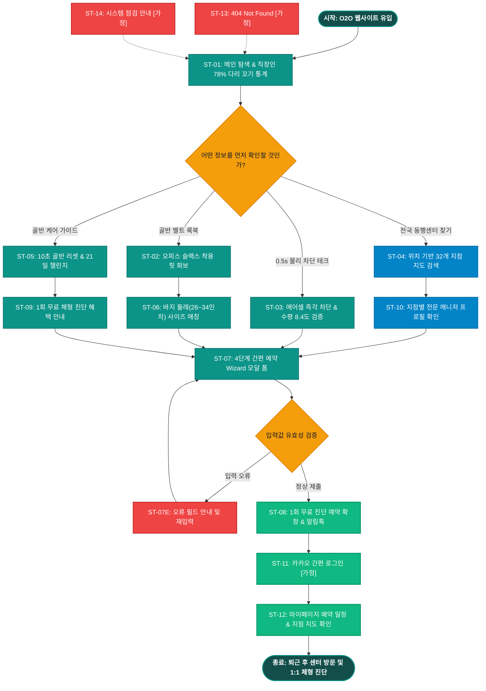

# SEUMIM(스밈) 오프라인 동행센터 & 골반 에어셀 벨트 서비스 흐름도 명세서 (가상클라이언트 5: 최수진)

## 1. 서비스 흐름 개요 (Service Flow Overview)

본 문서는 **스밈(SEUMIM) 골반 수평 에어셀 벨트 & 전국 교정 동행센터 1:1 체형 진단 O2O 웹 플랫폼(가상클라이언트 5: 최수진)**의 사이트맵과 사용자 분석 결과를 기반으로 설계된 서비스 흐름도(Service Flowchart) 명세서입니다.

장시간 데스크 착석 중 무의식적으로 다리를 꼬아 골반 비대칭과 짝다리, 하체 부종을 겪는 금융/사무직 직장인을 위해, **[O2O 메인 탐색 ➔ 0.5초 에어셀 물리 차단 검증 ➔ 직장 인접 32개 센터 지도 검색 ➔ 4단계 Wizard 간편 예약 ➔ 카카오 알림톡 수신 & 퇴근 후 지점 방문 진단 ➔ 마이페이지 연동]**으로 이어지는 정밀한 온·오프라인 융합 전환 흐름을 정의합니다.

```text
[서비스 기본 여정 구조]
탐색 (Discovery) ──> 물리 차단 검증 (Verification) ──> 센터 지도 검색 (O2O Search) ──> 4단계 간편 예약 (Wizard Action) ──> 알림톡 확정 & 방문 (Confirmation)
```

---

## 2. 사용자 유형과 시작 조건 (User Personas & Entry Points)

| 사용자 유형 (User Persona) | 시작 조건 (Entry Point) | 주요 니즈 및 목표 (Primary Goal) | 최종 도달 결과 (Target Result) |
|:---|:---|:---|:---|
| **유형 1: 금융/사무직 대리**<br>(일평균 9시간 착석, 습관적 다리 꼬기) | • 블라인드/SNS 직장인 건강 꿀팁 유입<br>• O2O 메인페이지(`P-0.0`) 진입 | • 0.5초 즉각 차단 에어셀 벨트 작동 원리 확인<br>• 여의도/강남 등 회사 근처 센터 검색<br>• 퇴근 후 1회 무료 1:1 진단 예약 | `4.2 4단계 예약 Wizard [모달] (P-4.2)` 접수 완료 ➔ 카카오 알림톡 수신 |
| **유형 2: 골반 에어셀 벨트 구매 유저**<br>(하드웨어 온라인 구매 희망자) | • 골반 수평 교정 벨트 검색 유입<br>• `1.0 골반 에어셀 벨트 (P-1.0)` 진입 | • 슬랙스 안 0.1mm 시크릿 핏 룩북 확인<br>• 바지 둘레(26~34인치) 기준 정밀 사이즈 매칭<br>• 30일 무료 시착 신청 | `1.3 골반 사이즈 가이드 [모달]` ➔ 30일 시착 신청 완료 |
| **유형 3: 데스크 웰니스 챌린저**<br>(운동 시간 부족 직장인) | • 다리 꼬기 방지 스트레칭 유입<br>• `5.0 골반 케어 가이드 (P-5.0)` 진입 | • 의자 10초 골반 수평 리셋 스트레칭 확인<br>• 21일 다리 꼬기 탈출 챌린지 참여<br>• 1회 무료 체형 진단권 획득 | `5.0 골반 케어 (P-5.0)` ➔ 주말 1:1 방문 예약 완료 |

---

## 3. 다중 핵심 정상 흐름 (Multiple Happy Paths)

### (1) Flow A: 인접 동행센터 검색 및 4단계 1회 무료 진단 예약 흐름 (메인 O2O 여정)
1. **탐색 (Discovery)**: 사용자가 `0.0 메인 랜딩페이지 (P-0.0)` 접속 후 직장인 78% 다리 꼬기 통계 및 오피스 실착 화보 확인.
2. **원리 검증 (Verification)**: `2.0 물리 차단 테크 (P-2.0)`에서 0.5초 에어셀 팽창 즉각 차단 및 좌우 수평 8.4도 복원 데이터 확인.
3. **지점 검색 (O2O Search)**: `3.0 전국 동행센터 찾기 (P-3.0)`에서 카카오맵 연동 회사 인접 지점(여의도점/강남점 등) 선택.
4. **핵심 행동 (Wizard Action)**: `4.2 4단계 예약 Wizard [모달] (P-4.2)` 호출 ➔ [1단계: 지점확인] ➔ [2단계: 퇴근 일시 선택] ➔ [3단계: 예약자 정보] ➔ [4단계: 최종 확인] 1-Click 접수.
5. **확정 안내 (Confirmation)**: `4.3 예약 완료 및 방문 안내 (P-4.3)` 노출 및 카카오 알림톡으로 예약 번호, 방문 지도, 주차 정보 수신.

### (2) Flow B: 골반 수평 에어셀 벨트 HW 30일 무료 시착 흐름 (온라인 전환)
1. **탐색 (Discovery)**: GNB `1.0 골반 에어셀 벨트 (P-1.0)` 클릭 진입.
2. **스펙 확인 (Spec View)**: 샌드베이지 오피스 슬랙스 핏 룩북 및 마이크로 에어셀 팽창 사양 확인.
3. **사이즈 매칭 (Size Fit)**: `1.3 골반 둘레 정밀 사이즈 [모달]`에서 바지 인치(26~34) 기준 사이즈 선택.
4. **핵심 행동 (Core Action)**: 30일 무료 시착 폼 작성 ➔ 사무실 택배 배송 접수 완료.

### (3) Flow C: 데스크 10초 리셋 & 21일 챌린지 예약 흐름 (습관 형성)
1. **탐색 (Discovery)**: GNB `5.0 골반 케어 가이드 (P-5.0)` 클릭 진입.
2. **루틴 확인 (Routine View)**: 앉은 자리 10초 골반 수평 리셋 모션 영상 시청 및 21일 챌린지 등록.
3. **핵심 행동 (Core Action)**: 무료 체형 진단권 수령 후 `4.2 4단계 예약 Wizard [모달]`로 주말 1:1 방문 예약 완료.

---

## 4. 분기, 오류, 이탈, 재진입 흐름 (Branching & Exception Flows)

```text
[주요 분기 및 예외 대응 체계]
├─ 1. 센터 방문 시간대 분기 (Time Slot Branch)
│  ├─ 평일 퇴근 시간대(18:00~20:00) 만석 시 ➔ "인접 지점(도보 10분 거리) 빠른 예약" 대체 슬롯 자동 추천
│  └─ 주말(토/일) 선호 시 ➔ 주말 전용 1:1 정밀 체형 측정 슬롯 노출
│
├─ 2. 예약 변경 및 취소 분기 (Reservation Management Branch)
│  ├─ 방문 24시간 전 알림톡에서 [1-Click 날짜 변경] 지원 (위약금 0원)
│  └─ 취소 요청 시 ➔ "온라인 10초 골반 케어 루틴" 가이드 무료 제공 후 안전 취소
│
├─ 3. 입력값 유효성 오류 분기 (Validation Error Branch)
│  ├─ 예약자 연락처 또는 방문 일시 누락 시 ➔ 에러 필드 딥 틸(#0D9488) 하이라이트 + 툴팁 노출
│  └─ 선택한 지점 및 시간 데이터 100% 보존 상태로 재포커스
│
├─ 4. 모달 취소 및 뒤로가기 흐름 (Back Flow)
│  ├─ Wizard 진행 중 닫기(X) 클릭 시 "작성 중인 예약 정보가 저장됩니다" 토스트 후 센터 지도 화면으로 복귀
│
└─ 5. 시스템 및 비정상 접근 예외 (System Exception Flow)
   ├─ 잘못된 URL ➔ 9.1 404 Not Found [가정] ➔ 동행센터 지도 메인 복귀
   └─ 정기 점검 ➔ 9.2 시스템 점검 안내 [가정] ➔ O2O 예약 데이터 안전 보존 공지
```

---

## 5. 단계별 서비스 흐름 상세 정의표 (ST-01 ~ ST-14)

| 단계 ID | 단계명 | 사용자 행동 (User Action) | 시스템 처리 (System Process) | 화면 / UI 요소 | 다음 조건 및 분기 (Next Condition) |
|:---|:---|:---|:---|:---|:---|
| **ST-01** | O2O 메인 웹사이트 접속 | 브라우저 URL 입력 또는 직장인 광고 유입 | • 딥 틸/샌드베이지 테마 렌더링<br>• 직장인 다리 꼬기 통계 및 GNB 로딩 | `0.0 메인 랜딩페이지 (P-0.0)` | • 골반 벨트 ➔ ST-02<br>• 물리 차단 ➔ ST-03<br>• 센터 찾기 ➔ ST-04<br>• 무료 예약 ➔ ST-07 |
| **ST-02** | 골반 에어셀 벨트 룩북 탐색 | GNB `1.0 골반 에어셀 벨트` 클릭 | • 오피스 슬랙스 핏 룩북 노출<br>• 마이크로 에어셀 원단 스펙 렌더링 | `1.0 골반 에어셀 벨트 (P-1.0)` | • 사이즈 매칭 ➔ ST-06<br>• 물리 차단 ➔ ST-03 |
| **ST-03** | 0.5s 물리 차단 테크 검증 | GNB `2.0 물리 차단 테크` 클릭 | • 0.5초 즉각 에어셀 팽창 차단 모식도 노출<br>• 수평 8.4도 복원 임상 데이터 렌더링 | `2.0 물리 차단 테크 (P-2.0)` | • 센터 찾기 ➔ ST-04<br>• 사이즈 매칭 ➔ ST-06 |
| **ST-04** | 전국 32개 동행센터 지도 검색 | GNB `3.0 전국 동행센터 찾기` 클릭 | • 카카오맵 연동 사용자 인접 지점 로딩<br>• 지점별 전문 매니저 프로필 렌더링 | `3.0 전국 동행센터 찾기 (P-3.0)` | • 지점 선택 ➔ ST-07<br>• 매니저 프로필 ➔ ST-10 |
| **ST-05** | 골반 케어 가이드 & 챌린지 | GNB `5.0 골반 케어 가이드` 클릭 | • 데스크 10초 리셋 영상 노출<br>• 21일 챌린지 등록 배너 렌더링 | `5.0 골반 케어 가이드 (P-5.0)` | • 무료 예약 ➔ ST-07<br>• 메인 복귀 ➔ ST-01 |
| **ST-06** | 골반 둘레 정밀 사이즈 매칭 | "바지 사이즈로 맞추기" 클릭 | • 바지 치수(26~34인치) 정밀 규격표 팝업 호출<br>• 실측 골반 둘레 추천값 계산 | `1.3 골반 정밀 사이즈 [모달] (P-1.3)` | • 사이즈 선택 ➔ HW 시착 신청<br>• 닫기 ➔ 기존 화면 |
| **ST-07** | 4단계 예약 Wizard 모달 오픈 | [1회 무료 체형 진단 예약] CTA 클릭 | • 4단계 Wizard 모달 렌더링<br>• 선택 지점 자동 바인딩 | `4.2 4단계 예약 Wizard [모달] (P-4.2)` | • 1~4단계 입력 ➔ ST-08<br>• 입력 오류 ➔ ST-07E<br>• 취소 ➔ 기존 화면 |
| **ST-07E** | 입력값 유효성 오류 | 필수 항목 누락 시 | • 미입력 필드 딥 틸 하이라이트 및 툴팁 노출<br>• 데이터 보존 후 재포커스 | `4.2 4단계 예약 Wizard [모달] (P-4.2)` | • 재입력 후 재제출 ➔ ST-07 |
| **ST-08** | 1회 무료 진단 예약 완료 | 최종 확인 후 "예약 확정" 클릭 | • O2O 예약 DB 저장 및 고유 예약 번호 발급<br>• 카카오 알림톡 자동 발송 | `4.3 예약 완료 및 방문 안내 (P-4.3)` | • 메인 복귀 ➔ ST-01<br>• 마이페이지 ➔ ST-12 |
| **ST-09** | 1회 무료 진단 혜택 확인 | GNB `4.0 1회 무료 진단 예약` 클릭 | • 1:1 체형 분석 혜택 상세 안내<br>• 오프라인 진단 프로세스 렌더링 | `4.0 1회 무료 진단 예약 (P-4.0)` | • Wizard 호출 ➔ ST-07<br>• 메인 복귀 ➔ ST-01 |
| **ST-10** | 전문 교정 매니저 프로필 | 매니저 카드 클릭 | • 물리치료사 자격 및 전문 진단 이력 노출 | `3.2 전문 매니저 프로필 (P-3.2)` | • 해당 매니저로 예약 ➔ ST-07 |
| **ST-11** | SNS 1-Click 간편 로그인 | [로그인] 버튼 클릭 | • 카카오 / 네이버 SNS 1-Click 간편 인증 모달 렌더링 | `6.1 간편 로그인 [가정] (P-6.1)` | • 로그인 완료 ➔ ST-12 |
| **ST-12** | 마이페이지 예약 관리 | [마이페이지] 클릭 | • 방문 예약 일정 조회, 1-Click 날짜 변경/취소<br>• 1:1 체형 진단 리포트 조회 | `6.2 마이페이지 [가정] (P-6.2)` | • 일정 변경 ➔ 완료<br>• 메인 이동 ➔ ST-01 |
| **ST-13** | 404 Not Found 에러 대응 | 잘못된 URL 접근 시 | • 친절한 에러 안내 및 센터 지도 바로가기 노출 | `9.1 404 Not Found [가정] (P-9.1)` | • 메인 이동 ➔ ST-01 |
| **ST-14** | 시스템 점검 대응 | 점검 중 접속 시 | • 정기 점검 안내 및 O2O 예약 데이터 보존 공지 | `9.2 시스템 점검 [가정] (P-9.2)` | • 점검 종료 후 ➔ ST-01 |

---

## 6. Mermaid 서비스 흐름도 다이어그램 (Full Flowchart)


