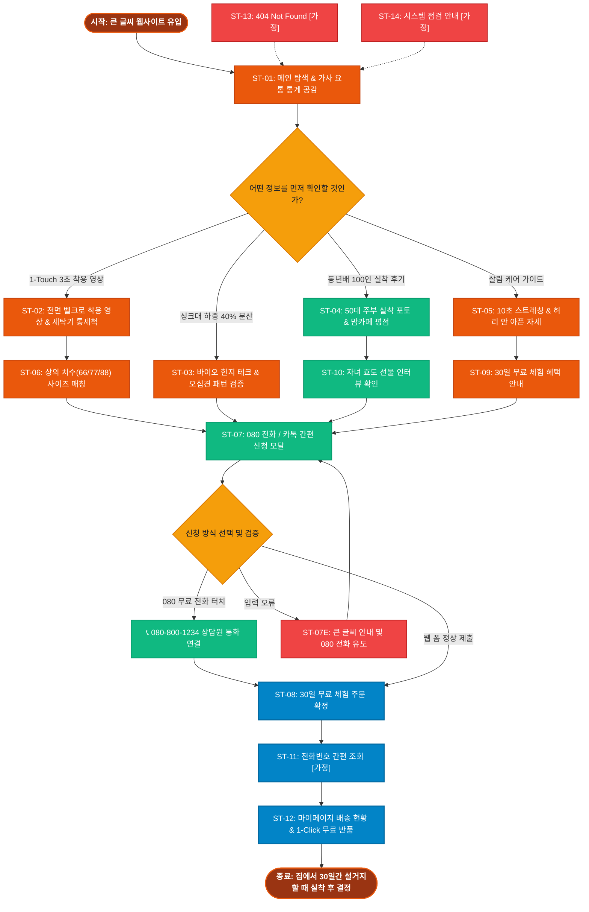

# SEUMIM(스밈) 주부 홈케어 1-Touch 척추 조끼 서비스 흐름도 명세서 (가상클라이언트 6: 정은숙)

## 1. 서비스 흐름 개요 (Service Flow Overview)

본 문서는 **스밈(SEUMIM) 주부 홈케어 1-Touch 전면 벨크로 척추 조끼 & 30일 무료 체험 웹 플랫폼(가상클라이언트 6: 정은숙)**의 사이트맵과 사용자 분석 결과를 기반으로 설계된 서비스 흐름도(Service Flowchart) 명세서입니다.

설거지, 청소기, 빨래 등 가사 노동 중 허리를 굽힐 때 통증을 겪고, 오십견 등으로 팔을 뒤로 돌리기 힘든 4060 주부층을 위해, **[큰 글씨 메인 탐색 ➔ 1-Touch 3초 착용 영상 확인 ➔ 싱크대 허리 하중 40% 분산 검증 ➔ 080 무료 전화 터치 또는 카톡 간편 신청 ➔ 집으로 30일 무료 체험 2벌 배송 ➔ 배송/반품 조회]**로 이어지는 정밀한 시니어 프렌들리 서비스 흐름을 정의합니다.

```text
[서비스 기본 여정 구조]
공감/탐색 (Discovery) ──> 1-Touch 착용 확인 (3s Wear) ──> 허리 하중 분산 검증 (40% Off) ──> 080 무료 전화/카톡 신청 (Easy Action) ──> 30일 무료 체험 시작 (Home Trial)
```

---

## 2. 사용자 유형과 시작 조건 (User Personas & Entry Points)

| 사용자 유형 (User Persona) | 시작 조건 (Entry Point) | 주요 니즈 및 목표 (Primary Goal) | 최종 도달 결과 (Target Result) |
|:---|:---|:---|:---|
| **유형 1: 50대 전업주부**<br>(가사 요통, 뒤로 손 안 닿음) | • 맘카페/카카오스토리 추천 링크 유입<br>• 큰 글씨 메인페이지(`P-0.0`) 진입 | • 앞에서 3초 만에 입는 1-Touch 착용 확인<br>• 설거지할 때 허리 덜 아픈지 검증<br>• 복잡한 결제 없이 080 무료 전화로 신청 | `4.2 080 전화/카톡 신청 [모달] (P-4.2)` ➔ 30일 무료 체험 접수 |
| **유형 2: 동년배 후기 신뢰 유저**<br>(의심 많은 4060 주부) | • 50대 주부 허리 보호대 검색 유입<br>• `3.0 동년배 100인 후기 (P-3.0)` 진입 | • 동년배 주부들의 싱크대 실착 포토 확인<br>• 세탁기 통세척 및 상의 사이즈 확인<br>• 30일 100% 무료 반품 보증 확인 | `1.3 상의 사이즈 가이드 [모달]` ➔ 30일 무료 시착 신청 |
| **유형 3: 자녀 효도 선물 유저**<br>(30대 직장인 자녀) | • 어머니 허리 통증 효도 선물 검색 유입<br>• `3.3 자녀 효도 선물 (P-3.3)` 진입 | • 부모님 만족도 99% 및 선물 포장 확인<br>• 부모님 댁으로 30일 무료 체험 배송 | `4.2 080 전화/카톡 모달` ➔ 부모님 댁 선물 배송 접수 |

---

## 3. 다중 핵심 정상 흐름 (Multiple Happy Paths)

### (1) Flow A: 080 무료 전화 & 카톡 1-Click 30일 무료 체험 흐름 (메인 시니어 전환)
1. **공감 및 탐색 (Discovery)**: 사용자가 `0.0 메인 랜딩페이지 (P-0.0)` 접속 후 18px 이상 큰 글씨와 가사 요통 통계(하중 3.5배 증가) 확인.
2. **착용법 확인 (3s Wear)**: `1.0 홈케어 조끼 (P-1.0)`에서 뒤로 손 돌릴 필요 없이 앞에서 당겨 붙이는 1-Touch 전면 벨크로 3초 착용 영상 확인.
3. **효과 검증 (Verification)**: `2.0 허리 안심 테크 (P-2.0)`에서 싱크대 숙임 시 허리 하중 40% 분산 바이오 힌지 데이터 확인.
4. **핵심 행동 (Easy Action)**: `4.2 080 전화/카톡 간편 신청 [모달] (P-4.2)` 호출 ➔ `[📞 080-800-1234 무료 전화 연결]` 터치 또는 성함/연락처/주소 10초 간편 입력.
5. **확정 안내 (Confirmation)**: `4.3 주문 완료 및 배송 안내 (P-4.3)` 노출 및 카카오 알림톡으로 30일 무료 체험 접수 번호와 배송 일정 수신.

### (2) Flow B: 동년배 100인 후기 확인 및 상의 사이즈 매칭 흐름 (신뢰 전환)
1. **탐색 (Discovery)**: GNB `3.0 동년배 100인 후기 (P-3.0)` 클릭 진입.
2. **후기 확인 (Review View)**: 50대 주부들의 싱크대 설거지 실착 포토 후기 및 맘카페 평점 4.92점 확인.
3. **사이즈 매칭 (Size Fit)**: `1.3 상의 치수 사이즈 가이드 [모달]`에서 평소 옷 치수(66/77/88) 선택 및 2벌 동시 배송 안내 확인.
4. **핵심 행동 (Core Action)**: 30일 무료 체험 신청 ➔ 집으로 2벌 동시 배송 접수 완료.

### (3) Flow C: 자녀 효도 선물 & 10초 살림 케어 흐름 (선물 전환)
1. **탐색 (Discovery)**: GNB `5.0 살림 케어 가이드 (P-5.0)` 클릭 진입.
2. **가이드 확인 (Guide View)**: 어머니를 위한 설거지 허리 안 아픈 자세 및 10초 의자 스트레칭 영상 확인.
3. **선물 신청 (Gift Action)**: 고급 선물 포장 옵션 체크 후 부모님 댁으로 30일 무료 체험 배송 접수 완료.

---

## 4. 분기, 오류, 이탈, 재진입 흐름 (Branching & Exception Flows)

```text
[주요 분기 및 예외 대응 체계]
├─ 1. 주문 방식 분기 (Order Method Branch)
│  ├─ 080 무료 전화 선호 시 ➔ 스마트폰 다이얼러(tel:0808001234) 즉시 연결 (상담원 1:1 통화)
│  ├─ 카카오톡 선호 시 ➔ 카카오톡 플러스친구 1-Click 간편 주문창 자동 호출
│  └─ 웹 직접 입력 시 ➔ 성함, 연락처, 주소 3대 필수 항목 10초 간편 입력 폼
│
├─ 2. 사이즈 선택 고민 분기 (Size Dilemma Branch)
│  ├─ 66과 77 사이 치수가 애매할 때 ➔ "66+77 2벌 동시 무료 발송 서비스" 자동 적용
│  └─ 집에서 2벌 다 입어보고 맞는 1벌만 착용, 안 맞는 1벌은 무료 반품 수거
│
├─ 3. 입력값 유효성 오류 분기 (Validation Error Branch)
│  ├─ 주소 또는 연락처 누락 시 ➔ 큰 글씨 붉은색 안내문 + "080 무료 전화로 상담원에게 주소 부르기" 유도
│  └─ 입력값 100% 보존 상태로 재포커스
│
├─ 4. 30일 무료 반품 분기 (Free Return Branch)
│  ├─ 30일 체험 중 불만족 시 ➔ 080 전화 또는 카톡으로 1-Click 무료 반품 신청
│  └─ 택배 기사님이 문 앞 무료 수거 (왕복 배송비 0원)
│
└─ 5. 시스템 및 비정상 접근 예외 (System Exception Flow)
   ├─ 잘못된 URL ➔ 9.1 404 Not Found [가정] ➔ 큰 글씨 080 전화 주문 버튼 노출
   └─ 정기 점검 ➔ 9.2 시스템 점검 안내 [가정] ➔ "점검 중에도 080 전화 주문은 정상 운영됩니다" 공지
```

---

## 5. 단계별 서비스 흐름 상세 정의표 (ST-01 ~ ST-14)

| 단계 ID | 단계명 | 사용자 행동 (User Action) | 시스템 처리 (System Process) | 화면 / UI 요소 | 다음 조건 및 분기 (Next Condition) |
|:---|:---|:---|:---|:---|:---|
| **ST-01** | 큰 글씨 메인 웹사이트 접속 | 브라우저 URL 입력 또는 맘카페 링크 유입 | • 웜 샌드/오렌지 테마 렌더링<br>• 18px 이상 큰 글씨 및 080 전화 헤더 로딩 | `0.0 메인 랜딩페이지 (P-0.0)` | • 홈케어 조끼 ➔ ST-02<br>• 허리 테크 ➔ ST-03<br>• 주부 후기 ➔ ST-04<br>• 080 무료 신청 ➔ ST-07 |
| **ST-02** | 1-Touch 3초 착용 영상 확인 | GNB `1.0 홈케어 조끼` 클릭 | • 전면 벨크로 3초 착용법 영상 노출<br>• 세탁기 통세척 메쉬 사양 렌더링 | `1.0 홈케어 조끼 (P-1.0)` | • 사이즈 매칭 ➔ ST-06<br>• 허리 테크 ➔ ST-03 |
| **ST-03** | 싱크대 하중 40% 분산 검증 | GNB `2.0 허리 안심 테크` 클릭 | • 싱크대 설거지 척추 하중 40% 분산 다이어그램<br>• 오십견 무간섭 어깨 패턴 렌더링 | `2.0 허리 안심 테크 (P-2.0)` | • 080 전화 주문 ➔ ST-07<br>• 주부 후기 ➔ ST-04 |
| **ST-04** | 동년배 100인 실착 후기 확인 | GNB `3.0 동년배 100인 후기` 클릭 | • 50대 전업주부 싱크대 실착 포토 노출<br>• 맘카페 평점 4.92점 갤러리 렌더링 | `3.0 동년배 100인 후기 (P-3.0)` | • 30일 무료 신청 ➔ ST-07<br>• 효도 선물 ➔ ST-10 |
| **ST-05** | 살림 케어 가이드 & 스트레칭 | GNB `5.0 살림 케어 가이드` 클릭 | • 설거지/청소기 허리 안 아픈 자세 영상<br>• 의자 10초 스트레칭 렌더링 | `5.0 살림 케어 가이드 (P-5.0)` | • 무료 신청 ➔ ST-07<br>• 메인 이동 ➔ ST-01 |
| **ST-06** | 상의 치수(66/77/88) 매칭 | "내 옷 사이즈로 찾기" 클릭 | • 상의 치수(66/77/88/99) 칩 모달 호출<br>• 2벌 동시 무료 발송 안내 | `1.3 상의 사이즈 가이드 [모달] (P-1.3)` | • 사이즈 선택 ➔ 무료 신청<br>• 닫기 ➔ 기존 화면 |
| **ST-07** | 080 전화 / 카톡 간편 신청 모달 | [30일 무료 체험 신청] CTA 클릭 | • 080 전화 다이얼러 & 10초 간편 신청 폼 모달 렌더링 | `4.2 080 전화/카톡 신청 [모달] (P-4.2)` | • 전화 터치 ➔ 통화 연결<br>• 폼 입력 ➔ ST-08<br>• 입력 오류 ➔ ST-07E |
| **ST-07E** | 입력값 누락 오류 | 주소/연락처 미입력 시 | • 큰 글씨 붉은색 안내문 노출<br>• "080 전화로 주소 부르기" 버튼 하이라이트 | `4.2 080 전화/카톡 신청 [모달] (P-4.2)` | • 재입력 후 제출 ➔ ST-07 |
| **ST-08** | 30일 무료 체험 주문 완료 | 성함/주소 입력 후 "신청 완료" 클릭 | • 무료 체험 주문 DB 저장 및 접수 번호 발급<br>• 카카오 알림톡 자동 발송 | `4.3 주문 완료 및 배송 안내 (P-4.3)` | • 메인 복귀 ➔ ST-01<br>• 배송 조회 ➔ ST-12 |
| **ST-09** | 30일 무료 체험 혜택 안내 | GNB `4.0 30일 무료 체험` 클릭 | • 100% 무료 반품 보증서 노출<br>• 문 앞 자동 수거 3단계 안내 | `4.0 30일 무료 체험 안내 (P-4.0)` | • 간편 신청 ➔ ST-07<br>• 메인 복귀 ➔ ST-01 |
| **ST-10** | 자녀 효도 선물 인터뷰 | "효도 선물 후기" 클릭 | • 부모님 선물 만족도 99% 인터뷰 노출<br>• 고급 선물 포장 옵션 렌더링 | `3.3 자녀 효도 선물 (P-3.3)` | • 선물 신청 ➔ ST-07 |
| **ST-11** | 전화번호 간편 조회 | [주문 조회] 클릭 | • 복잡한 비밀번호 없는 휴대폰 번호 간편 인증 | `6.1 전화번호 간편 조회 [가정] (P-6.1)` | • 조회 완료 ➔ ST-12 |
| **ST-12** | 마이페이지 배송/반품 조회 | [배송 조회] 클릭 | • 30일 무료 체험 배송 현황, 1-Click 무료 반품 신청 | `6.2 마이페이지 배송 조회 [가정] (P-6.2)` | • 반품 신청 ➔ 완료<br>• 메인 이동 ➔ ST-01 |
| **ST-13** | 404 Not Found 에러 대응 | 잘못된 URL 접근 시 | • 큰 글씨 에러 안내 및 080 전화 주문 버튼 노출 | `9.1 404 Not Found [가정] (P-9.1)` | • 메인 이동 ➔ ST-01 |
| **ST-14** | 시스템 점검 대응 | 점검 중 접속 시 | • 정기 점검 중에도 080 전화 주문 정상 운영 공지 | `9.2 시스템 점검 [가정] (P-9.2)` | • 점검 종료 후 ➔ ST-01 |

---

## 6. Mermaid 서비스 흐름도 다이어그램 (Full Flowchart)


