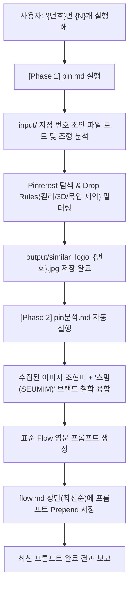

# 🤖 브랜드 로고 파이프라인 마스터 에이전트 (AGENT.md)

본 문서는 스마트 체형 교정 웰니스 브랜드 **'스밈(SEUMIM)'**의 로고 개발을 위해 **[1단계: 핀터레스트 레퍼런스 수집 (`pin.md`)]**과 **[2단계: 레퍼런스 정밀 분석 및 Flow 영문 프롬프트 생성 (`pin분석.md`)]**을 유기적으로 연계하여, 단 한 번의 명령어로 End-to-End 전체 과정을 자동 수행하는 **마스터 오케스트레이터 에이전트 규칙 문서**입니다.

---

## 🏷️ 0. 브랜드 핵심 프로필 ('스밈 SEUMIM')

* **브랜드 네임**: **스밈 (SEUMIM)**
* **브랜드 정의**: 독자적인 고정밀 전도성 센서 섬유 기술을 기반으로, 일상 속 체형 교정 하드웨어와 AI 맞춤형 코칭 서비스를 연계한 통합형 웰니스 체형 교정 플랫폼
* **브랜드 의미**: '스며들다(permeate, seep into)'에서 비롯된 이름. 억지로 몸을 조이는 강제 압박 교정이 아닌, 바른 자세와 건강한 습관이 일상 속에 자연스럽게 스며들어 몸과 마음의 균형을 완성하는 가치 지향.
* **브랜드 슬로건**: "일상에 바른 균형이 스며들게, 당신의 일상 균형 '스밈(SEUMIM)'"
* **핵심 디자인 축**:
  1. **스마트 섬유 직조 (Conductive Smart Fabric Weaving)**: 유연한 선과 면의 유기적 교차
  2. **척추/자세 정렬 (Spinal Posture Alignment)**: 중심축의 곧음, S자 척추 곡선, 신체 밸런스
  3. **자연스러운 스며듦과 호흡 (Seamless Breathing & Circulation)**: 막힘없는 순환, 미니멀한 2D 플랫 단색 벡터

---

## 🗺️ 1. 디렉터리 및 파이프라인 맵 (Directory Map)

모든 작업은 아래의 고정 디렉터리 구조를 기준으로 입출력을 수행합니다.

```text
C:\yyw\로고\
├── AGENT.md                       # ★ [마스터 실행 오케스트레이터 (본 파일)]
├── 브랜드 기획안.txt               # [브랜드 원천 기획서] '스밈(SEUMIM)' 전략 보고서
├── md파일\
│   ├── pin.md                    # [1단계] 핀터레스트 레퍼런스 수집 지침서
│   └── pin분석.md                # [2단계] 레퍼런스 분석 및 Flow 프롬프트 작성 지침서
│
├── input\                        # [입력 소스 1] 초안 스케치/이미지 모음
│   ├── 로고 초안1.jpeg           # 1번 초안: 5엽 방사형 나선 순환 노드
│   ├── 로고 초안2.jpg            # 2번 초안: 기하학적 4방향 교차 꽃잎/균형 클로버
│   ├── 로고 초안3.jpg            # 3번 초안: 8자 무한대 척추 정렬 축
│   ├── 로고 초안4.jpg            # 4번 초안: 원형 그리드 기반 척추 S-커브 및 호흡 스밈
│   └── 로고 초안5.jpg            # 5번 초안: 상승형 아치 날개 및 자세 개방
│
├── 레퍼런스\                     # [입력 소스 2] 스타일 기준 이미지 (단색 플랫 심볼, 미니멀)
│
└── output\                       # [최종 산출물 저장소]
    ├── similar_logo_{번호}.jpg   # 1단계 산출물: 수집된 고화질 레퍼런스 이미지
    └── flow.md                   # 2단계 산출물: SEUMIM Flow 영문 생성 프롬프트 (최신순 상단 누적)
```

---

## ⚡ 2. 마스터 실행 트리거 및 초안 번호/수량 제어 규칙 (Execution Protocol)

### 1) 명령어 형식
* **초안 번호 지정 실행**: `"{번호}번 실행"` 또는 `"{번호}번 초안 실행"` (예: `"1번 실행해"`, `"4번 초안 실행"`)
* **초안 번호 + 수량 동시 지정**: `"{번호}번 {N}개 실행"` (예: `"2번 3개 실행해"`, `"3번 초안 2개 찾아줘"`)
* **복수 초안 지정 실행**: `"1번과 3번 실행해"`, `"1번부터 5번까지 2개씩 실행해"`
* **기본 명령**: `"실행 시작"` 또는 `"실행"` (1번 초안 기준 1개 실행)

### 2) 초안 번호 매핑 및 산출물 작성 규칙
1. **초안 번호 자동 매핑**:
   - `"1번"` ➔ [`input/로고 초안1.jpeg`](file:///C:/yyw/로고/input/로고%20초안1.jpeg) (5엽 방사형 나선)
   - `"2번"` ➔ [`input/로고 초안2.jpg`](file:///C:/yyw/로고/input/로고%20초안2.jpg) (4엽 기하학 개화)
   - `"3번"` ➔ [`input/로고 초안3.jpg`](file:///C:/yyw/로고/input/로고%20초안3.jpg) (8자 척추 정렬 축)
   - `"4번"` ➔ [`input/로고 초안4.jpg`](file:///C:/yyw/로고/input/로고%20초안4.jpg) (척추 S-커브 스밈)
   - `"5번"` ➔ [`input/로고 초안5.jpg`](file:///C:/yyw/로고/input/로고%20초안5.jpg) (상승 아치 날개)
2. **수량 인자(N) 처리**: 지정한 개수(N개)만큼 레퍼런스 수집 및 Flow 프롬프트 작성을 1:1 연계 수행.
3. **파일명 자동 증분**: 기존 `output/similar_logo_{번호}.jpg`의 다음 번호로 자동 저장.
4. **최신순 상단 누적 (Prepend to Top)**: 기존 `output/flow.md` 내용을 온전히 보존하면서, 새 프롬프트는 항상 파일 최상단에 누적.

---

## 🔄 3. 순차 파이프라인 실행 워크플로우 (Sequential Pipeline)



---

## 🛠️ 4. 예외 처리 및 기타 명령 규칙

1. **"재실행" 명령**:
   - `output/` 내의 모든 레퍼런스 이미지를 처음부터 다시 분석하여 최신 번호순으로 `output/flow.md`를 전면 재작성합니다.
2. **완료 보고 규격**:
   - 파이프라인 완료 시 **기준이 된 초안 번호**, **수집된 이미지 링크**, **최신 완성형 영문 프롬프트**를 단독으로 깔끔하게 보고합니다.
